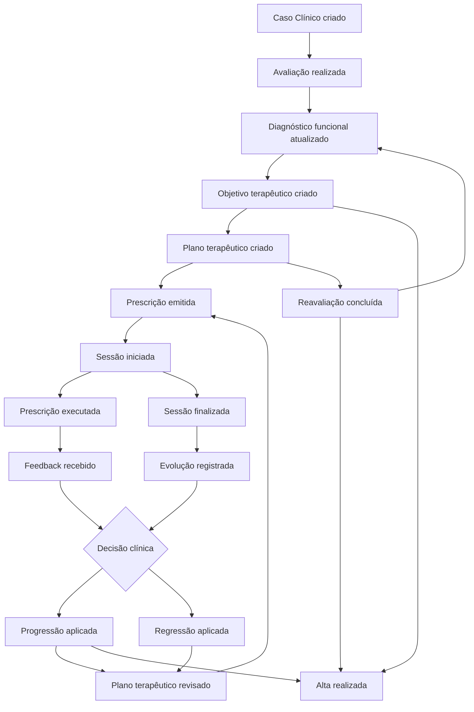

# FisioOS Core — Eventos de Domínio

> **Documento:** `docs/FISIOOS_DOMAIN_EVENTS.md`  
> **Versão:** 1.0  
> **Etapa:** 3 — Domain Events  
> **Escopo:** Catálogo conceitual de eventos do Motor de Prescrição Clínica — **sem código, banco, API ou implementação**  
> **Relacionado:** `docs/FISIOOS_CORE_ARCHITECTURE.md`, `docs/FISIOOS_DOMAIN_MODEL.md`

---

## 1. Objetivo

Definir os **eventos de domínio** do FisioOS Core: fatos clínicos irreversíveis que marcam transições de estado, decisões aprovadas e registros concluídos dentro do agregado **Caso Clínico**.

Eventos de domínio:

- Registram **o que aconteceu** no fluxo clínico, não como fazer.
- Carregam **contexto** (Caso Clínico, Profissional responsável, entidades afetadas).
- Permitem **encadear** o fluxo clínico de forma rastreável.
- Respeitam a regra: **toda decisão clínica é aprovada pelo fisioterapeuta**; eventos de sugestão (IA) só antecedem eventos de aprovação.

Este documento não descreve transporte, filas, persistência ou integrações — apenas semântica de domínio.

---

## 2. Princípios

| Princípio | Descrição |
|-----------|-----------|
| **Fato, não intenção** | Evento ocorre após ação concluída e validada no domínio (ex.: prescrição *emitida*, não *em edição*). |
| **Agregado Caso Clínico** | Todo evento clínico referencia um Caso Clínico, direta ou indiretamente. |
| **Ator humano identificável** | Eventos clínicos registram o Profissional responsável pela aprovação ou registro. |
| **Imutabilidade** | Evento publicado não é alterado; correções geram evento de retificação (futuro). |
| **Encadeamento explícito** | Cada evento indica quais eventos podem legitimamente seguir no fluxo. |
| **IA não dispara eventos clínicos finais** | Sugestões de IA precedem propostas; eventos finais exigem Profissional. |

### Atores do domínio

| Ator | Papel nos eventos |
|------|-------------------|
| **Profissional** | Dispara a maioria dos eventos clínicos por aprovação ou registro. |
| **Paciente** | Pode originar *Feedback recebido* (domiciliar/app), sujeito a validação clínica. |
| **Domínio (regra de negócio)** | Transições automáticas de estado derivadas de evento anterior (ex.: Caso → Em tratamento após plano criado). |
| **Sistema (operacional)** | Apenas eventos não clínicos periféricos (ex.: lembrete de reavaliação) — **fora do catálogo principal**. |

---

## 3. Catálogo de eventos

---

### 3.1 Caso Clínico criado

| Campo | Descrição |
|-------|-----------|
| **Quem dispara** | Profissional |
| **Quando ocorre** | Ao abrir um novo episódio de cuidado para um Paciente, com queixa principal e vínculo à Clínica definidos. |
| **O que muda no domínio** | Nasce um **Caso Clínico** em estado *Rascunho*. Paciente passa a ter tratamento longitudinal ativo. Nenhuma prescrição ou sessão clínica válida existe ainda. |
| **Eventos seguintes possíveis** | Avaliação realizada · Caso Clínico cancelado |

---

### 3.2 Avaliação realizada

| Campo | Descrição |
|-------|-----------|
| **Quem dispara** | Profissional |
| **Quando ocorre** | Quando a coleta estruturada (anamnese, exame físico, escalas, testes) é **concluída e fechada** — avaliação inicial ou intermediária que não é reavaliação comparativa. |
| **O que muda no domínio** | **Avaliação** transita para *Concluída*. Habilita registro ou confirmação do **Diagnóstico Funcional**. Caso Clínico permanece em *Rascunho* ou *Em tratamento*, conforme contexto. |
| **Eventos seguintes possíveis** | Diagnóstico funcional atualizado · Objetivo terapêutico criado · Plano terapêutico criado |

---

### 3.3 Diagnóstico funcional atualizado

| Campo | Descrição |
|-------|-----------|
| **Quem dispara** | Profissional |
| **Quando ocorre** | Ao confirmar ou revisar a síntese fisioterapêutica (limitações, capacidades, prognóstico funcional) vinculada a uma Avaliação concluída. |
| **O que muda no domínio** | **Diagnóstico Funcional** passa a *Confirmado* ou *Revisado*. Versão anterior permanece consultável se for revisão. Objetivos e plano futuros devem alinhar-se ao diagnóstico vigente. |
| **Eventos seguintes possíveis** | Objetivo terapêutico criado · Plano terapêutico criado · Plano terapêutico revisado |

---

### 3.4 Objetivo terapêutico criado

| Campo | Descrição |
|-------|-----------|
| **Quem dispara** | Profissional |
| **Quando ocorre** | Ao definir uma meta mensurável, temporal e priorizada derivada do Diagnóstico Funcional vigente. |
| **O que muda no domínio** | Novo **Objetivo Terapêutico** em estado *Ativo* entra no Caso Clínico. Passa a orientar prescrições e critérios de progressão, regressão e alta. |
| **Eventos seguintes possíveis** | Plano terapêutico criado · Plano terapêutico revisado · Prescrição emitida · Objetivo terapêutico atingido *(complementar)* |

---

### 3.5 Plano terapêutico criado

| Campo | Descrição |
|-------|-----------|
| **Quem dispara** | Profissional |
| **Quando ocorre** | Na primeira publicação da estratégia de tratamento (frequência, foco, condutas previstas, critérios de progressão/regressão) após avaliação inicial mínima. |
| **O que muda no domínio** | **Plano Terapêutico** nasce em estado *Ativo* (versão 1). **Caso Clínico** transita de *Rascunho* para *Em tratamento*. Prescrições passam a ser permitidas. |
| **Eventos seguintes possíveis** | Prescrição emitida · Sessão iniciada *(se já agendada)* · Plano terapêutico revisado · Reavaliação concluída *(se planejada)* |

---

### 3.6 Plano terapêutico revisado

| Campo | Descrição |
|-------|-----------|
| **Quem dispara** | Profissional |
| **Quando ocorre** | Quando alteração material no plano (objetivos, frequência, condutas previstas, critérios) é publicada — após evolução, feedback, reavaliação ou decisão clínica explícita. |
| **O que muda no domínio** | Nova **Versão de Plano** publicada; versão anterior arquivada. Plano vigente atualizado. Prescrições futuras obedecem à nova versão; prescrições já emitidas mantêm snapshot anterior. |
| **Eventos seguintes possíveis** | Prescrição emitida · Progressão aplicada · Regressão aplicada · Objetivo terapêutico criado · Reavaliação concluída |

---

### 3.7 Sessão iniciada

| Campo | Descrição |
|-------|-----------|
| **Quem dispara** | Profissional |
| **Quando ocorre** | No momento em que o atendimento presencial ou tele clínico é formalmente iniciado — paciente presente ou atendimento remoto em curso. |
| **O que muda no domínio** | **Sessão** transita para *Em andamento*. Caso Clínico permanece *Em tratamento*. Prescrição vinculada pode entrar em *Em execução*. |
| **Eventos seguintes possíveis** | Prescrição executada · Feedback recebido · Sessão finalizada · Prescrição emitida *(ajuste intra-sessão)* |

---

### 3.8 Sessão finalizada

| Campo | Descrição |
|-------|-----------|
| **Quem dispara** | Profissional |
| **Quando ocorre** | Ao encerrar o encontro clínico, com execução registrada ou pendência explicitada. |
| **O que muda no domínio** | **Sessão** transita para *Realizada*, *Faltou* ou *Cancelada*. Se *Realizada*, exige **Evolução** ou exceção documentada. Prescrição associada pode transitar para *Concluída*. |
| **Eventos seguintes possíveis** | Evolução registrada *(complementar)* · Feedback recebido · Prescrição executada · Plano terapêutico revisado · Progressão aplicada · Regressão aplicada · Reavaliação concluída |

---

### 3.9 Prescrição emitida

| Campo | Descrição |
|-------|-----------|
| **Quem dispara** | Profissional |
| **Quando ocorre** | Quando a prescrição (condutas, parâmetros, observações, vínculo a objetivos) é **aprovada e formalizada** para uma sessão ou período — inclusive após adaptação de protocolo. |
| **O que muda no domínio** | **Prescrição** transita de *Rascunho* para *Aprovada*/*Emitida*. **Itens de Conduta** tornam-se exigíveis na execução. Snapshot de exercícios/protocolos registrado. Entrega digital pode ser habilitada. |
| **Eventos seguintes possíveis** | Sessão iniciada · Prescrição executada · Prescrição revogada *(complementar)* · Feedback recebido *(domiciliar, após entrega)* |

---

### 3.10 Prescrição executada

| Campo | Descrição |
|-------|-----------|
| **Quem dispara** | Profissional *(execução clínica)* ou Paciente *(domiciliar, provisório até validação)* |
| **Quando ocorre** | Quando o registro de execução cobre os itens prescritos — integral, parcial ou omitido — com parâmetros efetivos e tempo. |
| **O que muda no domínio** | **Execução** em estado *Registrada*. **Itens de Conduta** atualizados (*Executado*, *Parcial*, *Omitido*). **Prescrição** pode transitar para *Concluída* ou *Em execução* conforme escopo. |
| **Eventos seguintes possíveis** | Feedback recebido · Sessão finalizada · Evolução registrada *(complementar)* · Progressão aplicada · Regressão aplicada · Plano terapêutico revisado |

---

### 3.11 Feedback recebido

| Campo | Descrição |
|-------|-----------|
| **Quem dispara** | Paciente *(app/domiciliar)* ou Profissional *(durante ou após sessão)* |
| **Quando ocorre** | Ao registrar resposta à execução: dor, esforço percebido, dificuldade, tolerância, compensações ou adesão. |
| **O que muda no domínio** | **Feedback** associado à Execução e/ou Itens de Conduta. Pode permanecer *Coletado* (paciente) até *Validado* (profissional). Sinaliza necessidade de regressão ou revisão — **sem aplicá-la automaticamente**. |
| **Eventos seguintes possíveis** | Regressão aplicada · Plano terapêutico revisado · Evolução registrada *(complementar)* · Progressão aplicada |

---

### 3.12 Progressão aplicada

| Campo | Descrição |
|-------|-----------|
| **Quem dispara** | Profissional |
| **Quando ocorre** | Quando o profissional **aprova explicitamente** aumento de demanda terapêutica (carga, volume, complexidade, amplitude) após critérios clínicos atingidos. |
| **O que muda no domínio** | **Decisão de Progressão** em estado *Aprovada*. Itens de Conduta ou parâmetros futuros ajustados. Pode gerar **Prescrição emitida** ou **Plano terapêutico revisado**. Objetivos podem aproximar-se de *Atingido*. |
| **Eventos seguintes possíveis** | Prescrição emitida · Plano terapêutico revisado · Objetivo terapêutico atingido *(complementar)* · Reavaliação concluída · Alta realizada |

---

### 3.13 Regressão aplicada

| Campo | Descrição |
|-------|-----------|
| **Quem dispara** | Profissional |
| **Quando ocorre** | Quando o profissional **aprova explicitamente** redução de demanda terapêutica por dor, fadiga, recidiva, baixa tolerância ou feedback negativo recorrente. |
| **O que muda no domínio** | **Decisão de Regressão** em estado *Aprovada*. Prescrição vigente pode ser *Substituída* ou *Revogada*. Plano pode ser revisado. Protege adesão e segurança do paciente. |
| **Eventos seguintes possíveis** | Prescrição emitida · Plano terapêutico revisado · Sessão iniciada · Feedback recebido |

---

### 3.14 Reavaliação concluída

| Campo | Descrição |
|-------|-----------|
| **Quem dispara** | Profissional |
| **Quando ocorre** | Quando avaliação comparativa (baseline vs. estado atual) é fechada, com registro explícito de evolução (melhora, estabilidade, piora). |
| **O que muda no domínio** | **Avaliação** tipo reavaliação *Concluída*. **Diagnóstico Funcional** pode ser revisado. **Objetivos** atualizados (*Atingido*, *Descartado*, *Revisado*). **Caso Clínico** pode transitar para *Em reavaliação* → retorno a *Em tratamento*. |
| **Eventos seguintes possíveis** | Diagnóstico funcional atualizado · Objetivo terapêutico criado · Plano terapêutico revisado · Progressão aplicada · Regressão aplicada · Alta realizada |

---

### 3.15 Alta realizada

| Campo | Descrição |
|-------|-----------|
| **Quem dispara** | Profissional |
| **Quando ocorre** | No encerramento formal do Caso Clínico, com critérios documentados, orientações de manutenção e estado final dos objetivos — inclusive alta parcial justificada. |
| **O que muda no domínio** | **Alta** *Confirmada*. **Caso Clínico** → *Alta* (encerrado). **Plano Terapêutico** → *Encerrado*. Novas prescrições e sessões clínicas **bloqueadas**. Prescrições ativas *Revogadas* ou *Concluídas*. |
| **Eventos seguintes possíveis** | Caso Clínico criado *(novo episódio no mesmo Paciente)* · *(nenhum evento clínico no caso encerrado)* |

---

## 4. Eventos complementares

Eventos auxiliares que completam o fluxo sem substituir o catálogo principal.

| Evento | Quem dispara | Quando | Mudança resumida | Seguintes |
|--------|--------------|--------|------------------|-----------|
| **Evolução registrada** | Profissional | Após sessão realizada, narrativa clínica finalizada | Evolução *Finalizada*; complementa Execução | Plano revisado · Progressão · Regressão · Reavaliação |
| **Objetivo terapêutico atingido** | Profissional | Meta com evidência registrada | Objetivo → *Atingido* | Alta · Reavaliação · Progressão |
| **Caso Clínico cancelado** | Profissional | Abandono antes da alta | Caso → *Cancelado*; prescrições revogadas | Caso Clínico criado |
| **Prescrição revogada** | Profissional | Cancelamento antes ou durante execução | Prescrição → *Revogada* | Prescrição emitida |

---

## 5. Mapa de encadeamento

Visão simplificada do fluxo principal. Setas indicam sequências **frequentes**, não exclusivas.

---

## 6. Matriz rápida

| # | Evento | Agregado principal | Estado resultante chave |
|---|--------|-------------------|-------------------------|
| 1 | Caso Clínico criado | Caso Clínico | Rascunho |
| 2 | Avaliação realizada | Avaliação | Concluída |
| 3 | Diagnóstico funcional atualizado | Diagnóstico Funcional | Confirmado / Revisado |
| 4 | Objetivo terapêutico criado | Objetivo Terapêutico | Ativo |
| 5 | Plano terapêutico criado | Plano + Caso | Ativo + Em tratamento |
| 6 | Plano terapêutico revisado | Versão de Plano | Nova versão publicada |
| 7 | Sessão iniciada | Sessão | Em andamento |
| 8 | Sessão finalizada | Sessão | Realizada / Faltou / Cancelada |
| 9 | Prescrição emitida | Prescrição | Aprovada / Emitida |
| 10 | Prescrição executada | Execução | Registrada |
| 11 | Feedback recebido | Feedback | Coletado / Validado |
| 12 | Progressão aplicada | Decisão de Progressão | Aprovada |
| 13 | Regressão aplicada | Decisão de Regressão | Aprovada |
| 14 | Reavaliação concluída | Avaliação (reavaliação) | Concluída + comparativo |
| 15 | Alta realizada | Alta + Caso | Encerrado |

---

## 7. Regras transversais sobre eventos

1. **Ordem lógica, não rígida** — Reavaliação, revisão de plano e nova prescrição podem ocorrer em ordens variadas durante *Em tratamento*.
2. **Evento não substitui entidade** — Publicar *Prescrição emitida* não elimina a necessidade de *Prescrição executada* na sessão.
3. **Sessão finalizada ≠ Prescrição executada** — Podem ocorrer em ordens diferentes; ambos devem convergir antes da evolução finalizada.
4. **Progressão e regressão são simétricas** — Ambas exigem aprovação explícita; nunca são efeito colateral automático de Feedback.
5. **Alta é terminal no agregado** — Após *Alta realizada*, o catálogo principal não produz novos eventos naquele Caso Clínico.
6. **Cancelamento interrompe** — *Caso Clínico cancelado* impede eventos clínicos subsequentes no mesmo caso.
7. **Rastreabilidade** — Todo evento deve ser correlacionável ao Caso Clínico, ao Profissional responsável e ao instante clínico em que o fato ocorreu.

---

**FISIOOS DOMAIN EVENTS v1.0**
