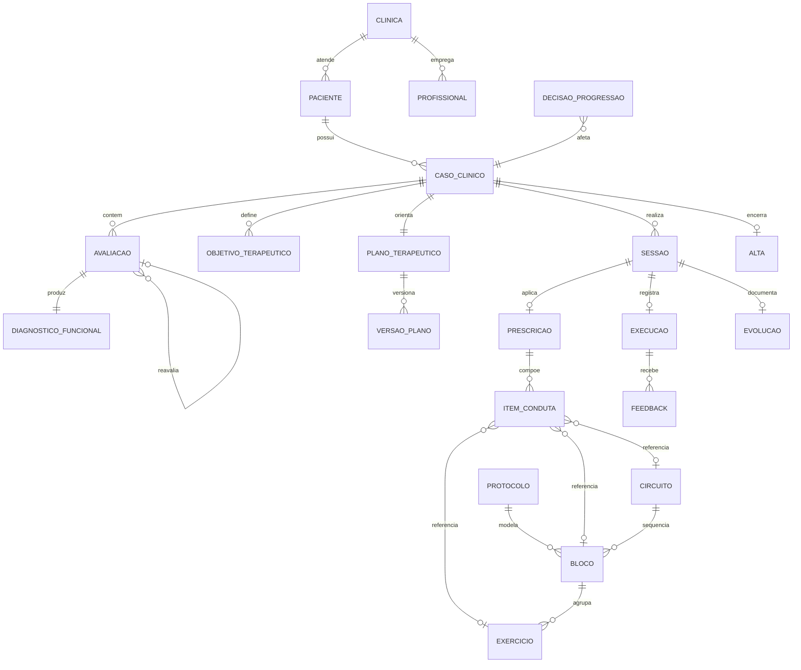

# FisioOS Core — Modelo de Domínio

> **Documento:** `docs/FISIOOS_DOMAIN_MODEL.md`  
> **Versão:** 1.0  
> **Etapa:** 2 — Domain Model  
> **Escopo:** Definição conceitual do domínio clínico — **sem código, migrations, banco ou alterações técnicas**  
> **Precede:** `docs/FISIOOS_CORE_ARCHITECTURE.md`

---

## 1. Objetivo

Este documento formaliza o **modelo de domínio** do Motor de Prescrição Clínica do FisioOS. Descreve **entidades**, **responsabilidades**, **relações**, **ciclos de vida** e **regras de negócio** em linguagem de domínio — independente de implementação técnica.

O agregado raiz do Core é o **Caso Clínico**. Todas as decisões terapêuticas e prescrições ativas orbitam este agregado.

---

## 2. Mapa de entidades



### Camadas do domínio

| Camada | Entidades | Papel |
|--------|-----------|-------|
| **Contexto organizacional** | Clínica, Profissional | Escopo multi-clínica e responsabilidade profissional |
| **Identidade clínica** | Paciente | Sujeito do cuidado |
| **Agregado raiz** | Caso Clínico | Container longitudinal do tratamento |
| **Raciocínio clínico** | Avaliação, Diagnóstico Funcional, Objetivo Terapêutico, Plano Terapêutico | Da coleta de dados à estratégia |
| **Operação** | Sessão, Prescrição, Item de Conduta, Execução, Feedback, Evolução | Atendimento e registro |
| **Catálogo (insumos)** | Exercício, Bloco, Circuito, Protocolo | Modelos reutilizáveis, não prescrições ativas |
| **Encerramento** | Reavaliação, Alta, Decisão de Progressão/Regressão | Marcos e transições |

---

## 3. Entidades — definição completa

---

### 3.1 Clínica

**Responsabilidade**  
Representar a unidade organizacional que presta o cuidado. Delimita o escopo de visibilidade de pacientes, casos, biblioteca e profissionais. Nenhum dado clínico cruza fronteiras entre clínicas.

**Relações**

- Possui muitos **Pacientes**
- Emprega muitos **Profissionais**
- Possui biblioteca própria de **Exercícios**, **Blocos**, **Circuitos** e **Protocolos** (além do catálogo global da plataforma)

**Ciclo de vida**

| Estado | Descrição |
|--------|-----------|
| Ativa | Operação normal |
| Suspensa | Acesso restrito; dados preservados |
| Encerrada | Sem novos casos; histórico arquivado |

**Regras de negócio**

- Todo **Caso Clínico** pertence a exatamente uma Clínica.
- Prescrições e execuções de uma clínica nunca são visíveis ou reutilizáveis em outra.
- Conteúdo global da plataforma é **leitura** para clínicas; alterações locais geram **cópias**, não mutações do global.

---

### 3.2 Profissional

**Responsabilidade**  
Representar o fisioterapeuta (ou profissional habilitado) que avalia, prescreve, executa, registra evolução e decide progressão, regressão e alta.

**Relações**

- Pertence a uma **Clínica**
- Responsável por **Avaliações**, **Planos Terapêuticos**, **Prescrições**, **Evoluções** e **Altas**
- Pode ser atribuído a **Sessões** e **Casos Clínicos**

**Ciclo de vida**

| Estado | Descrição |
|--------|-----------|
| Ativo | Pode atuar clinicamente |
| Inativo | Sem novos vínculos; histórico mantido |
| Suspenso | Bloqueio temporário de ações clínicas |

**Regras de negócio**

- Apenas profissionais ativos podem **aprovar** prescrições, evoluções e altas.
- Toda decisão clínica registrada deve identificar o **profissional responsável**.
- Sugestões de IA nunca substituem a assinatura/aprovação do profissional.

---

### 3.3 Paciente

**Responsabilidade**  
Identificar a pessoa atendida: dados demográficos, contato e contexto administrativo. Não concentra o tratamento — apenas referencia os **Casos Clínicos** ao longo do tempo.

**Relações**

- Pertence a uma **Clínica**
- Possui zero ou muitos **Casos Clínicos** (histórico longitudinal)
- Referenciado por **Sessões**, **Prescrições** e **Avaliações** via Caso Clínico

**Ciclo de vida**

| Estado | Descrição |
|--------|-----------|
| Ativo | Pode abrir novos casos e ser agendado |
| Inativo | Sem novos casos; histórico acessível |
| Anonimizado | Dados pessoais removidos ou pseudonimizados conforme política |

**Regras de negócio**

- Um Paciente pode ter **múltiplos Casos Clínicos** simultâneos ou sequenciais (ex.: joelho e lombalgia).
- Prescrição **nunca** é criada diretamente no Paciente sem **Caso Clínico** associado.
- Dados clínicos sensíveis vivem no Caso Clínico e suas entidades filhas, não no cadastro mínimo do Paciente.

---

### 3.4 Caso Clínico *(agregado raiz)*

**Responsabilidade**  
Ser o container longitudinal de um episódio de cuidado: queixa principal, linha do tempo, profissionais envolvidos, avaliações, plano, sessões, prescrições e encerramento. **Toda prescrição ativa pertence a um Caso Clínico.**

**Relações**

- Pertence a um **Paciente** e a uma **Clínica**
- Contém **Avaliações**, **Objetivos Terapêuticos**, **Plano Terapêutico**, **Sessões**, **Prescrições**
- Pode ser encerrado por **Alta**
- Referencia um ou mais **Profissionais**

**Ciclo de vida**

| Estado | Descrição |
|--------|-----------|
| Rascunho | Caso aberto, avaliação inicial pendente |
| Em tratamento | Plano ativo; sessões em curso |
| Em reavaliação | Pausa ou marco para nova avaliação comparativa |
| Alta | Encerrado formalmente; somente leitura clínica |
| Cancelado | Abandonado antes da alta; motivo registrado |

**Regras de negócio**

- Não pode haver prescrição ativa em Caso Clínico **Alta** ou **Cancelado**.
- Transição para **Em tratamento** exige **Avaliação** inicial com **Diagnóstico Funcional** e **Plano Terapêutico** mínimo.
- Um Caso Clínico mantém **integridade referencial**: sessões e prescrições órfãs são inválidas.
- Alterações estruturais (objetivos, plano) devem ser **rastreáveis** — não sobrescrever silenciosamente.

---

### 3.5 Avaliação

**Responsabilidade**  
Coletar dados clínicos estruturados: anamnese, exame físico, escalas, testes funcionais, goniometria, força muscular e demais instrumentos. Fundamenta o Diagnóstico Funcional.

**Relações**

- Pertence a um **Caso Clínico**
- Produz um **Diagnóstico Funcional**
- Pode referenciar **Avaliação** anterior (reavaliação)
- Realizada por um **Profissional**

**Ciclo de vida**

| Estado | Descrição |
|--------|-----------|
| Em elaboração | Coleta em andamento |
| Concluída | Dados fechados; diagnóstico funcional registrado |
| Retificada | Correção formal com histórico da versão anterior |
| Anulada | Invalidada; não entra em comparativos |

**Regras de negócio**

- Avaliação **Concluída** exige **Diagnóstico Funcional** associado.
- Reavaliação deve referenciar a **baseline** (avaliação inicial ou última reavaliação acordada).
- Anulação não apaga histórico; preserva trilha de auditoria clínica.
- IA pode **pré-preencher** campos; conclusão e assinatura são do **Profissional**.

---

### 3.6 Diagnóstico Funcional

**Responsabilidade**  
Expressar a síntese fisioterapêutica: limitações, capacidades preservadas, prognóstico funcional e hipóteses de intervenção — em linguagem funcional, não necessariamente nosológica.

**Relações**

- Pertence a uma **Avaliação** (relação 1:1 por avaliação concluída)
- Alimenta **Objetivos Terapêuticos** e **Plano Terapêutico**
- Pode ser **revisado** após **Reavaliação**

**Ciclo de vida**

| Estado | Descrição |
|--------|-----------|
| Provisório | Rascunho vinculado a avaliação em elaboração |
| Confirmado | Validado pelo profissional responsável |
| Revisado | Substituído por nova versão pós-reavaliação |

**Regras de negócio**

- Objetivos Terapêuticos devem **referenciar** o Diagnóstico Funcional que os originou.
- Revisão gera nova versão; versão anterior permanece consultável.
- Diagnóstico Funcional não equivale a prescrição — não contém condutas executáveis.

---

### 3.7 Objetivo Terapêutico

**Responsabilidade**  
Definir metas mensuráveis, temporais e priorizadas derivadas do Diagnóstico Funcional. Orientam prescrição, progressão e critérios de alta.

**Relações**

- Pertence a um **Caso Clínico**
- Originado de um **Diagnóstico Funcional**
- Referenciado por **Itens de Conduta** e **Prescrições**
- Avaliado em **Reavaliações** e **Evoluções**

**Ciclo de vida**

| Estado | Descrição |
|--------|-----------|
| Ativo | Em perseguição no plano atual |
| Atingido | Meta alcançada; data e evidência registradas |
| Suspenso | Temporariamente fora do foco |
| Descartado | Substituído ou considerado irrelevante |
| Revisado | Parâmetros alterados (prazo, métrica, prioridade) |

**Regras de negócio**

- Todo Caso Clínico em tratamento deve ter **ao menos um** Objetivo Ativo ou Atingido parcial documentado.
- Marcar como **Atingido** exige evidência (escala, teste, registro clínico).
- Descarte ou revisão exige **justificativa** e profissional responsável.
- Prescrições podem vincular-se a objetivos específicos para rastrear aderência terapêutica.

---

### 3.8 Plano Terapêutico

**Responsabilidade**  
Descrever a estratégia viva de tratamento: frequência, foco, condutas previstas, critérios de progressão/regressão, duração estimada e profissionais responsáveis. **Evolui** com sessões, feedback e reavaliações.

**Relações**

- Pertence a um **Caso Clínico** (1 plano vigente por vez; histórico versionado)
- Baseado em **Objetivos Terapêuticos** e **Diagnóstico Funcional**
- Orienta **Prescrições** e **Sessões**
- Possui **Versões de Plano** ao longo do tempo

**Ciclo de vida**

| Estado | Descrição |
|--------|-----------|
| Rascunho | Em construção pós-avaliação inicial |
| Ativo | Plano vigente guiando prescrições |
| Suspenso | Interrupção temporária (ex.: cirurgia, viagem) |
| Substituído | Nova versão publicada; anterior arquivada |
| Encerrado | Vinculado à Alta do Caso Clínico |

**Regras de negócio**

- Plano **Ativo** é obrigatório para prescrever em Caso em tratamento.
- Alteração material gera **nova versão** — nunca sobrescrita silenciosamente.
- Suspensão registra motivo, data e responsável.
- Critérios de progressão/regressão no plano são **referência**; a **Decisão de Progressão/Regressão** é entidade de aprovação explícita.

---

### 3.9 Versão de Plano

**Responsabilidade**  
Registrar snapshot auditável de uma revisão do Plano Terapêutico: o que mudou, quando, por quem e por qual motivo clínico.

**Relações**

- Pertence a um **Plano Terapêutico**
- Disparada por **Evolução**, **Reavaliação** ou decisão manual do **Profissional**

**Ciclo de vida**

| Estado | Descrição |
|--------|-----------|
| Publicada | Versão oficial a partir de sua data |
| Arquivada | Substituída por versão posterior |

**Regras de negócio**

- Toda versão publicada é **imutável**.
- Deve registrar diff semântico (objetivos, frequência, condutas previstas, critérios).
- Consulta histórica do plano percorre versões em ordem cronológica.

---

### 3.10 Sessão

**Responsabilidade**  
Representar um encontro clínico (presencial ou tele): unidade operacional onde prescrições são aplicadas, execução registrada e evolução documentada. Integra-se à agenda operacional.

**Relações**

- Pertence a um **Caso Clínico**
- Vinculada a um **Profissional** e **Paciente** (via caso)
- Pode ter uma **Prescrição** aplicada
- Gera **Execução**, **Feedback** e **Evolução**
- Origina-se de agendamento (conceito externo ao agregado; referência por identificador)

**Ciclo de vida**

| Estado | Descrição |
|--------|-----------|
| Agendada | Horário reservado |
| Confirmada | Presença confirmada |
| Em andamento | Atendimento iniciado |
| Realizada | Execução e evolução registradas |
| Faltou | Paciente ausente; sem execução |
| Cancelada | Não ocorrerá; motivo registrado |
| Reagendada | Substituída por nova sessão |

**Regras de negócio**

- Sessão **Realizada** em Caso em tratamento deve ter **Evolução** ou justificativa de omissão.
- Prescrição aplicada deve pertencer ao **mesmo Caso Clínico** da sessão.
- Sessão **Faltou** ou **Cancelada** não gera execução clínica válida.
- Reagendamento preserva vínculo com o Caso Clínico; não duplica prescrição automaticamente.

---

### 3.11 Prescrição

**Responsabilidade**  
Instanciar condutas concretas para um paciente, dentro de um Caso Clínico, para uma sessão ou período definido. Produto clínico do motor: parâmetros ajustados, observações e vínculo com objetivos.

**Relações**

- Pertence a um **Caso Clínico**
- Composta por **Itens de Conduta**
- Vinculada a zero ou uma **Sessão** (prescrição domiciliar pode não ter sessão imediata)
- Referencia **Objetivos Terapêuticos**
- Pode originar-se de **Protocolo** (como template, não cópia cega)
- Aprovada por **Profissional**

**Ciclo de vida**

| Estado | Descrição |
|--------|-----------|
| Rascunho | Em montagem pelo profissional |
| Aprovada | Validada; pronta para execução ou entrega digital |
| Em execução | Sessão ou período domiciliar em curso |
| Concluída | Período de validade encerrado ou sessão realizada |
| Substituída | Nova prescrição assume o papel; anterior arquivada |
| Revogada | Cancelada antes da execução; motivo registrado |

**Regras de negócio**

- Prescrição **Aprovada** exige ao menos um **Item de Conduta** e profissional responsável.
- Instanciação a partir de **Protocolo** sempre passa por edição/revisão — nunca aplicação automática.
- Prescrição não pertence à Biblioteca; é **instância clínica** não reutilizável em outros pacientes.
- Entrega digital (PDF, app) só de prescrições **Aprovadas**.

---

### 3.12 Item de Conduta

**Responsabilidade**  
Representar uma intervenção concreta dentro da prescrição: exercício, bloco expandido, circuito, orientação ou técnica — com parâmetros contextualizados (séries, repetições, carga, tempo, observações).

**Relações**

- Pertence a uma **Prescrição**
- Pode referenciar **Exercício**, **Bloco** ou **Circuito** da biblioteca (por referência ou snapshot)
- Vinculado a zero ou mais **Objetivos Terapêuticos**
- Executado via **Execução**

**Ciclo de vida**

| Estado | Descrição |
|--------|-----------|
| Planejado | Definido na prescrição aprovada |
| Executado | Realizado integralmente |
| Parcial | Realizado com adaptações |
| Omitido | Não realizado; motivo na execução |
| Ajustado | Parâmetros alterados na sessão (com registro) |

**Regras de negócio**

- Parâmetros na prescrição **sobrescrevem** defaults do Exercício/Bloco/Protocolo origem.
- Referência à biblioteca deve usar **snapshot** clínico quando o catálogo mudar após aprovação.
- Item **Omitido** ou **Parcial** exige registro na **Execução**.
- Contraindicação identificada na sessão pode marcar item como **Omitido** com justificativa.

---

### 3.13 Exercício *(catálogo)*

**Responsabilidade**  
Unidade atômica de conteúdo na biblioteca: instruções, parâmetros default, contraindicações, mídia e metadados clínicos. **Insumo** para prescrição — não prescrição em si.

**Relações**

- Pertence ao catálogo **global** ou de **Clínica**
- Agrupado em **Blocos** e **Protocolos**
- Referenciado por **Itens de Conduta** (prescrição)

**Ciclo de vida**

| Estado | Descrição |
|--------|-----------|
| Rascunho | Em elaboração |
| Ativo | Disponível para uso em prescrições |
| Arquivado | Oculto de novas prescrições; histórico preservado |
| Descontinuado | Substituído por outro exercício; referência mantida |

**Regras de negócio**

- Exercício global **não é editável** pela clínica — customização gera **cópia local**.
- Alteração em exercício **Ativo** não retroage em prescrições já aprovadas (snapshot).
- Exercício arquivado permanece resolvível em prescrições históricas.

---

### 3.14 Bloco *(catálogo)*

**Responsabilidade**  
Agrupar exercícios ou condutas com ordem e propósito comum (aquecimento, fortalecimento, alongamento). Facilita montagem de prescrições e protocolos.

**Relações**

- Contém **Exercícios** ordenados
- Usado em **Protocolos** e **Circuitos**
- Referenciado por **Itens de Conduta**

**Ciclo de vida**

| Estado | Descrição |
|--------|-----------|
| Rascunho | Em montagem |
| Ativo | Disponível como template |
| Arquivado | Fora de novas composições |

**Regras de negócio**

- Bloco é **modelo** — expansão na prescrição gera itens de conduta individuais ou grupo nomeado.
- Ordem dos exercícios no bloco é significativa na prescrição.
- Mesmas regras de cópia global/local aplicam-se ao Exercício.

---

### 3.15 Circuito *(catálogo)*

**Responsabilidade**  
Definir sequência cíclica de blocos ou exercícios: rodadas, intervalos, ordem de estações e critérios de transição.

**Relações**

- Composto por **Blocos** ou **Exercícios** ordenados
- Referenciado por **Protocolos** e **Itens de Conduta**

**Ciclo de vida**

| Estado | Descrição |
|--------|-----------|
| Rascunho | Em definição |
| Ativo | Template disponível |
| Arquivado | Sem uso em novas prescrições |

**Regras de negócio**

- Parâmetros de rodadas e intervalos são **defaults** — ajustáveis na prescrição.
- Circuito expandido na prescrição mantém identidade de grupo para execução e feedback.

---

### 3.16 Protocolo *(catálogo)*

**Responsabilidade**  
Modelo reutilizável de prescrição para perfil clínico, região ou objetivo. Acelera o trabalho do profissional; **nunca** substitui o Caso Clínico.

**Relações**

- Composto por **Blocos**, **Circuitos** e/ou **Exercícios**
- Origem de **Prescrições** via instanciação manual
- Pode ser **global**, de **Clínica** ou adquirido via **Marketplace** (futuro)

**Ciclo de vida**

| Estado | Descrição |
|--------|-----------|
| Rascunho | Em elaboração |
| Publicado | Disponível como template |
| Revisado | Nova versão publicada |
| Arquivado | Sem novas instanciações |
| Retirado | Removido do catálogo; instâncias históricas preservadas |

**Regras de negócio**

- Protocolo **nunca** gera prescrição ativa sem passo de **adaptação e aprovação**.
- Versão do protocolo usada na instanciação deve ser **registrada** na prescrição.
- Protocolo de marketplace, ao ser adotado, vira **cópia local** da clínica — não referência mutável externa.

---

### 3.17 Execução

**Responsabilidade**  
Registrar o que foi efetivamente realizado na sessão (ou domiciliarmente): itens executados, parâmetros reais, tempo, adaptações e omissões.

**Relações**

- Pertence a uma **Sessão** (ou período domiciliar vinculado ao **Caso Clínico**)
- Referencia **Itens de Conduta** da **Prescrição**
- Recebe **Feedback**
- Alimenta **Evolução** e decisões de progressão

**Ciclo de vida**

| Estado | Descrição |
|--------|-----------|
| Pendente | Sessão realizada; execução não registrada |
| Registrada | Dados de execução completos |
| Retificada | Correção formal com histórico |

**Regras de negócio**

- Execução **Registrada** deve cobrir todos os itens prescritos (executado, parcial ou omitido).
- Parâmetros efetivos podem divergir dos prescritos — divergência deve ser explícita.
- Execução domiciliar reportada pelo paciente entra como **provisória** até validação do profissional (futuro app).

---

### 3.18 Feedback

**Responsabilidade**  
Capturar resposta à execução: dor, esforço percebido, dificuldade, tolerância, compensações e adesão — do paciente e/ou do profissional.

**Relações**

- Associado a **Execução** e/ou **Item de Conduta**
- Informa **Evolução** e **Decisão de Progressão/Regressão**

**Ciclo de vida**

| Estado | Descrição |
|--------|-----------|
| Coletado | Registrado na sessão ou app |
| Validado | Confirmado pelo profissional |
| Descartado | Considerado inválido (ex.: erro de registro) |

**Regras de negócio**

- Feedback de paciente via app é **sugestão** até validação clínica quando configurado.
- Feedback negativo recorrente (dor alta, baixa tolerância) deve **sinalizar** regressão — não aplicá-la automaticamente.
- Escala e instrumentos de feedback devem ser consistentes ao longo do Caso Clínico quando usados como métrica de objetivo.

---

### 3.19 Evolução

**Responsabilidade**  
Documentar o registro clínico da sessão: resposta ao tratamento, observações, ajustes realizados e encaminhamentos. Complementa execução e feedback com narrativa clínica.

**Relações**

- Pertence a uma **Sessão** e **Caso Clínico**
- Redigida por **Profissional**
- Pode disparar **Versão de Plano** ou **Decisão de Progressão/Regressão**

**Ciclo de vida**

| Estado | Descrição |
|--------|-----------|
| Rascunho | Em redação |
| Finalizada | Registro clínico fechado |
| Retificada | Correção com preservação da versão anterior |

**Regras de negócio**

- Sessão **Realizada** exige Evolução **Finalizada** ou motivo documentado de exceção.
- Evolução **Finalizada** é atribuída a profissional habilitado.
- IA pode sugerir texto; **Finalização** é sempre humana.
- Evolução não substitui execução quantitativa — complementa.

---

### 3.20 Reavaliação

**Responsabilidade**  
Marco clínico em que uma nova **Avaliação** comparativa mede progresso em relação à baseline, revisando Diagnóstico Funcional, Objetivos e Plano.

**Relações**

- Implementada como **Avaliação** com tipo reavaliação
- Referencia **Avaliação** baseline
- Pertence ao **Caso Clínico**
- Pode preceder **Versão de Plano** ou **Alta**

**Ciclo de vida**

| Estado | Descrição |
|--------|-----------|
| Planejada | Data ou critério definido no plano |
| Em curso | Avaliação comparativa em elaboração |
| Concluída | Comparativo registrado; plano/objetivos revisados |
| Adiada | Nova data definida |

**Regras de negócio**

- Reavaliação **Concluída** deve registrar comparativo explícito (melhora, estabilidade, piora).
- Objetivos **Atingidos** ou **Descartados** devem ser atualizados na conclusão.
- Periodicidade de reavaliação é definida no **Plano Terapêutico**.

---

### 3.21 Decisão de Progressão / Regressão

**Responsabilidade**  
Registrar aprovação explícita do profissional para aumentar ou reduzir demanda terapêutica (carga, volume, complexidade), com motivo clínico e itens afetados.

**Relações**

- Pertence a um **Caso Clínico**
- Referencia **Objetivos**, **Itens de Conduta** e/ou **Plano Terapêutico**
- Aprovada por **Profissional**
- Pode originar nova **Prescrição** ou **Versão de Plano**

**Ciclo de vida**

| Estado | Descrição |
|--------|-----------|
| Proposta | Sugerida por IA ou alerta do sistema |
| Aprovada | Efetivada pelo profissional |
| Rejeitada | Descartada com justificativa |
| Revertida | Retorno ao estado anterior documentado |

**Regras de negócio**

- Progressão e regressão **nunca** são automáticas.
- Sugestão de IA permanece em **Proposta** até aprovação.
- Toda decisão **Aprovada** exige motivo clínico e responsável identificado.
- Reversão gera trilha auditável vinculada à decisão original.

---

### 3.22 Alta

**Responsabilidade**  
Encerrar formalmente o **Caso Clínico**: critérios atingidos, estado funcional final, orientações de manutenção e encaminhamentos.

**Relações**

- Pertence a um **Caso Clínico** (1:1 no encerramento)
- Emitida por **Profissional**
- Referencia **Objetivos** finais e última **Reavaliação** quando aplicável

**Ciclo de vida**

| Estado | Descrição |
|--------|-----------|
| Proposta | Alta sugerida; pendente confirmação |
| Confirmada | Caso encerrado |
| Retificada | Correção documental pós-confirmada (excepcional) |

**Regras de negócio**

- Alta **Confirmada** bloqueia novas prescrições e sessões clínicas no caso.
- Deve referenciar status final dos **Objetivos Terapêuticos**.
- Alta pode ocorrer com objetivos parcialmente atingidos — **justificativa obrigatória**.
- Reabertura de caso encerrado cria **novo Caso Clínico** ou reativação formal com trilha (política da clínica).

---

## 4. Relações transversais

### 4.1 Cardinalidades essenciais

| De | Para | Cardinalidade | Observação |
|----|------|---------------|------------|
| Clínica | Paciente | 1:N | Isolamento de tenant |
| Paciente | Caso Clínico | 1:N | Histórico longitudinal |
| Caso Clínico | Avaliação | 1:N | Inclui reavaliações |
| Avaliação | Diagnóstico Funcional | 1:1 | Por avaliação concluída |
| Caso Clínico | Objetivo Terapêutico | 1:N | Priorizados |
| Caso Clínico | Plano Terapêutico | 1:1 vigente | N versões históricas |
| Caso Clínico | Sessão | 1:N | |
| Sessão | Prescrição | 0:1 | Domiciliar pode desacoplar |
| Prescrição | Item de Conduta | 1:N | Ordenados |
| Sessão | Execução | 0:1 | |
| Execução | Feedback | 1:N | |
| Sessão | Evolução | 0:1 | |
| Protocolo | Prescrição | 1:N | Sempre via instanciação |
| Caso Clínico | Alta | 0:1 | No encerramento |

### 4.2 Agregados e consistência

| Agregado | Raiz | Entidades internas |
|----------|------|-------------------|
| **Caso Clínico** | Caso Clínico | Avaliação, Diagnóstico Funcional, Objetivos, Plano, Versões, Sessões, Prescrições, Execuções, Evoluções, Alta |
| **Biblioteca** | Exercício / Protocolo | Bloco, Circuito, mídia, tags |
| **Organização** | Clínica | Profissional, Paciente (cadastro) |

Invariantes entre agregados:

- **Prescrição** só referencia **Exercício/Protocolo** por ID + snapshot; não muta o catálogo.
- **Sessão** de agenda externa referencia **Caso Clínico** por identificador; cancelamento na agenda não apaga evolução já finalizada.

---

## 5. Ciclo de vida do Caso Clínico (visão integrada)

```
[Rascunho]
    │ avaliação inicial concluída + plano ativo
    ▼
[Em tratamento] ◄────────────────────────────┐
    │ sessões, prescrições, execuções,       │
    │ evoluções, feedback                    │
    │                                        │
    ├──► [Em reavaliação] ──► revisão plano ─┘
    │
    ├──► [Decisão progressão/regressão] ──► nova prescrição / versão plano
    │
    ├──► [Alta confirmada] ──► [Encerrado]
    │
    └──► [Cancelado] ──► [Encerrado]
```

Durante **Em tratamento**, o **Plano Terapêutico** permanece **Ativo** e mutável por versões. **Prescrições** nascem, executam e concluem em ciclos paralelos às sessões.

---

## 6. Regras de negócio globais do domínio

1. **Caso Clínico como raiz** — Nenhuma prescrição ativa existe fora de um Caso Clínico válido.
2. **Separação catálogo vs instância** — Biblioteca contém modelos; prescrição contém instâncias clínicas contextualizadas.
3. **Aprovação humana** — Prescrição, evolução, progressão, regressão e alta exigem profissional responsável.
4. **Imutabilidade clínica** — Registros finalizados são retificados por nova versão, não apagados.
5. **Rastreabilidade** — Protocolo, exercício e plano usados ficam registrados com versão/snapshot na prescrição.
6. **Isolamento multi-clínica** — Nenhuma entidade clínica atravessa fronteiras de Clínica.
7. **IA como proposta** — Sugestões permanecem em estado Proposta/Rascunho até aprovação explícita.
8. **Plano vivo** — Alterações materiais ao plano geram Versão de Plano; sessões posteriores obedecem a versão vigente.
9. **Encerramento bloqueante** — Caso em Alta ou Cancelado não aceita nova operação clínica.
10. **Integridade sessão-evolução** — Sessão realizada implica evolução ou exceção documentada.

---

## 7. Glossário de estados compartilhados

| Termo | Significado no domínio |
|-------|------------------------|
| **Ativo / Vigente** | Entidade corrente que governa decisões presentes |
| **Arquivado** | Fora de uso em novas operações; consulta histórica permitida |
| **Snapshot** | Cópia imutável de conteúdo de catálogo no momento da prescrição |
| **Instanciação** | Criação de prescrição a partir de protocolo ou bloco template |
| **Baseline** | Avaliação de referência para comparativos de reavaliação |
| **Proposta** | Estado intermediário aguardando aprovação humana |

---

**FISIOOS DOMAIN MODEL v1.0**
