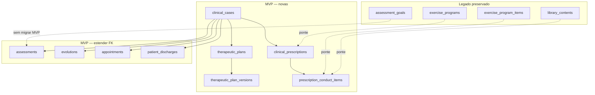
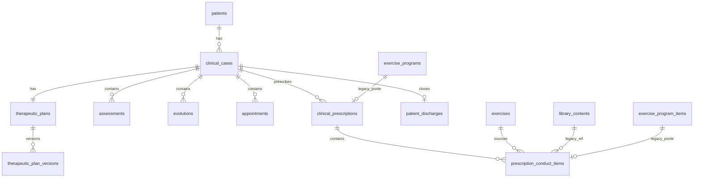

# FisioOS Core — Modelo Técnico de Dados (MVP)

> **Documento:** `docs/FISIOOS_TECHNICAL_DATA_MODEL.md`  
> **Versão:** MVP v1.0  
> **Etapa:** 4 — Technical Data Model (revisão de escopo)  
> **Escopo:** Migração mínima viável do Motor de Prescrição Clínica — **sem SQL, código, migrations ou alterações ao banco atual**  
> **Relacionado:** `docs/FISIOOS_CORE_ARCHITECTURE.md`, `docs/FISIOOS_DOMAIN_MODEL.md`, `docs/FISIOOS_DOMAIN_EVENTS.md`

---

## 1. Objetivo desta revisão

Reduzir o Technical Data Model completo (v1.0) ao **MVP Core Migration v1**: o menor conjunto de estruturas que introduz o **Caso Clínico** como agregado raiz, versiona o **Plano Terapêutico** e substitui a prescrição legada (`exercise_programs`) por **prescrição clínica** (`clinical_prescriptions`), **sem** normalizar ainda diagnóstico funcional, objetivos, execução, feedback, progressão ou log de eventos.

| Incluso no MVP | Fora do MVP (post-MVP) |
|----------------|------------------------|
| `clinical_cases` | `functional_diagnoses` |
| `clinical_case_id` nas entidades clínicas principais | `therapeutic_objectives` |
| `therapeutic_plans` | `session_executions` |
| `therapeutic_plan_versions` | `execution_feedback` |
| `clinical_prescriptions` | `progression_decisions` |
| `prescription_conduct_items` | `clinical_case_events` |

---

## 2. Fonte da verdade (MVP)

Durante o MVP, cada conceito de domínio tem **uma** fonte primária. Tabelas legadas permanecem legíveis; novas escritas clínicas convergem para o Core.

| Conceito de domínio | Fonte da verdade no MVP | Legado consultável |
|---------------------|-------------------------|-------------------|
| **Paciente** | `patients` | — |
| **Caso Clínico** | `clinical_cases` | Episódio inferido por paciente + datas (pré-backfill) |
| **Avaliação / Reavaliação** | `assessments` (+ `clinical_case_id`) | Sub-tabelas `assessment_*` inalteradas |
| **Diagnóstico funcional** | `assessments.diagnostico_fisio` | — (sem `functional_diagnoses`) |
| **Objetivos terapêuticos** | `assessment_goals` + `assessments.objetivos` / `therapeutic_goals` | Texto livre em avaliação |
| **Plano terapêutico** | `therapeutic_plans` + `therapeutic_plan_versions` | Campos espelhados em `assessments` até cutover UI |
| **Sessão** | `appointments` (+ `clinical_case_id`) | `status` legado da agenda |
| **Prescrição** | `clinical_prescriptions` + `prescription_conduct_items` | `exercise_programs` / `exercise_program_items` (read-only pós-cutover) |
| **Evolução** | `evolutions` (+ `clinical_case_id`) | Sem vínculo formal a prescrição no MVP |
| **Execução / Feedback** | `evolutions` (`procedimentos`, `resposta_paciente`, `conduta`) | — |
| **Alta** | `patient_discharges` (+ `clinical_case_id`) + `clinical_cases.status` | `patients.data_alta` / `discharge_id` (espelho UX) |
| **Catálogo exercício** | `exercises` (preferencial) · `library_contents` (ponte) | `library_contents` polimórfico |
| **Protocolo template** | `exercise_protocols` | `library_contents` tipo protocolo |
| **Progressão / Regressão** | Nova `therapeutic_plan_versions` + narrativa em `evolutions` | — |
| **Eventos de domínio** | Timestamps e FKs nas entidades | Sem `clinical_case_events` |

**Regra MVP:** se o dado existe no Core e no legado, **o Core prevalece** para prescrição e plano; **o legado prevalece** para diagnóstico funcional e objetivos até post-MVP.

---

## 3. Escopo MVP — tabelas novas

---

### 3.1 `clinical_cases`

**Domínio:** Caso Clínico (agregado raiz)

| Campo | Descrição |
|-------|-----------|
| `id`, `clinic_id`, `patient_id` | Identidade e tenant |
| `lead_professional_id` | Responsável principal |
| `chief_complaint` | Queixa / motivo |
| `status` | `draft`, `in_treatment`, `in_reassessment`, `discharged`, `cancelled` |
| `opened_at`, `closed_at` | Linha do tempo |
| `discharge_id` | FK → `patient_discharges` (quando alta formal) |
| `cancel_reason` | Se cancelado |
| `created_by`, `created_at`, `updated_at` | Auditoria mínima |

**Relacionamentos MVP:** 1:N com `assessments`, `evolutions`, `appointments`, `clinical_prescriptions`; 1:1 com `therapeutic_plans`; 0:1 com `patient_discharges`.

**Constraints conceituais**

- Prescrição nova exige `clinical_case_id` com status `in_treatment` ou `in_reassessment`.
- `discharged` / `cancelled` bloqueia nova prescrição aprovada.

---

### 3.2 `therapeutic_plans`

**Domínio:** Plano Terapêutico (cabeçalho)

| Campo | Descrição |
|-------|-----------|
| `id`, `clinic_id`, `clinical_case_id` | 1 plano por caso |
| `status` | `draft`, `active`, `suspended`, `closed` |
| `current_version_id` | FK → versão vigente |
| `frequency_text`, `estimated_duration_days`, `reassessment_interval_days` | Resumo operacional |
| `created_by`, `created_at`, `updated_at` | Auditoria |

**MVP:** critérios de progressão/regressão vivem dentro do `snapshot` JSON da versão — sem tabela dedicada.

---

### 3.3 `therapeutic_plan_versions`

**Domínio:** Versão imutável do plano

| Campo | Descrição |
|-------|-----------|
| `id`, `therapeutic_plan_id`, `version_number` | Sequência |
| `snapshot` | JSON versionado (ver § 5) |
| `change_summary`, `change_reason` | Diff semântico |
| `published_by`, `published_at` | Publicação |
| `created_at` | Criação |

**Constraint:** versão publicada é imutável; revisão = nova linha.

---

### 3.4 `clinical_prescriptions`

**Domínio:** Prescrição (sucessor de `exercise_programs`)

| Campo | Descrição |
|-------|-----------|
| `id`, `clinic_id`, `clinical_case_id`, `patient_id` | Vínculos |
| `professional_id`, `title`, `notes`, `frequency_text` | Conteúdo |
| `valid_from`, `valid_until` | Validade (opcional MVP) |
| `status` | `draft`, `approved`, `completed`, `superseded`, `revoked` |
| `approved_by`, `approved_at` | Emissão |
| `protocol_id`, `protocol_version_snapshot` | Origem template (opcional) |
| `sent_at`, `sent_via` | Entrega digital |
| `legacy_program_id` | Ponte → `exercise_programs` |
| `created_by`, `created_at`, `updated_at` | Auditoria |

**MVP:** sem `session_id` obrigatório; execução continua em `evolutions`.

---

### 3.5 `prescription_conduct_items`

**Domínio:** Item de conduta (sucessor de `exercise_program_items`)

| Campo | Descrição |
|-------|-----------|
| `id`, `prescription_id`, `sort_order` | Ordem |
| `conduct_type` | MVP: `exercise`, `orientation`, `other` |
| `exercise_id`, `library_content_id` | Referência catálogo |
| `custom_title`, `sets`, `reps`, `rest_seconds`, `instructions`, `notes` | Parâmetros |
| `snapshot` | Obrigatório na aprovação (ver § 5) |
| `legacy_item_id` | Ponte → `exercise_program_items` |
| `created_at` | Criação |

**MVP:** sem `execution_status` persistido — execução narrada em `evolutions`.

---

## 4. Extensões MVP — `clinical_case_id`

Coluna nullable na fase de backfill; NOT NULL após cutover por entidade.

| Tabela | Extensão MVP | Observação |
|--------|--------------|------------|
| `assessments` | `clinical_case_id` | Avaliações e reavaliações agrupadas no caso |
| `evolutions` | `clinical_case_id` | Evoluções por episódio |
| `appointments` | `clinical_case_id` | Sessões da agenda |
| `patient_discharges` | `clinical_case_id` | Alta do episódio, não só do paciente |

**Fora do MVP (sem coluna nova agora):** `reassessment_schedule.clinical_case_id`, `evolutions.prescription_id`, `appointments.session_phase`.

**Diagnóstico / objetivos:** permanecem em `assessments` e `assessment_goals` — **sem** novas tabelas.

---

## 5. Snapshots mínimos obrigatórios

Snapshots garantem imutabilidade clínica quando o catálogo muda após emissão.

### 5.1 `prescription_conduct_items.snapshot` (obrigatório em `approved`)

| Chave | Conteúdo mínimo |
|-------|-----------------|
| `source_type` | `exercise`, `library_content`, `custom` |
| `source_id` | UUID de origem (se houver) |
| `title` | Título exibido ao paciente |
| `instructions` | Texto prescrito |
| `parameters` | `{ sets, reps, rest_seconds }` efetivos |
| `captured_at` | Timestamp da emissão |

**Opcional MVP:** mídia URL, contraindicações — copiar se disponível no catálogo.

### 5.2 `therapeutic_plan_versions.snapshot` (obrigatório na publicação v1+)

| Chave | Conteúdo mínimo |
|-------|-----------------|
| `objectives_text` | De `assessments.objetivos` ou agregado de `assessment_goals` |
| `conducts_text` | De `assessments.condutas` |
| `frequency` | Texto ou `frequency_text` do plano |
| `reassessment_date` | De `assessments.next_reassessment_date` se existir |
| `diagnosis_fisio` | Cópia de `assessments.diagnostico_fisio` no momento |
| `captured_at` | Timestamp da publicação |

### 5.3 `clinical_prescriptions.protocol_version_snapshot` (se `protocol_id` preenchido)

| Chave | Conteúdo mínimo |
|-------|-----------------|
| `protocol_id`, `protocol_name` | Identificação |
| `protocol_updated_at` | Versão do template |
| `item_count` | Quantidade de itens do protocolo na instanciação |

---

## 6. Legado preservado

Nenhuma tabela legada é removida no MVP. Política:

| Tabela legada | Política MVP |
|---------------|--------------|
| `exercise_programs` | Read histórico; **zero writes** após cutover; ponte `legacy_program_id` |
| `exercise_program_items` | Idem; ponte `legacy_item_id` |
| `library_contents` | Catálogo legado; referência + snapshot em itens novos |
| `library_categories`, `library_favorites` | Inalteradas |
| `assessment_goals` | Fonte de objetivos até post-MVP |
| `assessments.*` (campos plano/diagnóstico) | Espelho legível; plano oficial migra para `therapeutic_plans` |
| `patients.data_alta`, `discharge_id` | Espelho UX; encerramento canônico em `clinical_cases` + `patient_discharges` |
| `exercises`, `exercise_protocols` | Catálogo preferencial para **novas** prescrições |

**Dual-read (transição):** UI pode ler prescrição por `clinical_prescriptions.id` ou, se ausente, por `exercise_programs.id` via mapeamento de migração — somente leitura no legado.

---

## 7. Fora do MVP — registro explícito

| Tabela / conceito | Motivo do adiamento | Onde fica no MVP |
|-------------------|---------------------|------------------|
| `functional_diagnoses` | Normalização prematura | `assessments.diagnostico_fisio` |
| `therapeutic_objectives` | `assessment_goals` suficiente | `assessment_goals` + JSON em avaliação |
| `session_executions` | Execução já registrada narrativamente | `evolutions.procedimentos`, `conduta` |
| `execution_feedback` | Feedback em evolução | `evolutions.resposta_paciente` |
| `progression_decisions` | Decisão manual documentada | Nova versão de plano + evolução |
| `clinical_case_events` | Auditoria via timestamps/FKs | `approved_at`, `published_at`, `created_at` |

Post-MVP: introduzir tabelas acima **sem** quebrar snapshots e FKs do MVP.

---

## 8. Relacionamentos MVP

---

## 9. Constraints conceituais (MVP)

1. Todo registro nas tabelas Core MVP possui `clinic_id` coerente.
2. `clinical_prescriptions.clinical_case_id` obrigatório em prescrições novas.
3. Prescrição `approved` exige ≥ 1 item com `snapshot` preenchido.
4. Plano `active` exige `current_version_id` com snapshot publicado.
5. Caso `discharged` / `cancelled` → bloquear nova prescrição `approved`.
6. Legado: nenhum delete em `exercise_programs` / items durante migração — apenas ponte.
7. Ambiguidade de backfill → **não gravar** até revisão manual (ver § 10).

---

## 10. Plano de backfill com dry-run

### 10.1 Princípios

- **Dry-run primeiro:** toda fase gera relatório antes de qualquer escrita.
- **Idempotência:** reexecutar backfill não duplica casos nem prescrições (chaves de correlação: `patient_id` + janela temporal + `legacy_program_id`).
- **Revisão manual obrigatória** para casos ambíguos — nunca atribuição automática silenciosa.

### 10.2 Casos ambíguos (exigem revisão manual)

| Situação | Ação dry-run | Ação pós-revisão |
|----------|--------------|------------------|
| Paciente com **múltiplas avaliações** sem alta, sobrepostas no tempo | Flag `AMBIGUOUS_MULTI_EPISODE` | Operador define N casos ou 1 caso consolidado |
| Paciente com **alta** e **novas avaliações** posteriores | Flag `EPISODE_AFTER_DISCHARGE` | Novo caso vs. reabertura — decisão clínica |
| `exercise_programs` sem avaliação/plano associável | Flag `ORPHAN_PROGRAM` | Vincular ao caso mais recente ou caso sintético |
| Registros clínicos com **gap > 180 dias** entre eventos | Flag `STALE_GAP` | Unificar ou separar episódios |
| **Duas clínicas** no histórico do paciente (multi-tenant) | Flag `CLINIC_BOUNDARY` | 1 caso por clínica — nunca cruzar |
| Avaliação / evolução / appointment **anterior** à abertura do caso inferido | Flag `TEMPORAL_INCONSISTENCY` | Ajustar `opened_at` ou realocar FK |

Relatório dry-run deve listar: `patient_id`, flags, registros afetados, sugestão automática (não aplicada).

### 10.3 Fases

#### Fase A — Dry-run: inventário

- Contar pacientes com atividade clínica, programs, assessments sem caso.
- Emitir CSV/relatório de flags (§ 10.2).
- **Zero writes.**

#### Fase B — Dry-run: simulação de casos

- Simular criação de `clinical_cases` por heurística:
  1. Paciente ativo sem alta → 1 caso `in_treatment`.
  2. Paciente com alta → 1 caso `discharged` fechado na `data_alta`.
  3. Avaliações posteriores à alta → caso adicional simulado.
- Simular atribuição de `clinical_case_id` a assessments, evolutions, appointments, discharges por proximidade temporal.
- Listar conflitos restantes → fila **revisão manual**.

#### Fase C — Apply: casos e FKs (após aprovação do relatório)

1. Inserir `clinical_cases` aprovados (automáticos + manuais).
2. Atualizar `clinical_case_id` nas quatro tabelas principais.
3. Validar: nenhum registro clínico recente (ex.: 12 meses) sem caso, salvo exceções documentadas.

#### Fase D — Dry-run: planos

- Simular `therapeutic_plans` + v1 `therapeutic_plan_versions` a partir da **primeira avaliação concluída** de cada caso.
- Snapshot mínimo (§ 5.2) preview no relatório.

#### Fase E — Apply: planos

- Inserir planos e versão 1 publicada.
- Marcar `therapeutic_plans.status = active` para casos `in_treatment`.

#### Fase F — Dry-run: prescrições

- Simular 1:1 `exercise_programs` → `clinical_prescriptions`.
- Simular items com snapshot mínimo (§ 5.1).
- Reportar programs órfãos e conteúdos `library_contents` sem mapeamento para `exercises`.

#### Fase G — Apply: prescrições

- Inserir prescrições + itens; preencher pontes legado.
- Status migrado: `sent_at` preenchido → `approved`; caso contrário → `approved` se program existia em uso, senão `completed` histórico.

#### Fase H — Cutover

| Critério | Meta |
|----------|------|
| Novas prescrições | 100% em `clinical_prescriptions` |
| Writes em `exercise_programs` | 0 |
| Registros recentes com `clinical_case_id` | 100% (exceto fila manual) |
| Snapshots em prescrições aprovadas | 100% |

---

## 11. Mapeamento resumido legado → MVP

| Origem | Destino MVP | Notas |
|--------|-------------|-------|
| Episódio implícito por paciente | `clinical_cases` | Heurística + manual |
| `assessments` | + `clinical_case_id` | Diagnóstico permanece na linha |
| `assessment_goals` | *(sem migrar)* | Fonte de objetivos MVP |
| `assessments.objetivos/condutas` | `therapeutic_plan_versions.snapshot` v1 | Cópia na publicação |
| `exercise_programs` | `clinical_prescriptions` | `legacy_program_id` |
| `exercise_program_items` | `prescription_conduct_items` | `legacy_item_id` + snapshot |
| `library_contents` | `prescription_conduct_items.library_content_id` | Ponte + snapshot |

---

## 12. Resumo executivo MVP

| Categoria | Itens |
|-----------|-------|
| **Criar** | `clinical_cases`, `therapeutic_plans`, `therapeutic_plan_versions`, `clinical_prescriptions`, `prescription_conduct_items` |
| **Estender** | `clinical_case_id` em `assessments`, `evolutions`, `appointments`, `patient_discharges` |
| **Legado preservado** | `exercise_programs`, `exercise_program_items`, `library_contents`, `assessment_goals`, campos plano/diagnóstico em `assessments` |
| **Adiar** | `functional_diagnoses`, `therapeutic_objectives`, `session_executions`, `execution_feedback`, `progression_decisions`, `clinical_case_events` |

---

**FISIOOS TECHNICAL DATA MODEL MVP v1.0**
