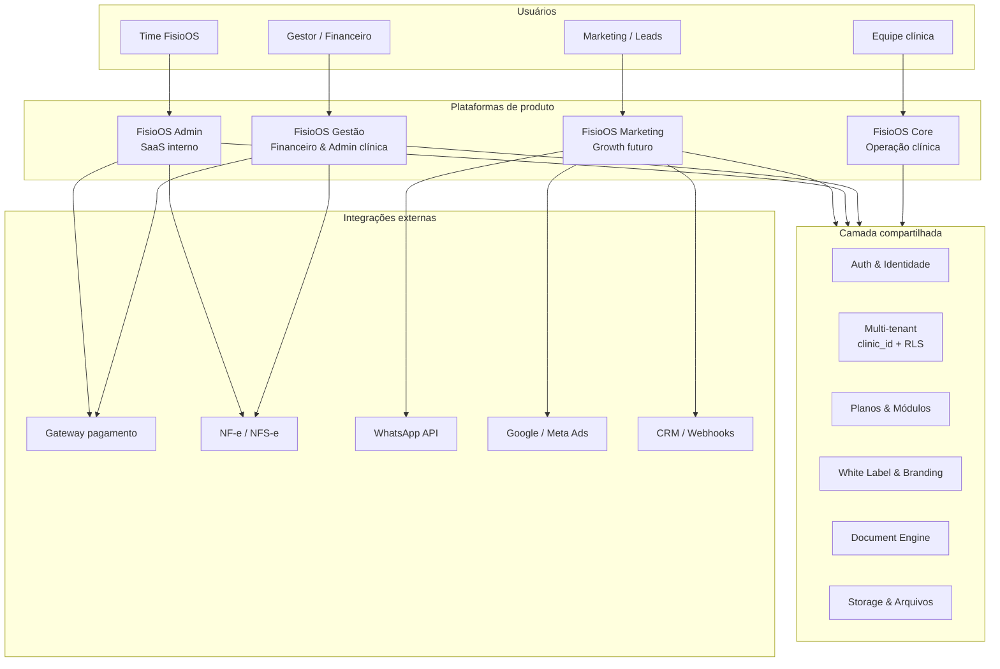
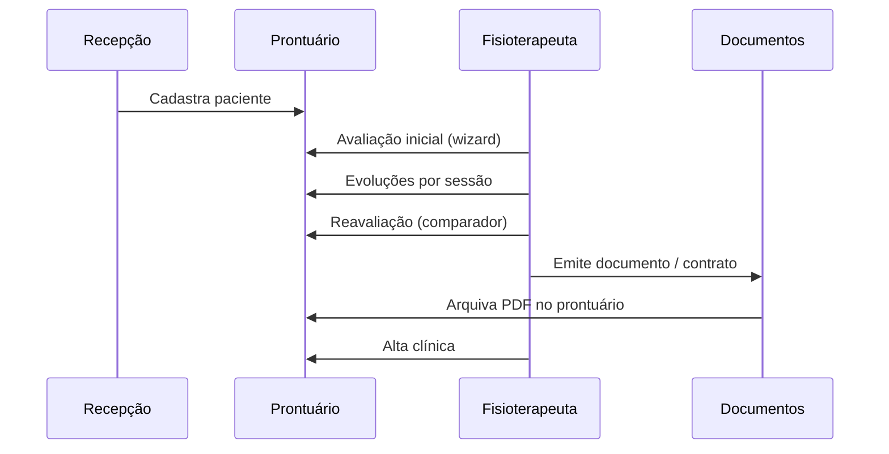
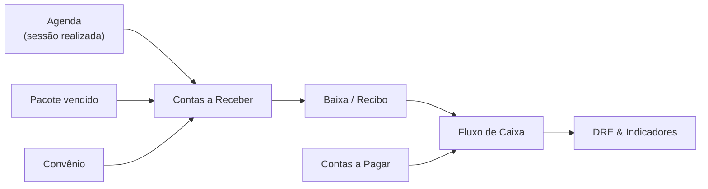
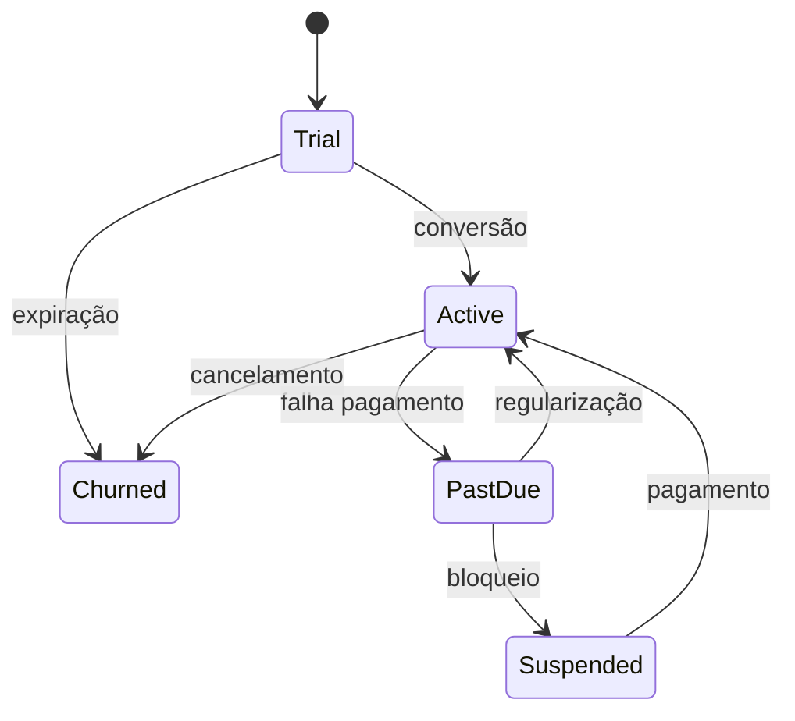
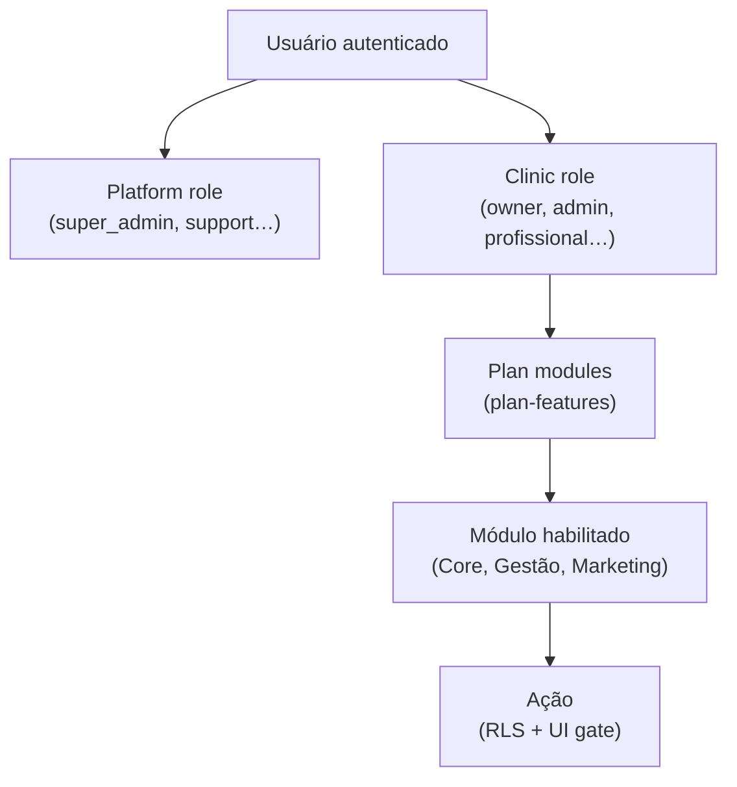
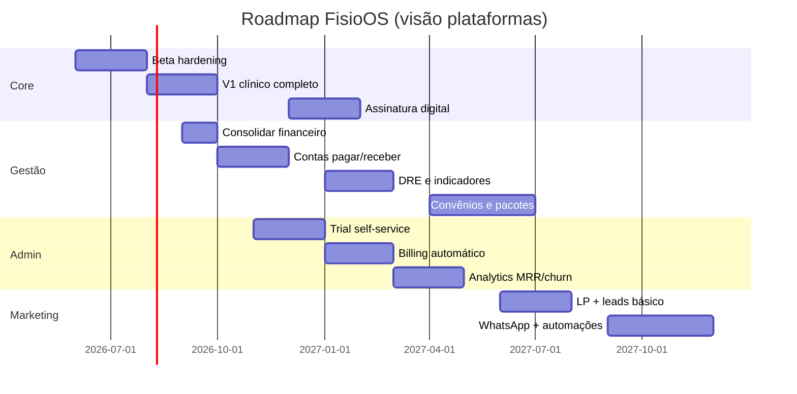
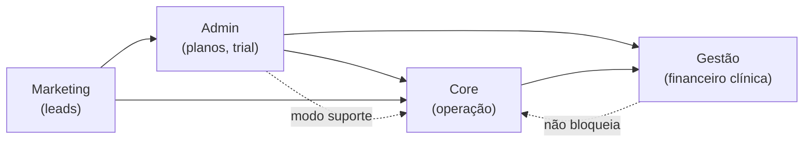

# FisioOS — Arquitetura Oficial da Plataforma

> **Documento:** `docs/architecture/FISIOOS_PLATFORM_ARCHITECTURE.md`  
> **Versão:** 1.0  
> **Data:** 2026-06-28  
> **Escopo:** Planejamento arquitetural — **sem alteração de código, banco, APIs ou UI**  
> **Horizonte:** 3–5 anos de evolução do produto

---

## Sumário

1. [Visão geral](#1-visão-geral)
2. [Mapa geral da arquitetura](#2-mapa-geral-da-arquitetura)
3. [Princípios arquiteturais](#3-princípios-arquiteturais)
4. [Plataforma 1 — FisioOS Core](#4-plataforma-1--fisioos-core)
5. [Plataforma 2 — FisioOS Gestão](#5-plataforma-2--fisioos-gestão)
6. [Plataforma 3 — FisioOS Admin](#6-plataforma-3--fisioos-admin)
7. [Plataforma 4 — FisioOS Marketing](#7-plataforma-4--fisioos-marketing)
8. [Modelo de permissões unificado](#8-modelo-de-permissões-unificado)
9. [Integrações transversais](#9-integrações-transversais)
10. [Escalabilidade e infraestrutura](#10-escalabilidade-e-infraestrutura)
11. [Roadmap de implementação](#11-roadmap-de-implementação)
12. [Matriz de prioridade, complexidade e tempo](#12-matriz-de-prioridade-complexidade-e-tempo)
13. [Dependências entre plataformas](#13-dependências-entre-plataformas)
14. [Glossário](#14-glossário)

---

## 1. Visão geral

O **FisioOS** é uma plataforma SaaS multi-tenant para clínicas de fisioterapia e reabilitação. A arquitetura de produto divide-se em **quatro plataformas independentes**, compartilhando identidade, billing e dados de tenant, mas com objetivos, usuários e ciclos de release distintos.

| Plataforma | Código interno | Público principal | Estado atual (repo) |
|------------|----------------|-------------------|---------------------|
| **FisioOS Core** | `core` | Equipe clínica | **Maduro / em produção piloto** |
| **FisioOS Gestão** | `gestao` | Gestores e financeiro | **Parcial** (`financeiro`, `recibos`) |
| **FisioOS Admin** | `admin` | Time FisioOS (SaaS) | **Parcial** (`admin-saas`) |
| **FisioOS Marketing** | `marketing` | Marketing / growth | **Placeholder** (`marketing`) |

### Stack técnica compartilhada (referência)

| Camada | Tecnologia |
|--------|------------|
| Frontend | React 19, TanStack Router, TanStack Query, Tailwind |
| Runtime | TanStack Start (Nitro) |
| Backend / dados | Supabase (Postgres + RLS + Auth + Storage) |
| PDFs | Motor interno (`pdf-engine`) |
| Deploy | Lovable / Vercel-like (conforme ambiente) |

---

## 2. Mapa geral da arquitetura

### Fronteiras de responsabilidade

| Fronteira | Regra |
|-----------|-------|
| Core ↔ Gestão | Core **registra** eventos clínicos; Gestão **monetiza** e **concilia** (sessões, pacotes, convênios). |
| Core ↔ Admin | Admin **provisiona** clínicas e planos; Core **consome** features habilitadas. |
| Gestão ↔ Admin | Admin **cobra** assinatura SaaS; Gestão **cobra** paciente/convênio da clínica. |
| Marketing ↔ demais | Marketing **gera leads**; Admin **converte** em trial/cliente; Core **retém** uso. |

---

## 3. Princípios arquiteturais

1. **Multi-tenant first** — Todo dado de negócio carrega `clinic_id`; RLS como última linha de defesa.
2. **Produtos separados, identidade única** — Um login, múltiplos módulos gated por plano e papel.
3. **Core clínico intocável em releases financeiros** — Gestão e Admin não quebram fluxos assistenciais.
4. **Server-side para operações sensíveis** — Billing, convites, suporte e exports em server functions.
5. **Documentos como artefatos imutáveis** — PDF emitido = snapshot; preview ≠ arquivado.
6. **White label por clínica** — Branding, logo e cores isolados por `clinic_id`.
7. **Evolução incremental** — Consolidar o existente antes de novos domínios (ver roadmap).

---

## 4. Plataforma 1 — FisioOS Core

### Objetivo

Suportar a **operação clínica diária**: agenda, prontuário, avaliação, evolução, documentos e continuidade do cuidado (incluindo domiciliar).

### Usuários

| Papel | Descrição |
|-------|-----------|
| **Owner / Gestor clínico** | Visão ampla, configurações, usuários |
| **Fisioterapeuta** | Avaliações, evoluções, documentos, agenda |
| **Recepção / Admin clínico** | Pacientes, agenda, documentos administrativos |
| **Profissional multi-clínica** | Acesso a várias clínicas via `clinic_members` |

### Módulos

| Módulo | Rota / área atual | Responsabilidade |
|--------|-------------------|------------------|
| **Dashboard** | `/app`, `/app/dashboard-clinico` | KPIs operacionais, agenda do dia, pendências |
| **Agenda** | `/app/agenda` | Agendamentos, status, profissional, paciente |
| **Pacientes** | `/app/pacientes` | Cadastro, prontuário, timeline clínica |
| **Avaliações** | Wizard + `/app/avaliacoes` | Avaliação inicial, formulários, perfis clínicos |
| **Evoluções** | `/app/evolucoes`, prontuário | Registro por sessão, SOAP, EVA |
| **Reavaliações** | `/app/reavaliacoes` | Comparador, cronograma, workspace premium |
| **Altas** | `/app/altas`, `DischargeWizard` | Alta clínica, comparativo final |
| **Documentos** | `/app/documentos` | Emissão, templates, merge tags, PDF arquivado |
| **Biblioteca** | `/app/biblioteca` | Materiais institucionais, cartilhas PDF |
| **Home Care** | `/app/home-care` | Visitas domiciliares, KPIs diferenciais |
| **White Label** | `/app/configuracoes`, branding | Logo, cores, rodapé PDF, identidade |
| **Templates** | `/app/templates` | Modelos de documento por clínica |
| **Relatórios clínicos** | `/app/relatorios` | Indicadores assistenciais (não financeiros) |
| **Profissionais** | `/app/profissionais` | Cadastro CREFITO, responsável técnico |
| **Usuários clínica** | `/app/usuarios` | Membros, convites, papéis locais |

### Permissões (Core)

| Permissão | Owner | Admin clínico | Fisioterapeuta | Recepção |
|-----------|-------|---------------|----------------|----------|
| Ver prontuário | ✓ | ✓ | ✓ (seus pacientes*) | ✓ |
| Editar avaliação finalizada | ✓ | config | — | — |
| Emitir documento | ✓ | ✓ | ✓ | config |
| Configurar white label | ✓ | — | — | — |
| Modo suporte (read-only emit) | — | — | — | — |

\* Política configurável por clínica (futuro: escopo por profissional).

### Dependências

| Dependência | Tipo |
|-------------|------|
| Supabase Auth | Identidade |
| `clinic_members`, RLS | Multi-tenant |
| `plan-features` | Gate de módulos (Home Care, inteligência) |
| PDF Engine | Documentos, biblioteca, validação QR |
| Storage `documents` | PDFs arquivados |

### Integrações

| Integração | Uso |
|------------|-----|
| Supabase Storage | PDFs, logos |
| Validação pública | `/validar/:hash` |
| (Futuro) Assinatura digital | Wizard assinaturas |
| (Futuro) TISS / convênio | Autorização de sessões → Gestão |

### Fluxos principais

### Escalabilidade (Core)

| Dimensão | Estratégia |
|----------|------------|
| **Dados** | Paginação server-side em pacientes; índices por `clinic_id` + datas |
| **PDF** | Geração assíncrona / fila para lotes; cache de logo por clínica |
| **UI** | Code-splitting por rota; lazy load de wizard e PDF preview |
| **Equipe dev** | Extrair camada de serviço clínico; unificar wizard + form clássico |

---

## 5. Plataforma 2 — FisioOS Gestão

### Objetivo

Gestão **financeira e administrativa da clínica** (não do SaaS FisioOS): fluxo de caixa, receitas de pacientes, convênios, contratos terapêuticos e indicadores gerenciais.

### Usuários

| Papel | Descrição |
|-------|-----------|
| **Owner / Sócio** | DRE, indicadores, aprovações |
| **Financeiro** | Contas a pagar/receber, conciliação |
| **Gestor operacional** | Pacotes, orçamentos, metas |
| **Recepção** | Cobrança avulsa, recibos (limitado) |

### Módulos planejados

| Módulo | Descrição | Estado |
|--------|-----------|--------|
| **Financeiro (base)** | Lançamentos, categorias | Parcial (`/app/financeiro`) |
| **Recibos** | Recibo PDF, histórico | Parcial (`/app/recibos`) |
| **Fluxo de Caixa** | Entradas/saídas diárias, saldo projetado | Planejado |
| **Contas a Pagar** | Fornecedores, vencimentos, status | Planejado |
| **Contas a Receber** | Pacientes, convênios, inadimplência | Planejado |
| **DRE** | Demonstrativo por período e centro de custo | Planejado |
| **Orçamentos** | Proposta comercial antes do plano | Planejado |
| **Pacotes** | Sessões agrupadas (ex.: 20 sessões) | Planejado |
| **Planos terapêuticos (comercial)** | Vínculo pacote ↔ plano clínico Core | Planejado |
| **Contratos** | Contrato comercial + vínculo doc Core | Planejado |
| **Convênios** | Operadoras, tabelas, glosas | Planejado |
| **Receitas** | Classificação de entradas | Planejado |
| **Despesas** | Classificação de saídas | Planejado |
| **Centros de Custo** | Unidades, salas, profissionais | Planejado |
| **Indicadores financeiros** | Ticket médio, margem, inadimplência | Planejado |
| **Relatórios gerenciais** | Export CSV/PDF gerencial | Planejado |

### Permissões (Gestão)

| Permissão | Owner | Financeiro | Gestor | Recepção |
|-----------|-------|------------|--------|----------|
| Ver DRE | ✓ | ✓ | ✓ | — |
| Lançar despesa | ✓ | ✓ | — | — |
| Baixar recebível | ✓ | ✓ | ✓ | ✓ |
| Alterar plano de contas | ✓ | config | — | — |
| Emitir recibo | ✓ | ✓ | ✓ | ✓ |

### Dependências

| Dependência | Origem |
|-------------|--------|
| **FisioOS Core** | Paciente, sessão (agenda), profissional |
| **Planos SaaS** | Módulo `gestao_financeira` habilitado |
| **Admin** | Status da clínica (ativa/inadimplente SaaS) |
| **Gateway pagamento** | Pix, cartão, boleto (fase 2+) |

### Integrações

| Integração | Finalidade |
|------------|------------|
| Open Banking / OFX | Conciliação bancária |
| Gateway (Stripe, Asaas, etc.) | Cobrança paciente |
| NF-e / NFS-e | Notas de serviço clínica |
| Contabilidade (export) | SPED, CSV contador |
| Core: agenda | Baixa automática por sessão realizada |

### Fluxos principais

### Escalabilidade (Gestão)

| Dimensão | Estratégia |
|----------|------------|
| **Ledger** | Modelo de lançamentos contábeis imutáveis (partida dobrada opcional) |
| **Relatórios** | Views materializadas por `clinic_id` + mês |
| **Batch** | Fechamento mensal assíncrono |
| **Isolamento** | Schema ou prefixo `gestao_*`; nunca misturar com tabelas clínicas assistenciais |

---

## 6. Plataforma 3 — FisioOS Admin

### Objetivo

Sistema **interno do SaaS FisioOS** para operar clientes, assinaturas, suporte, métricas de negócio e white label global.

### Usuários

| Papel | Descrição |
|-------|-----------|
| **Super Admin** | Acesso total plataforma |
| **Platform Admin** | Clientes, planos, suporte |
| **Suporte N1/N2** | Modo suporte, logs, impersonate controlado |
| **Financeiro SaaS** | Faturamento, NF, inadimplência |
| **CS / CRM** | Trial, onboarding, churn |

### Módulos planejados

| Módulo | Descrição | Estado |
|--------|-----------|--------|
| **Clientes (Clínicas)** | CRUD clínica, provisionamento | Parcial (`admin-saas`) |
| **Planos** | Módulos, limites, preços | Parcial |
| **Assinaturas** | Ciclo, upgrade/downgrade | Parcial |
| **Trial** | Período, conversão, expiração | Planejado |
| **Cobranças** | Faturas SaaS, retry | Planejado |
| **Bloqueios** | Suspensão por inadimplência | Parcial |
| **Faturamento** | Ciclo mensal/anual | Planejado |
| **Notas fiscais SaaS** | NF serviço FisioOS → clínica | Planejado |
| **CRM interno** | Pipeline trial → pago | Planejado |
| **Suporte** | Tickets, modo suporte | Parcial |
| **Logs / Auditoria** | `saas_audit_log`, trilhas | Parcial |
| **Modo suporte** | Sessão read-only em clínica cliente | Implementado |
| **Analytics** | Uso por clínica, feature adoption | Planejado |
| **MRR / ARR** | Receita recorrente | Planejado |
| **LTV / CAC / Churn** | Métricas SaaS | Planejado |
| **White Label global** | Temas, domínios customizados | Planejado |

### Permissões (Admin)

| Permissão | Super Admin | Platform Admin | Suporte | Financeiro SaaS |
|-----------|-------------|----------------|---------|-----------------|
| Criar clínica | ✓ | ✓ | — | — |
| Alterar plano | ✓ | ✓ | — | — |
| Modo suporte | ✓ | ✓ | ✓ | — |
| Ver MRR global | ✓ | ✓ | — | ✓ |
| Emitir NF SaaS | ✓ | — | — | ✓ |
| Impersonate owner | ✓ | config | — | — |

### Dependências

| Dependência | Descrição |
|-------------|-----------|
| Server Functions | `saas-admin.functions.ts` — padrão maduro |
| Supabase Service Role | Operações cross-tenant controladas |
| Gateway pagamento | Assinaturas SaaS |
| Core + Gestão | Dados de uso para analytics |

### Integrações

| Integração | Finalidade |
|------------|------------|
| Stripe / Asaas / Pagar.me | Billing SaaS |
| NF-e SaaS | Nota FisioOS |
| Sentry / APM | Erros por tenant |
| E-mail transacional | Trial, cobrança, convite |
| Webhooks | Eventos de pagamento |

### Fluxos principais

### Escalabilidade (Admin)

| Dimensão | Estratégia |
|----------|------------|
| **Provisionamento** | Self-service signup (fase futura); hoje manual |
| **Audit** | Append-only logs; nunca delete |
| **Support mode** | Sessão temporária com TTL e banner obrigatório |
| **Métricas** | Warehouse read-only (BigQuery / ClickHouse) em escala |

---

## 7. Plataforma 4 — FisioOS Marketing

### Objetivo

**Aquisição e retenção** de pacientes e clínicas: landing pages, campanhas, automações e funis — separado da operação clínica.

### Usuários

| Papel | Descrição |
|-------|-----------|
| **Marketing clínica** | Campanhas locais, WhatsApp |
| **Growth FisioOS** | Aquisição de clínicas (B2B) |
| **Agência parceira** | Acesso limitado por clínica |

### Módulos planejados

| Módulo | Descrição | Estado |
|--------|-----------|--------|
| **Landing Pages** | Builder ou templates por clínica | Placeholder |
| **Campanhas** | E-mail, SMS, push | Planejado |
| **Google Ads** | UTM, conversão, offline import | Planejado |
| **Meta Ads** | Pixel, leads, CAPI | Planejado |
| **WhatsApp** | Templates, respostas, agendamento | Planejado |
| **CRM marketing** | Lead → paciente | Planejado |
| **Automações** | Fluxos (ex.: pós-alta, reativação) | Planejado |
| **Funis** | Etapas, taxa conversão | Planejado |
| **Leads** | Captura, scoring, atribuição | Planejado |

### Permissões (Marketing)

| Permissão | Owner clínica | Marketing | Growth FisioOS |
|-----------|---------------|-----------|----------------|
| Editar LP clínica | ✓ | ✓ | — |
| Ver leads | ✓ | ✓ | — |
| Campanhas B2B SaaS | — | — | ✓ |
| Budget Ads | ✓ | config | — |

### Dependências

| Dependência | Descrição |
|-------------|-----------|
| **Core** | Conversão lead → paciente |
| **Admin** | Trial a partir de campanha B2B |
| **Gestão** | ROI por campanha (opcional) |
| **LGPD** | Consentimento e opt-out |

### Integrações

| Integração | Finalidade |
|------------|------------|
| Google Ads API | Campanhas, conversões |
| Meta Marketing API | Leads, custom audiences |
| WhatsApp Business API | Mensagens |
| RD Station / HubSpot (opcional) | CRM externo |
| Analytics (GA4, PostHog) | Funil |

### Escalabilidade (Marketing)

| Dimensão | Estratégia |
|----------|------------|
| **Eventos** | Fila de eventos (lead_created, appointment_booked) |
| **Isolamento** | Dados de campanha por `clinic_id` |
| **Rate limit** | WhatsApp e e-mail com quotas por plano |

---

## 8. Modelo de permissões unificado

### Camadas

### Matriz resumida por plataforma

| Plataforma | Gate principal | Implementação alvo |
|------------|----------------|-------------------|
| Core | `clinic_members.role` + RLS | Supabase policies |
| Gestão | role + `gestao_*` permissions | RLS + server functions |
| Admin | `platform_admins` / super admin | Server-only |
| Marketing | plan module + clinic role | RLS + feature flag |

---

## 9. Integrações transversais

| Integração | Core | Gestão | Admin | Marketing |
|------------|------|--------|-------|-----------|
| Supabase Auth | ✓ | ✓ | ✓ | ✓ |
| Supabase Storage | ✓ | ✓ | ✓ | — |
| PDF Engine | ✓ | ✓ (recibos) | — | — |
| E-mail | convites | cobrança | trial/billing | campanhas |
| Pagamentos | — | paciente | SaaS | — |
| NF | — | clínica | FisioOS | — |
| WhatsApp | lembrete agenda | — | — | ✓ |
| Analytics | uso clínico | financeiro | MRR/churn | funis |

---

## 10. Escalabilidade e infraestrutura

### Fases de escala

| Fase | Clínicas | Foco |
|------|----------|------|
| **Beta** | 1–10 | RLS correto, CI, observabilidade |
| **V1** | 10–100 | Paginação, code-split, staging |
| **V1.5** | 100–500 | Read replicas, cache, filas PDF |
| **V2** | 500+ | Warehouse analytics, micro-frontends opcionais |

### Diretrizes técnicas (sem implementar agora)

1. **Monorepo lógico** — Pastas ou packages: `@fisioos/core`, `@fisioos/gestao`, `@fisioos/admin`, `@fisioos/marketing`.
2. **Server functions por domínio** — Padrão `saas-admin.functions.ts` estendido ao clínico sensível.
3. **Event bus interno** — `clinic.session.completed` → Gestão; `clinic.created` → Admin CRM.
4. **Feature flags** — `plan-features` evolui para registry versionado.

---

## 11. Roadmap de implementação

Horizonte em **sprints de 2 semanas** (1 dev full-time). Marcos alinhados ao `PLANO-MESTRE.md`.

### Fase 0 — Fundação (agora → Beta)

**Foco:** Core estável + Admin mínimo + Gestão não regressiva.

- Tenant-safe em BI e dashboards
- Segurança convites e RLS
- CI, Sentry, README, staging
- Unificar recibos vs financeiro (decisão produto)

### Fase 1 — V1.0 Core (2–4 meses)

- Onboarding visível, wizard único
- Paginação pacientes
- PDF assíncrono para lotes
- Home Care e módulos gated corretamente

### Fase 2 — Gestão MVP (4–8 meses)

- Fluxo de caixa + contas a pagar/receber
- Pacotes vinculados a sessões (agenda)
- DRE simplificado
- Recibos integrados ao ledger

### Fase 3 — Admin SaaS (6–10 meses)

- Trial + conversão automática
- Cobrança recorrente SaaS
- Dashboard MRR, churn, LTV
- CRM trial pipeline

### Fase 4 — Marketing (12+ meses)

- Landing pages por clínica
- Captura de leads → paciente
- WhatsApp lembretes
- Campanhas B2B para aquisição de clínicas

---

## 12. Matriz de prioridade, complexidade e tempo

Legenda: **P** = Prioridade (P0 crítico → P3 baixo), **C** = Complexidade (S/M/L/XL), **T** = Tempo estimado (1 dev).

### FisioOS Core

| Módulo | P | C | T | Dependências |
|--------|---|---|---|--------------|
| Dashboard | P1 | S | 1–2 sem | BI tenant-safe |
| Agenda | P0 | M | contínuo | — |
| Pacientes | P0 | M | 2–3 sem | paginação server |
| Avaliações | P0 | L | 4–6 sem | unificar wizard/form |
| Evoluções | P0 | M | 2 sem | — |
| Reavaliações | P1 | L | 3–4 sem | avaliações |
| Altas | P1 | M | 2–3 sem | avaliações, evoluções |
| Documentos | P0 | L | contínuo | PDF engine |
| Biblioteca | P2 | M | 2 sem | PDF engine |
| Home Care | P2 | M | 3 sem | plan feature |
| White Label | P1 | S | 1–2 sem | storage logos |
| Templates | P1 | M | 2 sem | documentos |
| Relatórios clínicos | P1 | M | 2 sem | tenant-safe |
| Assinaturas digitais | P2 | XL | 8–12 sem | legal, PDF |

### FisioOS Gestão

| Módulo | P | C | T | Dependências |
|--------|---|---|---|--------------|
| Financeiro (consolidar) | P0 | M | 3–4 sem | decisão recibos |
| Recibos | P0 | M | 2 sem | PDF receipt |
| Fluxo de Caixa | P1 | M | 3–4 sem | ledger base |
| Contas a Pagar | P1 | M | 3 sem | fluxo caixa |
| Contas a Receber | P1 | M | 3 sem | agenda, pacientes |
| DRE | P2 | L | 4–6 sem | plano contas |
| Orçamentos | P2 | M | 2–3 sem | pacotes |
| Pacotes | P1 | L | 4–5 sem | Core agenda |
| Planos comerciais | P2 | M | 2 sem | pacotes |
| Contratos comerciais | P2 | M | 3 sem | Core documentos |
| Convênios | P3 | XL | 8–12 sem | TISS futuro |
| Centros de Custo | P2 | M | 2 sem | DRE |
| Indicadores financeiros | P2 | L | 4 sem | DRE, CR/CP |
| Relatórios gerenciais | P2 | M | 3 sem | indicadores |

### FisioOS Admin

| Módulo | P | C | T | Dependências |
|--------|---|---|---|--------------|
| Clientes / provision | P0 | M | contínuo | server functions |
| Planos | P0 | S | 1–2 sem | — |
| Assinaturas | P0 | M | 3–4 sem | gateway |
| Trial | P1 | M | 3 sem | assinaturas |
| Cobranças | P1 | L | 4–6 sem | gateway |
| Bloqueios | P0 | S | 1 sem | assinaturas |
| Faturamento | P1 | L | 4 sem | cobranças |
| NF SaaS | P2 | L | 6–8 sem | faturamento |
| CRM interno | P2 | L | 6 sem | trial |
| Suporte / modo suporte | P0 | M | contínuo | audit log |
| Logs / auditoria | P0 | M | 2–3 sem | — |
| Analytics uso | P2 | L | 4–6 sem | eventos |
| MRR / ARR / LTV / CAC / Churn | P2 | L | 4–6 sem | billing |
| White Label global | P3 | XL | 8+ sem | domínios |

### FisioOS Marketing

| Módulo | P | C | T | Dependências |
|--------|---|---|---|--------------|
| Landing Pages | P3 | L | 6–8 sem | Core pacientes |
| Campanhas e-mail | P3 | L | 4–6 sem | LGPD |
| Google Ads | P3 | L | 4 sem | LP, analytics |
| Meta Ads | P3 | L | 4 sem | LP, leads |
| WhatsApp | P2 | L | 6–8 sem | API oficial |
| CRM marketing | P3 | L | 6 sem | leads |
| Automações | P3 | XL | 8–12 sem | CRM, WhatsApp |
| Funis | P3 | M | 3–4 sem | analytics |
| Leads | P2 | M | 3 sem | LP |

---

## 13. Dependências entre plataformas

| De | Para | Relação |
|----|------|---------|
| Admin → Core | Habilita módulos via `clinic_plans` | Hard |
| Core → Gestão | Sessões e pacientes alimentam recebíveis | Soft (eventual) |
| Core → Admin | Métricas de uso para churn | Soft |
| Marketing → Core | Lead vira paciente | Soft |
| Marketing → Admin | Lead vira trial SaaS | Soft |
| Gestão → Core | **Nenhuma** dependência clínica | — |

---

## 14. Glossário

| Termo | Definição |
|-------|-----------|
| **Tenant** | Clínica (`clinic_id`) isolada no multi-tenant |
| **Core** | Domínio assistencial — prontuário, sessões, documentos clínicos |
| **Gestão** | Domínio financeiro **da clínica** |
| **Admin** | Domínio **do SaaS FisioOS** (operador da plataforma) |
| **White Label** | Marca visual da clínica (logo, cores, PDF) |
| **Modo suporte** | Sessão Admin em clínica cliente, emissão bloqueada |
| **MRR** | Monthly Recurring Revenue — receita recorrente mensal SaaS |
| **RLS** | Row Level Security — Postgres Supabase |

---

## Referências internas

| Documento | Conteúdo |
|-----------|----------|
| `docs/auditorias/auditoria-arquitetura.md` | Estado técnico atual |
| `docs/backlog/BACKLOG-OFICIAL.md` | Backlog Beta → V2 |
| `docs/roadmap/PLANO-MESTRE.md` | Sprints e marcos |
| `docs/design-language/FISIOOS_DESIGN_LANGUAGE.md` | Linguagem visual |
| `ARCHITECTURE_FREEZE.md` | Congelamento de schema (quando aplicável) |

---

*Documento normativo de arquitetura de produto. Alterações de schema, API ou código exigem ADR em `docs/decisoes/` e aprovação explícita conforme governança do projeto.*
