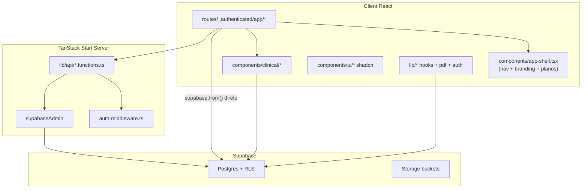
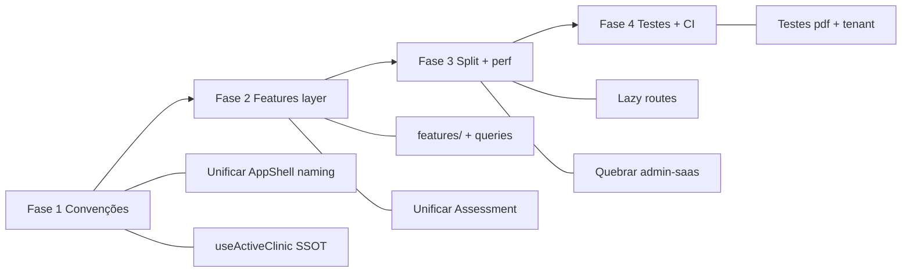

# Auditoria de Arquitetura — FisioOS (READ ONLY)

Análise estática do repositório. Nenhum arquivo foi alterado.

---

## Resumo executivo

O FisioOS é um **TanStack Start + React 19 + Supabase** com backend multi-tenant maduro (documentado em `ARCHITECTURE_FREEZE.md`) e frontend que **cresceu por acréscimo**: rotas grandes, Supabase direto nos componentes, dois pipelines de PDF, dois fluxos de avaliação e uma migração de design system **incompleta**. A base é utilizável e coerente no domínio clínico (`components/clinical/`, `useActiveClinic`), mas a **escalabilidade de equipe, testabilidade e manutenção** são limitadas por monólitos de UI, ausência total de testes e camada de dados inexistente no client.

---

## Mapa atual (visão rápida)



---

## Matriz de achados

### CRÍTICO

| Área | Achado |
|------|--------|
| **Testabilidade** | **Zero** arquivos `*.test.*` / `*.spec.*` em `src/`. Lógica crítica (PDF, recibos, avaliações, multi-tenant) não tem rede de segurança automatizada. |
| **Componentização** | Monólitos: `admin-saas.tsx` (~1.557 linhas), `assessment-wizard.tsx` (~926), `assessment-form.tsx` (~751), `documentos.tsx` (~729), `saas-admin.functions.ts` (~1.135). |
| **Reutilização / Coesão** | Dois fluxos paralelos de avaliação (`AssessmentWizard` + `AssessmentForm`) usados no mesmo prontuário — duplicação funcional e de manutenção. |
| **Organização / Nomenclatura** | Colisão de nomes: `components/app-shell.tsx` = shell de navegação; `components/layout/AppShell.tsx` = wrapper de página. Mesmo nome, responsabilidades opostas. |
| **Multi-tenant (client)** | Contexto de clínica resolvido de **3 formas**: `useActiveClinic`, `useRoles`, e queries ad hoc `["active-clinic-id"]` em `pacientes/index.tsx` e `profissionais.tsx`. |
| **Escalabilidade** | Sem `lazyRouteComponent` / `React.lazy` — bundle único carrega jsPDF (~1.3k linhas), recharts, admin-saas, etc. juntos. |
| **Separação de responsabilidades** | Rotas = UI + queries Supabase + mutations + regras de negócio + export CSV/PDF. Não há camada de serviço/repositório no domínio clínico. |

### ALTO

| Área | Achado |
|------|--------|
| **Server Functions** | Padrão maduro só no **admin/SaaS** (`lib/api/*.functions.ts` + `requireSupabaseAuth`). Domínio clínico (pacientes, documentos, recibos) usa **client Supabase direto**. `recibos.functions.ts` tem sufixo `.functions` mas **não é server function** — nomenclatura enganosa. |
| **TanStack Query** | `QueryClient` sem defaults (`router.tsx`); `useActiveClinic` com `staleTime: 0` + `refetchOnMount: "always"`. Refetch agressivo e cache frágil. |
| **TanStack Router** | Rotas autenticadas com `ssr: false`; guards inconsistentes (`admin-saas` tem `beforeLoad` extra; `/app/usuarios` depende só de UI). |
| **PDF (arquitetura)** | Quatro módulos: `pdf-engine.ts` (puro), `pdf.ts` (Supabase), `pdf-builders.ts`, `receipt-pdf.ts` (+ `library-pdf.ts`). Recibos **fora** do pipeline principal. |
| **Biblioteca de componentes** | Design system emergente em `components/layout/` (`PageHeader`, `PageSection`, etc.) adotado em **2 telas**; resto usa padrões ad hoc. Dois `EmptyState` (`empty-state.tsx` vs `layout/EmptyState.tsx`). |
| **Hooks** | Pasta `hooks/` com um único `use-mobile.tsx`. Hooks de domínio espalhados em `lib/` (`auth.ts`, `active-clinic.ts`, `platform-context.ts`, …). |
| **Acoplamento** | Rotas acopladas ao schema Supabase (`as any`, casts em recibos). Mudança de schema exige tocar muitas telas. |
| **Relatórios / dashboards** | `relatorios.tsx` inclui `clinicId` na queryKey mas **não filtra** `.eq("clinic_id")` em patients/assessments/evolutions/scales — depende 100% de RLS. `dashboard-clinico.tsx` repete o padrão em `assessment_scales` e `assessment_goals`. |

### MÉDIO

| Área | Achado |
|------|--------|
| **Organização do projeto** | Top-level claro (`routes/`, `components/`, `lib/`, `integrations/`), mas `lib/` virou **gaveta** (PDF, auth, branding, recibos, delete, scales, merge-tags…). |
| **React** | Sem memoização; componentes pesados re-renderizam com frequência (wizard, charts, agenda). |
| **Supabase** | `integrations/supabase/` bem separado (client, server, middleware, attacher). `types.ts` (~3.611 linhas) gera acoplamento tipado inevitável. |
| **Multi-tenant (conceitual)** | `useActiveClinic` documentado como SSOT — correto — mas `useRoles` ainda usado em `goals-panel`, `signature-pad`, `pacientes/index`, `app-shell`. Migração incompleta. |
| **Manutenibilidade** | `ARCHITECTURE_FREEZE.md` detalha backend; `docs/arquitetura/ARQUITETURA.md` está **vazio**. Documentação frontend desalinhada. |
| **Duplicação de produto** | Dois painéis clínicos: `/app` (Painel operacional) e `/app/dashboard-clinico` (Indicadores com recharts) — sobreposição de propósito. |
| **Código morto** | `example.functions.ts` (server fn sem auth) permanece no repo. |

### BAIXO

| Área | Achado |
|------|--------|
| **TanStack Router** | File-based routing, `routeTree.gen.ts`, `scrollRestoration`, layout `_authenticated` — padrão correto. |
| **TanStack Query (pontos positivos)** | `__root.tsx` limpa cache em `SIGNED_OUT` — boa prática multi-conta. |
| **Server Functions (pontos positivos)** | `attachSupabaseAuth` global em `start.ts`; lazy import de `supabaseAdmin`; validação Zod nos inputs admin. |
| **Componentização clínica** | `components/clinical/*` coeso (painéis MRC, goniometria, escalas, assinatura, timeline). |
| **UI** | shadcn/Radix completo em `components/ui/` — base sólida. |
| **PDF (ponto positivo)** | `pdf-engine.ts` puro, usado por scripts em `scripts/` — separação testável parcial. |
| **Platform vs Clinic** | `usePlatformContext` vs `useActiveClinic` com responsabilidades documentadas — bom modelo mental. |

---

## Análise por domínio

### Organização do projeto — **MÉDIO**

Estrutura TanStack Start convencional. Backend em `supabase/migrations/` (51 migrations). Scripts utilitários em `scripts/`. Falta camada `features/` ou `modules/` para domínios (clínico, SaaS, financeiro).

### Estrutura de pastas — **ALTO**

| Pasta | Papel | Problema |
|-------|-------|----------|
| `routes/` | Páginas | Contém lógica de negócio |
| `components/clinical/` | Domínio clínico | Boa |
| `components/layout/` | Design system de página | Parcial, conflito de nomes |
| `components/app-shell.tsx` | Nav global | God component |
| `lib/` | Tudo | Sem subdivisão por domínio |
| `lib/api/` | Server fns admin | Só SaaS |
| `hooks/` | Quase vazia | Hooks estão em `lib/` |

### Componentização — **CRÍTICO**

Pontos fortes: painéis clínicos modulares, forms extraídos (`patient-form`, `evolution-form`).

Pontos fracos: rotas-admin monolíticas; wizard e form de avaliação coexistem; `app-shell` concentra nav, planos, branding, suporte, busca e avatar.

### Reutilização — **ALTO**

- Layout primitives nascentes, adoção mínima.
- PDF parcialmente reutilizado; recibos duplicam pipeline.
- CSV export inline em `relatorios.tsx` — não compartilhado.

### Separação de responsabilidades — **CRÍTICO**

```
Padrão dominante hoje:
  Route Component → useQuery → supabase.from() → UI

Padrão admin (melhor):
  Route → useServerFn → createServerFn → assertRole → supabaseAdmin
```

O domínio clínico não segue o padrão admin. RLS compensa segurança, não organização.

### TanStack Router — **MÉDIO**

- `_authenticated` + `beforeLoad` com `getUser()`.
- Redirect pós-login via `resolvePostLoginRedirect`.
- `/validar/$hash` público bem isolado.
- Sem code splitting; guards desiguais entre rotas sensíveis.

### TanStack Query — **ALTO**

- Query keys geralmente incluem `clinicId` — bom.
- Defaults ausentes; refetch agressivo em hooks centrais.
- Invalidations manuais espalhadas (`qc.invalidateQueries` por tela).

### React — **MÉDIO**

React 19, hooks consistentes, sem patterns de performance. Componentes de 700–1.500 linhas dificultam revisão e testes.

### Supabase — **MÉDIO** (integração) / **BAIXO** (pasta `integrations/`)

Integração limpa. Uso direto em ~30+ pontos do client gera acoplamento schema-UI.

### Server Functions — **ALTO** (assimetria)

| Módulo | Linhas | Uso |
|--------|--------|-----|
| `saas-admin.functions.ts` | ~1.135 | Painel SaaS |
| `clinic-ops.functions.ts` | ~382 | Suporte, membros |
| `admin-users.functions.ts` | ~198 | Convites clínica |
| `clinics-admin.functions.ts` | ~120 | CRUD clínicas |
| `recibos.functions.ts` | ~298 | **Client-side** (nome incorreto) |

### Hooks — **ALTO**

Hooks de domínio existem e são úteis, mas vivem em `lib/` e se sobrepõem (`useRoles` vs `useActiveClinic`). Falta convenção única.

### Biblioteca de componentes — **MÉDIO**

- **Primitivos**: shadcn completo — maduro.
- **Layout de produto**: em transição (`layout/*` vs padrões inline).
- **Shell**: `app-shell.tsx` funcional mas sobrecarregado.

### Multi-tenant — **ALTO** (client) / **BAIXO** (modelo)

Modelo backend congelado e bem pensado. Client ainda inconsistente: múltiplos resolvedores de clínica, queries sem filtro explícito de tenant em relatórios.

### Escalabilidade — **CRÍTICO**

| Dimensão | Estado |
|----------|--------|
| Bundle | Monolítico, libs pesadas |
| Equipe | Monólitos impedem trabalho paralelo |
| Dados | RLS escala; client queries não |
| SaaS admin | Um arquivo de 1.100+ linhas não escala |

### Manutenibilidade — **ALTO**

Backend congelado ajuda. Frontend com duplicação (wizard/form, EmptyState, AppShell), docs vazias e migração incompleta de contexto aumentam custo de change.

### Testabilidade — **CRÍTICO**

- Nenhum teste automatizado em `src/`.
- Scripts manuais (`scripts/test-eva-pdf.ts`) só para PDF.
- Lógica em componentes = difícil de unit test.

### Acoplamento — **ALTO**

- UI ↔ schema Supabase
- Rotas ↔ jsPDF/recharts
- `app-shell` ↔ plan-features + branding + platform-context

### Coesão — **MÉDIO**

Alta coesão em `clinical/` e `integrations/supabase/`. Baixa coesão em `lib/` (responsabilidades mistas) e rotas admin (UI + API + estado).

---

## O que já funciona bem

1. **Stack moderna** bem escolhida (TanStack Start/Router/Query + Supabase).
2. **`useActiveClinic`** como conceito de SSOT — documentação clara em código.
3. **`usePlatformContext`** separado do contexto clínico.
4. **Server fn admin** com auth middleware, Zod e lazy admin client.
5. **`components/clinical/`** — modularização real do prontuário.
6. **`pdf-engine.ts`** desacoplado do Supabase.
7. **Limpeza de cache** em logout no root.
8. **`ARCHITECTURE_FREEZE.md`** — referência valiosa para backend.

---

## Plano de evolução da arquitetura (sem implementação)

### Fase 1 — Fundação e convenções (2–3 semanas)

**Objetivo:** parar a erosão estrutural.

1. **Glossário de nomes**
   - Renomear `layout/AppShell` → `PageLayout` (ou similar).
   - Renomear `recibos.functions.ts` → `recibos.api.ts` ou mover lógica para server fn real.
   - Remover `example.functions.ts`.

2. **SSOT de tenant no client**
   - Proibir queries `active-clinic-id` ad hoc; migrar `pacientes/index` e `profissionais` para `useActiveClinic`.
   - Depreciar `useRoles` para permissões clínicas; manter só SaaS/platform.

3. **Adotar layout primitives**
   - Definir template de página: `PageHeader` + `PageSection` + `EmptyState` (unificar em um só).
   - Migrar 3–5 rotas piloto (pacientes, recibos, evoluções).

4. **QueryClient defaults**
   - `staleTime` global (ex.: 30s clínico, 5min catálogos).
   - Remover `refetchOnMount: "always"` de `useActiveClinic`.

5. **Documentar**
   - Preencher `docs/arquitetura/ARQUITETURA.md` com mapa de pastas, fluxos e convenções (espelho frontend do ARCHITECTURE_FREEZE).

### Fase 2 — Camada de dados e modularização (3–5 semanas)

**Objetivo:** tirar Supabase das rotas.

6. **Criar `src/features/` (ou `src/modules/`)**

```
features/
  patients/     queries.ts, mutations.ts, types.ts, components/
  assessments/  ...
  documents/    ...
  receipts/     ...
  saas/         mover saas-admin UI + hooks
```

7. **Padrão query/mutation**
   - Cada feature exporta hooks (`usePatients`, `useEmitDocument`).
   - Rotas ficam com <200 linhas: composição + layout.

8. **Filtro tenant explícito**
   - Toda query inclui `.eq("clinic_id", clinicId)` mesmo com RLS.
   - Helper `withClinicScope(table, clinicId)`.

9. **Unificar avaliações**
   - Escolher **Wizard OU Form** como base; extrair steps compartilhados.
   - Meta: um componente, modos `create | edit | reassessment`.

10. **Server functions clínicas (selectivo)**
    - Operações complexas (emitir documento, gerar recibo, delete paciente) → server fn com validação + audit.
    - Manter leituras simples no client com RLS.

### Fase 3 — Performance e escalabilidade (2–4 semanas)

11. **Code splitting por rota**
    - `lazyRouteComponent` para admin-saas, documentos, pacientes/$id, financeiro.
    - Chunks separados para jsPDF e recharts.

12. **Quebrar monólitos**
    - `admin-saas.tsx` → tabs como sub-rotas ou features/saas/*.
    - `app-shell.tsx` → `AppSidebar`, `AppTopbar`, `AppNavConfig`.
    - `saas-admin.functions.ts` → por domínio (clinics, plans, audit).

13. **Consolidar PDF**
    - `receipt-pdf.ts` passa a usar builders comuns de `pdf-engine`.
    - Um export surface: `lib/pdf/index.ts`.

14. **Unificar dashboards**
    - Decidir: `/app` operacional + `/app/dashboard-clinico` analítico **ou** merge.
    - Extrair `useClinicalMetrics(clinicId, range)`.

### Fase 4 — Qualidade e operação contínua (contínuo)

15. **Pirâmide de testes**
    - Unit: `pdf-engine`, `format`, merge-tags, recibos (lógica pura).
    - Integration: hooks de feature com MSW/mock Supabase.
    - E2E: fluxos críticos (login, criar paciente, emitir doc, validar hash).

16. **CI mínimo**
    - `lint` + `build` + testes unitários em PR.
    - Alerta de bundle size por rota.

17. **Contratos de API**
    - Tipos de feature desacoplados de `Database` onde possível (DTOs).
    - Reduzir `as any` em recibos/extra flow.

18. **Governança**
    - ADRs curtos para decisões (ex.: "client Supabase vs server fn").
    - Checklist de PR: tenant scope, query key, layout primitives, tamanho de arquivo.

---

## Priorização



---

## Conclusão

A **arquitetura backend** do FisioOS está deliberadamente congelada e é o ponto mais maduro do sistema. A **arquitetura frontend** está em transição: há intenção clara (`useActiveClinic`, layout primitives, server fns admin), mas a realidade ainda é de **rotas-monólito + Supabase inline + duplicação**. Os bloqueadores estruturais para escalar time e produto são: **ausência de testes**, **monólitos de UI**, **camada de dados inexistente no client** e **inconsistência de contexto multi-tenant**.

Nenhum arquivo foi modificado nesta análise.