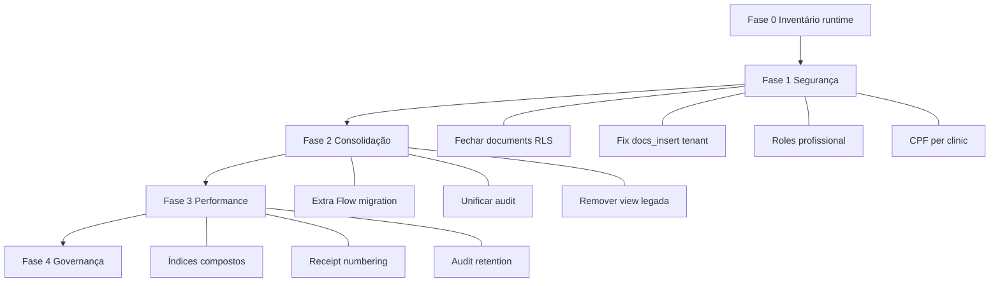

# Auditoria do Banco de Dados — FisioOS (READ ONLY)

Análise exclusiva das **50 migrations** em `supabase/migrations/`, helpers SQL, RLS, triggers, RPC e views. Nenhum arquivo foi alterado.

---

## Resumo executivo

O banco evoluiu de um **modelo single-tenant (Move 60+)** para um **SaaS multi-clínica** com camada de autorização madura (`clinic_members`, `can_access_clinic`, limites de plano, modo suporte). A modelagem clínica é **rica e coerente** para fisioterapia (avaliações, sub-tabelas, escalas, documentos, recibos).

Porém a evolução incremental deixou **dívida estrutural crítica**: policies legadas ainda ativas, duas famílias de documentos (`documents` vs `clinical_documents`), dois sistemas de papéis (`user_roles` vs `clinic_members`), e **schema aplicativo ausente nas migrations** (Extra Flow: `pagamentos`, `extras`, `recibos`). O estado final real só é confiável com inventário em produção — as migrations sozinhas não garantem consistência total.

---

## Inventário do schema

| Camada | Quantidade aproximada |
|--------|----------------------|
| Tabelas `public.*` | ~45 |
| Migrations | 50 |
| Views | 2 (`v_document_validation`, `clinic_usage`) |
| RPCs públicas relevantes | ~15+ |
| Funções `SECURITY DEFINER` | ~25+ |
| Tabelas com RLS | ~40+ |

**Domínios principais:** identidade (`profiles`, `user_roles`, `clinic_members`), clínica (`clinics`, `clinic_settings`, `plans`, `clinic_plans`), prontuário (`patients`, `assessments` + 10 sub-tabelas), documentos (`clinical_documents`, `document_templates`, legado `documents`), financeiro (`financial_entries`, `receipts`), SaaS (`saas_audit_log`, `support_sessions`), catálogos (`catalog_*`, `library_*`, `merge_tags`).

---

## Matriz de achados

### CRÍTICO

| Área | Achado |
|------|--------|
| **RLS** | `public.documents` mantém `"doc read authed" USING (true)` desde a migration inicial — **nunca removida**. Qualquer autenticado lê todos os registros legados. |
| **RLS / Multi-tenant** | `clinics_admin` concede `FOR ALL` a `has_role(..., 'admin')` global — policy ativa desde `20260620185317`. |
| **RLS** | `clinical_documents`: policy `docs_insert` valida só `can_access_patient(patient_id)` — **não amarra** `clinic_id` ao paciente (injeção cross-tenant). |
| **Integridade / App** | `clinic_members.role` CHECK exige `'profissional'`, mas o app grava `'physiotherapist'` no convite — **violação de constraint** no INSERT. |
| **Migrations / Drift** | Tabelas Extra Flow (`pagamentos`, `extras`, `recibos`) usadas no app **não existem nas migrations locais** — schema divergente prod vs repo. |
| **Modelagem** | Duas famílias paralelas de documentos: `documents` (legado) e `clinical_documents` (moderno), ambas ativas. |

### ALTO

| Área | Achado |
|------|--------|
| **Constraints** | `patients.cpf UNIQUE` global — impede mesmo CPF em clínicas diferentes (problemático em SaaS). |
| **RLS legado** | Policies com `has_role(..., 'admin')` remanescentes: `sig_delete`, deletes em sub-tabelas de assessment (parcialmente corrigidos), `doc delete admin` em `documents`. |
| **Views** | `v_document_validation` faz `LEFT JOIN clinic_settings c ON true` — retorna branding errado; `GRANT SELECT TO anon` (substituída parcialmente por RPC, view ainda exposta). |
| **Triggers** | `fn_block_support_writes` cobre 8 tabelas core + `receipts`; **fora**: `clinical_signatures`, `patient_attachments`, `clinic_members`, biblioteca, marketing. |
| **Normalização / Papéis** | Dois sistemas de role: `user_roles.app_role` (global) vs `clinic_members.role` (tenant) — sem FK ou sync automático. |
| **Migrations** | 50 arquivos com DROP/CREATE de policies em camadas — estado final difícil de auditar sem `pg_policies` em runtime. |
| **Performance RLS** | Policies com `EXISTS (SELECT 1 FROM patients p WHERE ...)` em cascata — correto, mas **caro** em volume sem índices compostos tenant+data em todas as tabelas filhas. |
| **Auditoria** | Três trilhas: `audit_log` (trigger), `assessment_audit_log`, `saas_audit_log` — sem modelo unificado. |

### MÉDIO

| Área | Achado |
|------|--------|
| **Modelagem** | `assessments` muito wide (~30 colunas text) — aceitável clínico, dificulta evolução de schema. |
| **Relacionamentos** | Sub-tabelas de assessment (`assessment_scales`, `mrc`, etc.) têm `patient_id` **redundante** com `assessment_id` — útil para RLS, risco de inconsistência. |
| **Chaves** | `clinical_documents.clinic_id ON DELETE SET NULL` — documentos órfãos de tenant se clínica removida. |
| **Índices** | Bom coverage em `clinic_id`, `patient_id`, datas; faltam compostos explícitos `(clinic_id, data)` em `evolutions`/`appointments` para relatórios. |
| **Triggers** | `fn_receipts_set_numero` usa `MAX(numero)+1` por clínica — **contention** sob alta concorrência. |
| **RPC** | `seed_default_document_templates` com `GRANT EXECUTE TO authenticated` — mutação pesada exposta a client autenticado (mitigada por lógica interna). |
| **Multi-tenant** | `current_clinic_id()` usa `ORDER BY is_default DESC` — sem constraint garantindo um único default por usuário. |
| **Integridade** | `patient_discharges` sem `clinic_id` explícito — depende de join via `patient_id`. |
| **Escalabilidade** | `audit_log` / `assessment_audit_log` crescem sem particionamento ou retenção. |
| **Manutenção** | `ARCHITECTURE_FREEZE.md` congela migrations — evita caos, mas impede correções estruturais rápidas. |

### BAIXO

| Área | Achado |
|------|--------|
| **Modelagem** | Enums bem definidos (`app_role`, `document_type`, `assessment_type`, etc.). |
| **Catálogos** | `catalog_diagnoses`, `catalog_scales`, `normative_rom` — normalizados, read-mostly. |
| **Chaves** | UUID PKs consistentes; `UNIQUE(clinic_id, user_id)` em `clinic_members`. |
| **Índices** | `idx_docs_validation_hash`, GIN em `clinical_profiles`, índices parciais em templates. |
| **RPC** | `validate_document_by_hash` — SECURITY DEFINER, dados mínimos LGPD, grant anon controlado. |
| **Views** | `clinic_usage` com `security_invoker = true` — padrão correto. |
| **Triggers positivos** | `block_locked_updates`, `fn_set_validation_hash`, limites de plano, sync lifecycle de clínicas. |
| **Storage** | Policies amarradas a `clinical_documents.pdf_url` e `receipts.pdf_path` — bom isolamento. |
| **Provisionamento** | `provision_clinic` + seed de templates canônicos — idempotente e documentado. |

---

## Análise por dimensão

### Modelagem — **MÉDIO** (global) / **BAIXO** (domínio clínico)

Pontos fortes:
- Hierarquia clara: `clinic → patient → assessment → modules/scales/goals`.
- Documentos clínicos com `content jsonb`, `body_text`, `validation_hash`, `locked_at`.
- SaaS comercial: `plans`, `clinic_plans`, limites (`max_patients`, `max_documents_month`).
- Templates versionáveis (`document_templates`, `canonical_document_templates`).

Pontos fracos:
- Legado convive com moderno (`documents`, `user_roles.admin`).
- Extra Flow no app sem modelagem versionada no repo.

### Normalização — **MÉDIO**

- Sub-tabelas de assessment bem decompostas (vitals, ortho, neuro, postural).
- Redundância intencional: `patient_id` em quase todas as tabelas filhas para RLS direto.
- JSONB em templates e conteúdo clínico — flexível, menos queryable.
- `clinic_settings` separado de `clinics` (via `settings_id` + `clinic_id`) — relação bidirecional confusa.

### Relacionamentos — **MÉDIO**

```
clinics ─┬─ clinic_members ── auth.users
         ├─ clinic_settings (1:1 via clinic_id UNIQUE)
         ├─ patients ─┬─ assessments ── assessment_*
         │            ├─ evolutions
         │            ├─ clinical_documents
         │            └─ patient_discharges
         ├─ professionals
         ├─ appointments
         └─ financial_entries ── receipts
```

- FKs sólidas na maioria (`ON DELETE CASCADE` em paciente, `RESTRICT` em financeiro).
- `clinical_documents.clinic_id` nullable com `SET NULL` — frágil para auditoria.

### Chaves — **BAIXO**

- UUID v4 via `gen_random_uuid()`.
- Uniques bem pensados: `(clinic_id, numero)` em receipts, `(clinic_id, user_id)` em members.
- **Exceção CRÍTICA:** `patients.cpf UNIQUE` global.

### Índices — **MÉDIO**

Existem ~40+ `CREATE INDEX` across migrations. Destaques:
- `idx_*_clinic` nas tabelas tenant-core.
- `idx_scales_patient`, `idx_docs_patient`, `idx_assess_status`.
- GIN em `clinical_profiles`.

Gaps:
- Compostos `(clinic_id, issued_at)` em `clinical_documents` parcial.
- Sub-tabelas de assessment indexadas por `patient_id`, não por `(clinic_id, applied_at)` — exige join para relatórios tenant-scoped.

### Constraints — **ALTO**

| Constraint | Avaliação |
|------------|-----------|
| `clinic_members.role CHECK` | Correto no DB, **incompatível com app** |
| `patients.cpf UNIQUE` | Problemático multi-tenant |
| `clinics.status CHECK` | Evoluiu (`deleted`, `canceled`) |
| `validation_hash UNIQUE` | Bom para QR |
| Plan limits triggers | Enforcement server-side sólido |

### Triggers — **MÉDIO**

| Trigger | Função |
|---------|--------|
| `fn_default_clinic_id` | Default tenant em INSERT |
| `block_locked_updates` | Imutabilidade pós-assinatura |
| `fn_block_support_writes` | Modo suporte read-only |
| `fn_audit_trigger` | Trilha em tabelas clínicas |
| `fn_set_validation_hash` | Hash criptográfico server-side |
| `fn_schedule_reassessment` | Agenda reavaliação automática |
| `fn_enforce_*_limit` | Limites de plano |
| `fn_receipts_set_numero` | Numeração por clínica |
| `fn_sync_clinic_*` | Lifecycle comercial |

Risco: cobertura incompleta do modo suporte; `block_locked_updates` ainda permite bypass via `super_admin` nas policies.

### RPC — **MÉDIO**

| RPC | Papel | Grant |
|-----|-------|-------|
| `validate_document_by_hash` | Validação pública | anon, authenticated |
| `provision_clinic` | SaaS onboarding | authenticated (super_admin check interno) |
| `start/end_support_session` | Modo suporte | authenticated |
| `has_plan_feature`, `current_plan_limits` | Feature gating | authenticated |
| `can_access_clinic`, `has_role`, etc. | Helpers RLS | authenticated |
| `generate_clinic_slug` | Utility | implícito |
| `seed_default_document_templates` | Seed | authenticated + service_role |

Boas práticas: `search_path = public` na maioria dos DEFINER; EXECUTE revogado em triggers internos (`20260620190116`).

### Views — **ALTO**

1. **`v_document_validation`** — JOIN incorreto em `clinic_settings`, exposta a `anon`. Substituída funcionalmente por RPC, mas view permanece.
2. **`clinic_usage`** — agregações por clínica, `security_invoker = true`. Adequada.

### Migrations — **ALTO**

Evolução em **4 ondas**:
1. **Jun/14** — schema base single-tenant, RLS aberta.
2. **Jun/20** — domínio clínico expandido (escalas, documentos, audit).
3. **Jun/21** — multi-tenant definitivo (`clinic_id`, reescrita RLS, SaaS).
4. **Jun/25–26** — patches (`fix_assessments_insert_rls`, storage, soft delete).

Problemas:
- Policies antigas nem sempre removidas (`doc read authed`, `clinics_admin`).
- Migrations de **fix** indicam RLS quebrada em produção (assessments insert).
- Extra Flow **fora** do versionamento.

### Integridade referencial — **MÉDIO**

- Cascades corretos no prontuário.
- `financial_entries.patient_id NOT NULL` + `ON DELETE RESTRICT` — protege histórico financeiro.
- Receipts desacoplados de `financial_entry_id` (nullable após migration) — flexível, menos integridade.
- Sem CHECK garantindo `clinical_documents.clinic_id = patients.clinic_id`.

### Multi-tenant — **ALTO** (modelo) / **CRÍTICO** (execução)

**Modelo maduro:**
- `clinic_members` + helpers DEFINER.
- `can_access_clinic` inclui modo suporte restrito.
- Backfill Move 60+ documentado.
- Limites por plano por clínica.

**Falhas de execução:**
- Tabelas/policies legadas abertas.
- `docs_insert` sem amarração de tenant.
- CPF global unique.
- Schema Extra Flow não versionado.

### RLS — **CRÍTICO**

Evolução exemplar nas tabelas core (patients, assessments, evolutions, receipts, templates, library), mas **policies legadas coexistem** com novas (PostgreSQL OR entre policies permissivas).

Estado problemático confirmado nas migrations:

```380:381:supabase/migrations/20260614141802_de0380b9-1965-46f7-b740-c272f1bbcfe0.sql
CREATE POLICY "doc read authed" ON public.documents FOR SELECT TO authenticated USING (true);
CREATE POLICY "doc insert authed" ON public.documents FOR INSERT TO authenticated WITH CHECK (true);
```

(`doc insert authed` foi substituída; **`doc read authed` permanece**.)

### Performance — **MÉDIO**

- Índices adequados para Beta/pequena escala.
- RLS com subqueries correlacionadas — monitorar `EXPLAIN ANALYZE` em listagens.
- `fn_receipts_set_numero` e triggers de audit em cada write — overhead linear.
- Storage policy join `d.pdf_url = storage.objects.name` — OK com índice em `validation_hash`/`pdf_url`.

### Escalabilidade — **MÉDIO**

| Dimensão | Limite prático |
|----------|----------------|
| Clínicas | Boa (row-level isolation) |
| Pacientes/clínica | Limitado por plano (trigger) |
| Writes concorrentes | Numeração de recibos, audit triggers |
| Storage | Path `{clinic_id}/...` — escala horizontal no bucket |
| Audit logs | Crescimento ilimitado — precisa retenção |

### Manutenibilidade futura — **ALTO**

- 50 migrations sequenciais — difícil para novos devs reconstruir estado mental.
- ARCHITECTURE_FREEZE impede evolução ágil.
- Drift app ↔ migrations (Extra Flow, types.ts).
- Dois vocabulários de role (`physiotherapist` vs `profissional`, `admin` global vs tenant).
- Falta diagrama ER versionado (ARQUITETURA.md vazio).

---

## O que funciona bem (base sólida)

1. **Helpers tenant** (`can_access_clinic`, `is_member_of`, `can_manage_clinic`, `has_role_in`).
2. **Reescrita RLS** nas tabelas clínicas principais (Bloco III + Bloco C).
3. **Enforcement comercial** (limites, lifecycle, planos).
4. **Modo suporte** com triggers de bloqueio e audit SaaS.
5. **Documentos modernos** com hash, lock, validação RPC.
6. **Recibos multi-tenant** com numeração por clínica e cancelamento (sem DELETE policy).
7. **Revogação de EXECUTE** em funções internas de trigger.
8. **Patch recente** de assessments insert com validação cruzada patient/professional/clinic.

---

## Plano de evolução do banco (sem implementação)

### Fase 0 — Inventário e baseline (1 semana)

1. Rodar em staging/prod e documentar:
   - `SELECT * FROM pg_policies WHERE schemaname = 'public'`
   - Tabelas existentes vs migrations locais
   - Policies com `USING (true)` ou `has_role(..., 'admin')`
2. Comparar schema prod com `types.ts` — listar drift (Extra Flow).
3. Gerar ER diagram a partir do estado real (não das migrations).

### Fase 1 — Segurança e integridade (bloqueante, 2–3 semanas)

4. **Fechar `public.documents`**
   - Opção A: RLS tenant-scoped + deprecar.
   - Opção B: migrar dados para `clinical_documents` + dropar tabela.
5. **Remover policies globais `admin`/`clinics_admin`**
   - Substituir por `super_admin` (SaaS) ou `can_manage_clinic` (tenant).
6. **Corrigir `docs_insert`**
   - `WITH CHECK (clinic_id = (SELECT clinic_id FROM patients WHERE id = patient_id) AND is_member_of(clinic_id))`.
   - Trigger BEFORE INSERT reforçando a mesma regra.
7. **Alinhar roles**
   - Migration de dados: `physiotherapist` → `profissional` em `clinic_members`.
   - Deprecar `user_roles.admin` operacional; reservar `super_admin`.
8. **CPF multi-tenant**
   - Trocar `UNIQUE(cpf)` por `UNIQUE(clinic_id, cpf)` (ou partial unique onde cpf NOT NULL).

### Fase 2 — Consolidação de modelo (3–4 semanas)

9. **Versionar Extra Flow**
   - Migration formal: `pagamentos`, `extras`, `recibos` com `clinic_id`, FKs, RLS, índices.
   - Regenerar `types.ts`.
10. **Unificar auditoria**
    - Definir trilha canônica (clínica vs SaaS).
    - Política de retenção (ex.: 7 anos clínico, 2 anos SaaS).
11. **Remover/substituir `v_document_validation`**
    - Manter só RPC; revogar grant anon na view.
12. **Adicionar `clinic_id` onde falta**
    - `patient_discharges`, sub-tabelas críticas para relatórios (opcional, com trigger default).
13. **CHECK constraints de coerência**
    - `clinical_documents.clinic_id = patients.clinic_id`.
    - `financial_entries.clinic_id` NOT NULL após backfill.

### Fase 3 — Performance e escala (2–4 semanas)

14. **Índices compostos para relatórios**
    - `(clinic_id, data DESC)` em evolutions, appointments, assessments.
    - `(clinic_id, applied_at DESC)` em assessment_scales.
15. **Numeração de recibos**
    - Substituir `MAX+1` por sequence por clínica ou `INSERT ... ON CONFLICT` com counter table.
16. **Otimizar policies RLS**
    - Avaliar `can_access_patient` cacheável ou coluna `clinic_id` denormalizada em todas as filhas.
17. **Particionamento / arquivamento**
    - `audit_log`, `saas_audit_log`, `assessment_audit_log` por mês ou `occurred_at`.

### Fase 4 — Governança e manutenção (contínuo)

18. **Squash migrations** (quando ARCHITECTURE_FREEZE permitir)
    - Baseline única + migrations incrementais a partir de snapshot validado.
19. **Testes de banco**
    - pgTAP ou scripts SQL: usuário clínica A não lê B; convite grava role válido; insert documento rejeita clinic_id errado.
20. **Política de migration review**
    - Checklist: toda nova tabela = RLS + clinic_id + índice + trigger default + policy sem `true`.
21. **Documentação**
    - ER diagram, glossário de roles, mapa de triggers, matriz RLS por tabela.

---

## Priorização visual



---

## Conclusão

O banco do FisioOS tem **arquitetura multi-tenant bem pensada** na camada moderna (Jun/21+), com enforcement de plano, suporte read-only, documentos autenticáveis e recibos por clínica. A modelagem clínica é **madura o suficiente para Beta**, desde que o runtime seja corrigido.

A **dívida da camada legada** (Jun/14–20) — policies abertas, papéis globais, tabela `documents`, CPF global — e o **drift de schema** (Extra Flow) classificam o estado atual como **CRÍTICO para produção multi-clínica**. Sem a Fase 1, o banco **não deve** ser considerado confiável para dados sensíveis de múltiplos tenants, independentemente da qualidade da UI.

Nenhum arquivo foi modificado nesta análise.