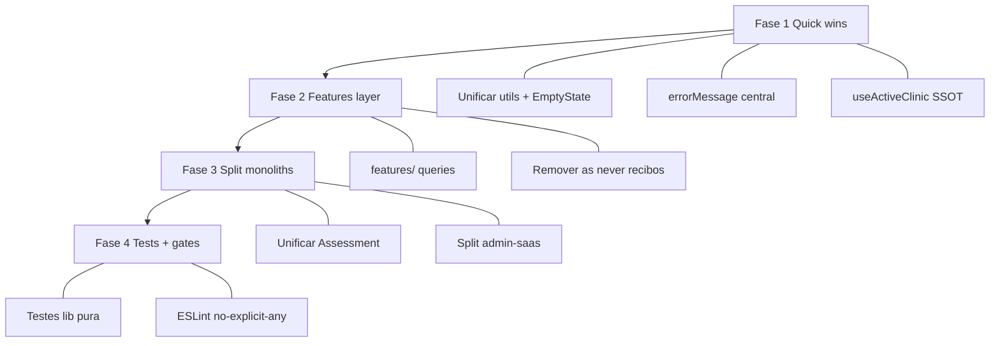

# Auditoria de Qualidade de Código — FisioOS (READ ONLY)

Análise estática de `src/` (~153 arquivos TS/TSX). Nenhum arquivo foi alterado.

---

## Resumo executivo

O FisioOS roda com **TypeScript strict**, **Zod nas server functions admin** e **componentes clínicos modulares** (`components/clinical/*`) que mostram intenção de qualidade. Porém o crescimento orgânico produziu **monólitos de 700–1.500 linhas**, **centenas de escapes de tipo** (`as any`, `as never`), **duplicação estrutural** (dois fluxos de avaliação, dois `EmptyState`, três `assertSuperAdmin`) e **zero testes**. A legibilidade local é aceitável; a **manutenibilidade em equipe e a escalabilidade do codebase** são os pontos mais frágeis.

---

## Métricas rápidas

| Métrica | Valor |
|---------|-------|
| Maior arquivo | `types.ts` (~3.611 linhas, gerado) |
| Maior route | `admin-saas.tsx` (~1.557 linhas) |
| Maior componente | `assessment-wizard.tsx` (~926 linhas) |
| Maior lib | `pdf-engine.ts` (~1.296 linhas) |
| `as any` (excl. `routeTree.gen`) | ~120+ ocorrências |
| `as never` (recibos) | 17 ocorrências |
| Testes automatizados | **0** |
| `React.memo` | ~0 uso estratégico |
| `tsconfig strict` | ✅ `true` |

---

## Matriz por princípio

### CRÍTICO

| Princípio | Achado |
|-----------|--------|
| **Complexidade** | Monólitos: `admin-saas.tsx`, `saas-admin.functions.ts`, `assessment-wizard.tsx`, `assessment-form.tsx`, `agenda.tsx`, `documentos.tsx`, `app-shell.tsx`. Múltiplas responsabilidades por arquivo. |
| **DRY** | Dois sistemas completos de avaliação (`AssessmentWizard` + `AssessmentForm`) com lógica paralela de persistência/PDF. |
| **Manutenibilidade** | **Zero** arquivos `*.test.*` / `*.spec.*` — refatoração sem rede de segurança. |
| **Tipagem** | Uso massivo de `as any` em rotas críticas (`documentos.tsx`, `assessment-wizard.tsx`, `validar.$hash.tsx`, `agenda.tsx`). `strict: true` é contornado na prática. |
| **Organização** | Rotas = UI + Supabase + regras de negócio + export CSV/PDF. Violação forte de **SRP** (SOLID). |

### ALTO

| Princípio | Achado |
|-----------|--------|
| **DRY** | `assertSuperAdmin` copiado em 3 arquivos (`saas-admin`, `clinics-admin`, `clinic-ops`). `logAudit` duplicado. `errorMessage()` definido 3× (`configuracoes`, `avatar-uploader`, `logo-uploader`). |
| **DRY / Nomes** | Dois `EmptyState` (`empty-state.tsx` vs `layout/EmptyState.tsx`). Dois `AppShell` (nav vs page wrapper) — mesmo nome, papéis opostos. |
| **DRY** | Resolução de clínica ativa em 3 formas: `useActiveClinic`, `useRoles`, query ad hoc `active-clinic-id`. |
| **KISS** | `recibos.functions.ts`: 17× `as never` por schema ausente em `types.ts` — complexidade de contorno em vez de tipos. |
| **Hooks** | Pasta `hooks/` com 1 arquivo; hooks de domínio espalhados em `lib/` sem convenção única. |
| **Tratamento de erros** | Padrão inconsistente: `e: any`, `e: unknown`, `e.message` direto, `console.error` silencioso em audit best-effort. |
| **Escalabilidade** | Server functions admin usam `supabase: any`; queries Supabase inline em ~25 rotas — acoplamento total ao schema. |
| **Clean Code** | Steps do wizard tipados como `any` (`StepIdentificacao`, `StepDiagnostico`, etc.). `eslint-disable react-hooks/exhaustive-deps` no wizard. |

### MÉDIO

| Princípio | Achado |
|-----------|--------|
| **SOLID — OCP** | Feature gating via `usePlanFeatures` + flags no menu — extensível, mas menu hardcoded em `app-shell.tsx`. |
| **SOLID — DIP** | PDF engine desacoplado (`pdf-engine.ts` puro) vs `pdf.ts` (Supabase) — bom onde aplicado; recibos duplicam pipeline. |
| **Reutilização** | `components/clinical/*` reutilizável (goniometria, escalas, assinatura). Layout primitives (`PageHeader`) adotados em 2 telas. |
| **Legibilidade** | Código em português alinhado ao domínio (nomes de negócio claros). Comentários úteis em `active-clinic.ts`, `auth.ts`, `recibos.functions.ts`. |
| **Logs** | `reportLovableError` no root boundary; `console.error` espalhado; audit SaaS best-effort sem falhar operação. |
| **Nomes** | Inconsistência `recibos.functions.ts` (client-side, não server fn). `gerarRecibosPagamento` bem nomeado. |
| **Componentização** | Forms extraídos (`patient-form`, `evolution-form`). Tabs de prontuário separadas. |
| **KISS** | `home-care.tsx` usa `useState` + fetch manual enquanto resto usa React Query — padrão duplo. |

### BAIXO

| Princípio | Achado |
|-----------|--------|
| **Clean Code** | `lib/format.ts`, `lib/utils.ts` (`cn`), merge-tags — utilitários focados. |
| **Tipagem** | Zod rigoroso nas server functions admin (~31 schemas em `saas-admin.functions.ts`). |
| **Organização** | `integrations/supabase/` bem delimitado. `components/ui/` shadcn padronizado. |
| **Tratamento de erros** | `configuracoes.tsx` e uploaders usam `errorMessage(e: unknown)` — padrão correto a propagar. |
| **Logs** | Middleware auth loga env missing de forma clara. |
| **Documentação inline** | `useRoles` / `useActiveClinic` documentam intenção arquitetural no código. |

---

## Análise por dimensão solicitada

### Clean Code — **ALTO** (dívida) / **MÉDIO** (pontos isolados)

Funções longas dentro de monólitos; steps do wizard como componentes internos sem props tipadas; variáveis de negócio em português (positivo para o time BR). Falta extrair funções com nomes que expressem intenção nas rotas grandes.

### SOLID — **ALTO**

| Letra | Estado |
|-------|--------|
| **S** (Single Responsibility) | Violado em rotas e `app-shell` |
| **O** (Open/Closed) | Parcial via plan features e templates |
| **L** (Liskov) | N/A relevante |
| **I** (Interface Segregation) | Props genéricas `any` nos steps |
| **D** (Dependency Inversion) | Supabase acoplado diretamente; server fn admin melhor |

### DRY — **CRÍTICO**

Duplicações principais:
- Wizard + Form de avaliação
- `assertSuperAdmin` ×3
- `EmptyState` ×2
- Resolução de clínica ×3
- Pipeline PDF (`pdf.ts` / `receipt-pdf.ts` / `library-pdf.ts`)
- Recibos em `financeiro.tsx` e `recibos.tsx`

### KISS — **ALTO**

Contornos desnecessários: `as never` em recibos, `as any` em vez de tipos gerados, dual assessment UX, fetch manual em biblioteca/home-care misturado com React Query.

### Nomes — **MÉDIO**

Bons: `useActiveClinic`, `gerarRecibosPagamento`, `can_access_clinic` (SQL). Ruins: colisão `AppShell`, sufixo `.functions.ts` em módulo client, `PainelClinico` em duas rotas.

### Organização — **ALTO**

Top-level OK (`routes/`, `components/`, `lib/`). `lib/` é gaveta única. Sem camada `features/` ou `services/`. Server logic só em admin.

### Componentização — **CRÍTICO** (monólitos) / **BAIXO** (`clinical/`)

`components/clinical/` coeso. Rotas-admin e wizard são anti-componentização.

### Hooks — **ALTO**

Hooks valiosos existem (`useActiveClinic`, `usePlatformContext`, `usePlanFeatures`, `useBranding`) mas:
- Convivem com lógica duplicada
- `hooks/` quase vazia
- `useRoles` ainda usado onde deveria ser só `useActiveClinic`

### Tipagem TypeScript — **CRÍTICO**

- `strict: true` ✅
- `Database` types gerados ✅
- Bypass sistemático com `as any` em rotas e painéis clínicos
- `validar.$hash.tsx`: 15× `as any` na UI pública
- Server handlers: `supabase: any` nos asserts

### Tratamento de erros — **ALTO**

| Padrão | Onde |
|--------|------|
| `toast.error(e.message)` | Maioria das mutations |
| `e: any` | wizard, panels, rotas |
| `errorMessage(unknown)` | uploaders, configuracoes |
| `console.error` + swallow | `logAudit`, biblioteca PDF |
| Error boundary | `__root.tsx` + Lovable reporting |

Sem tipo `AppError` ou mapper central; mensagens Supabase expostas raw ao usuário.

### Logs — **MÉDIO**

- Estruturado: `reportLovableError` (boundary)
- Ad hoc: `console.error("[saas_audit_log]", e)`
- Sem correlation ID, sem níveis, sem logger abstraído
- Audit best-effort contradiz fail-closed de segurança

### Reutilização — **MÉDIO**

Boa em UI primitiva e painéis clínicos. Fraca em camada de dados e PDF. Layout design system iniciado mas não adotado.

### Duplicação — **CRÍTICO**

Ver DRY. Assessment duplicado é o caso mais caro em LOC e risco de divergência.

### Complexidade ciclomática — **CRÍTICO**

Arquivos >500 LOC com múltiplos `useQuery`, `useMutation`, JSX condicional profundo (`documentos.tsx`, `admin-saas.tsx`). Wizard com 7 steps + persistência inline.

### Legibilidade — **MÉDIO**

Arquivos pequenos/médios legíveis. Monólitos exigem scroll extensivo e contexto mental alto. Comentários de bloco (Bloco A, Fase 3) ajudam quem conhece a história.

### Manutenibilidade — **CRÍTICO**

Monólitos + zero testes + `as any` + duplicação = alto custo de change. Qualquer alteração em assessment exige editar 2 arquivos de ~800+ LOC combinados.

### Escalabilidade (código) — **ALTO**

Time não escala em paralelo nos mesmos arquivos. Novas features continuam padrão “colar na rota”. Bundle importa tudo estaticamente.

---

## O que está bem feito

1. **`recibos.functions.ts`** — funções puras (`mergeReciboIds`, `groupExtrasByProfessional`), tipos exportados, comentários de regra de negócio.
2. **`useActiveClinic` / `usePlatformContext`** — separação documentada de contextos.
3. **Server functions admin** — Zod + `requireSupabaseAuth` + lazy `supabaseAdmin`.
4. **`pdf-engine.ts`** — separação engine puro / integração Supabase.
5. **`components/clinical/*`** — painéis focados, query keys com `clinicId`.
6. **`errorMessage(e: unknown)`** onde usado — padrão a generalizar.
7. **Strict TypeScript** habilitado — base correta se deixarem de contornar.

---

## Plano de refatoração (sem implementação)

### Fase 1 — Quick wins (1–2 semanas)

**Objetivo:** parar sangramento de qualidade sem mudar comportamento.

1. **Unificar utilitários duplicados**
   - Extrair `assertSuperAdmin`, `logAudit`, `errorMessage` para `lib/api/_shared.server.ts` (ou `.ts` com sufixo server).
   - Unificar `EmptyState` em um componente; deprecar o outro.
   - Renomear `layout/AppShell` → `PageLayout`.

2. **SSOT de tenant no client**
   - Eliminar queries `active-clinic-id`; migrar para `useActiveClinic` only.
   - Deprecar `useRoles` para gates clínicos (grep + substituir).

3. **Padrão de erro**
   - Criar `lib/errors.ts`: `getErrorMessage(e: unknown): string`.
   - Substituir `e: any` nos `onError` de mutations (mechanical refactor).

4. **Lint gate**
   - Regra ESLint `@typescript-eslint/no-explicit-any`: warn → error em `src/routes` e `src/components` (exceto `routeTree.gen.ts`).

### Fase 2 — Extrair camada de dados (2–4 semanas)

**Objetivo:** SRP nas rotas; DRY nas queries.

5. **Módulos por domínio em `src/features/`**

```
features/
  patients/queries.ts, mutations.ts, types.ts
  assessments/...
  documents/...
  receipts/...
```

6. **Rotas ≤ 200 LOC**
   - Cada route importa hooks (`usePatientsList`, `useEmitDocument`).
   - Mover Supabase para features; rotas só compõem layout.

7. **Tipos derivados de `Database`**
   - `type Patient = Database['public']['Tables']['patients']['Row']`.
   - Eliminar `as any` em `documentos.tsx` e `pacientes/$id.tsx` primeiro.

8. **Recibos**
   - Regenerar types ou criar `types/recibos.ts` manual alinhado ao schema.
   - Remover 17× `as never`.

### Fase 3 — Desmontar monólitos (3–5 semanas)

9. **Assessment unificado**
   - Manter `AssessmentWizard` como base.
   - Extrair steps para arquivos (`steps/identificacao.tsx`, etc.) com props tipadas.
   - Remover `AssessmentForm` ou reduzir a thin wrapper deprecated.

10. **Quebrar `admin-saas.tsx`**
    - Sub-rotas ou tabs como componentes em `features/saas/`.
    - Um arquivo por domínio (clinics, plans, audit).

11. **Quebrar `app-shell.tsx`**
    - `AppSidebar`, `AppTopbar`, `nav-config.ts`, `useNavItems()`.

12. **PDF**
    - `lib/pdf/index.ts` export único; `receipt-pdf` consome builders comuns.

### Fase 4 — Qualidade sustentável (contínuo)

13. **Testes mínimos**
    - Unit: `recibos.functions`, `merge-tags`, `format`, helpers puros do wizard.
    - Integration: hooks de feature com mock Supabase.
    - Target: 20% coverage em `lib/` e `features/` antes de Beta ampliado.

14. **Complexidade guard**
    - ESLint `max-lines` (ex.: 400) em `routes/` e `components/` (warn).
    - PR checklist: sem `as any` novo, sem query Supabase na route.

15. **Performance React**
    - `useMemo` em listas pesadas (agenda, pacientes).
    - Lazy routes para admin-saas, documentos, pacientes/$id.

16. **Documentação de código**
    - ADR: “queries vivem em features/”.
    - Glossário de naming (`PageLayout` vs `AppShell`).

---

## Priorização



---

## Conclusão

A qualidade do código do FisioOS é **heterogênea**: utilitários e módulos recentes (`recibos.functions`, context hooks, server fn admin) mostram **intenção profissional**; o acervo de rotas e componentes clínicos grandes carrega **dívida clássica de MVP acelerado** — monólitos, `any`, duplicação e ausência de testes.

Classificação global: **ALTO** risco de manutenção, com itens **CRÍTICOS** em complexidade, DRY (assessment duplo) e tipagem contornada. A Fase 1 do plano é de baixo risco e alto retorno; a Fase 3 (assessment + admin) é onde se recupera a maior parte do custo futuro de desenvolvimento.

Nenhum arquivo foi modificado nesta análise.