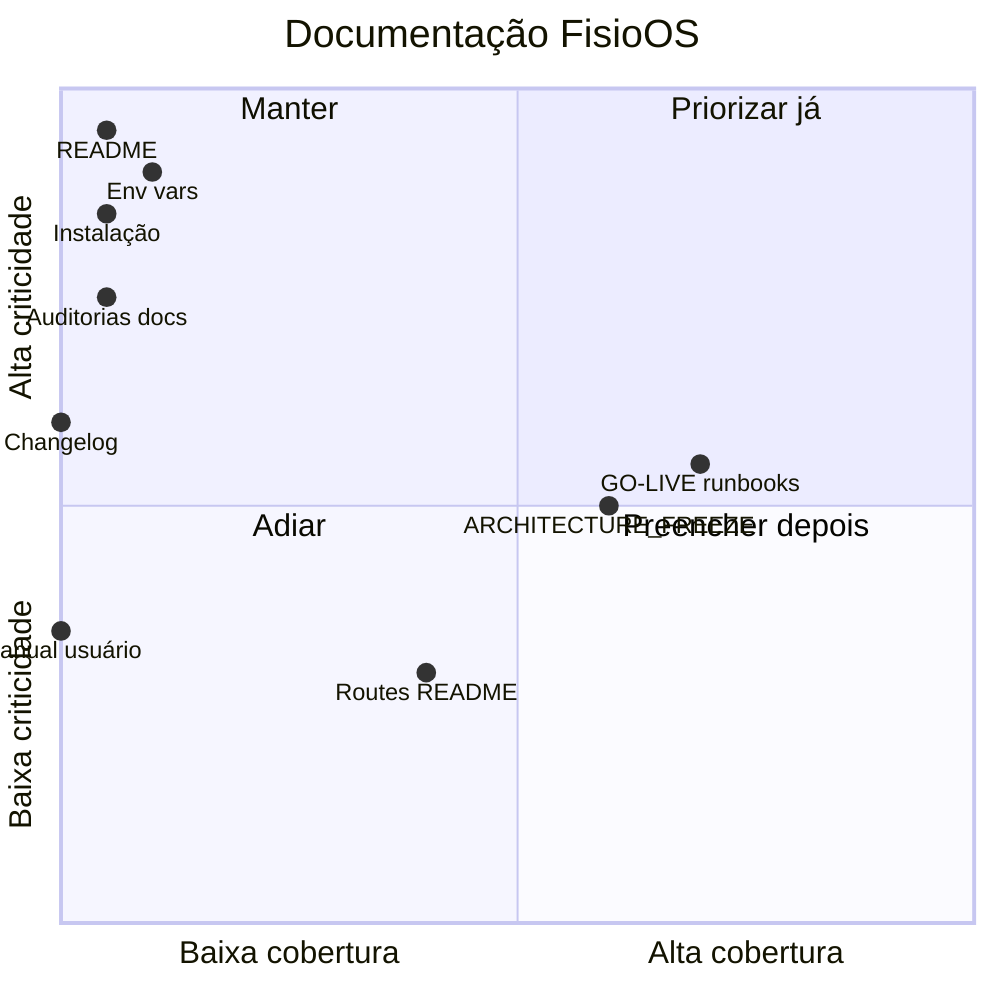

# Auditoria de Documentação — FisioOS (READ ONLY)

Análise **exclusiva da documentação persistida no repositório** (arquivos `.md`, comentários inline em código de configuração, `supabase/config.toml`). Nenhum arquivo foi alterado.

**Nota importante:** vários arquivos em `docs/auditorias/` e `docs/arquitetura/ARQUITETURA.md` aparecem com conteúdo no editor, mas estão com **0 bytes no disco** — ou seja, **não fazem parte da documentação versionada** até serem salvos e commitados. Apenas `auditoria-clinica.md` (~4,7 KB) está persistido entre as auditorias.

---

## Inventário real (estado no disco)

| Local | Arquivo | Conteúdo |
|---|---|---|
| **Raiz** | `GO-LIVE-V1.md` | ✅ Completo (~212 linhas) — piloto, DR, monitoramento |
| **Raiz** | `ARCHITECTURE_FREEZE.md` | ✅ Completo — congelamento multi-tenant |
| **Raiz** | `BACKLOG-POS-V1.md` | ✅ Completo (~191 linhas) — roadmap pós-V1 |
| **Raiz** | `README.md` | ❌ **Inexistente** |
| **Raiz** | `CHANGELOG.md` | ❌ **Inexistente** |
| **Raiz** | `.env.example` | ❌ **Inexistente** (`.env` existe, sem doc pública) |
| `docs/arquitetura/` | `ARQUITETURA.md` | ❌ **Vazio (0 bytes)** |
| `docs/auditorias/` | 12 arquivos | ⚠️ **11 vazios no disco**; só `auditoria-clinica.md` tem conteúdo |
| `docs/backlog/` | `BACKLOG-OFICIAL.md` | ❌ Vazio |
| `docs/decisoes/` | `DECISOES.md` | ❌ Vazio |
| `docs/roadmap/` | `ROADMAP.md` | ❌ Vazio |
| `src/routes/` | `README.md` | ✅ Convenções TanStack Router (~22 linhas) |
| `.lovable/` | `plan.md` | ✅ Plano UX/estabilização (~73 linhas) |

**Conclusão estrutural:** existe um **esqueleto de `docs/` bem organizado**, mas **~85% dos arquivos estão vazios no repositório**. A documentação útil concentra-se na **raiz** (3 arquivos legados Move+/V1) e em **notas pontuais** (rotas, Lovable, recibos).

---

## Avaliação por dimensão

| Dimensão | O que existe | Classificação |
|---|---|---|
| **README** | Ausente na raiz | **CRÍTICO** |
| **Estrutura da documentação** | Pastas `docs/{arquitetura,auditorias,backlog,decisoes,roadmap}` criadas; conteúdo não populado no disco | **ALTO** |
| **Arquitetura** | `ARCHITECTURE_FREEZE.md` (o que *não* mudar); `ARQUITETURA.md` vazio; freeze pode estar desatualizado vs código | **ALTO** |
| **Instalação** | Nenhum guia (`npm install`, Node, Supabase local) | **CRÍTICO** |
| **Deploy** | Parcial em `GO-LIVE-V1.md` (Lovable Cloud, URL fixa); sem CI/CD, sem path alternativo | **ALTO** |
| **Ambiente** | Implícito no código; sem doc dev/staging/prod | **CRÍTICO** |
| **Variáveis de ambiente** | Comentários em `config.server.ts` + uso em `client.ts`, `auth-middleware.ts`, scripts; **sem `.env.example` nem tabela central** | **CRÍTICO** |
| **Banco de dados** | 50 migrations SQL (fonte de verdade); sem ER diagram, sem guia de migrations/seed | **ALTO** |
| **API** | Server functions em `src/lib/api/*.functions.ts` + `recibos.functions.ts`; **zero doc de contratos** | **ALTO** |
| **Fluxos clínicos** | Checklists operacionais em `GO-LIVE-V1.md` (§2–3); sem mapa de rotas/módulos | **MÉDIO** |
| **Fluxos SaaS** | Mencionados em `BACKLOG-POS-V1.md`; `auditoria-saas.md` vazio | **ALTO** |
| **Padrões de código** | `src/routes/README.md` (routing only); ESLint/Prettier configurados, **sem guia escrito** | **ALTO** |
| **Convenções** | Naming parcial no routes README; inconsistência de marca (Move+ vs FisioOS) | **MÉDIO** |
| **Guias para novos devs** | Inexistente | **CRÍTICO** |
| **Runbooks** | `GO-LIVE-V1.md` §5–7 (logs, backup, DR) — **únicos runbooks reais** | **MÉDIO** |
| **Changelog** | Inexistente | **ALTO** |

---

## 1. O que está documentado?

### Documentação substantiva (raiz)

**`GO-LIVE-V1.md`** — melhor documento do repositório:
- Checklist de infra (Lovable Cloud, storage, secrets)
- Checklist de banco (migrations, RLS, triggers, índices)
- Checklist de segurança e performance
- **Configuração inicial da clínica** (30–45 min): settings, profissionais, pacientes, templates, avaliação teste, PDF/QR, mobile
- **Treinamento** admin (2h) e fisioterapeuta (3h)
- Ambiente de produção (tabela de status)
- **Runbook de monitoramento** semanal (`audit_log`, linter, slow queries)
- **Runbook de backup** e **DR** (RPO 24h, RTO 2h)
- Triagem de demandas no piloto (Bug / UX / V1.1)
- Relatório de readiness com bloqueadores

**`ARCHITECTURE_FREEZE.md`** — contrato de estabilidade:
- Camadas congeladas (multi-tenant, RLS, provisionamento, PDFs, storage, suporte)
- Lista explícita de funções/triggers/policies imutáveis
- Escopo permitido vs bloqueado

**`BACKLOG-POS-V1.md`** — visão de produto:
- Itens adiados por área (PDF, BI, LGPD, mobile, SaaS, Stripe)
- Bloco C: hardening aplicado, checklist comercial
- Blocos D–F: piloto, rebranding FisioOS, fluxo clínico 360º

### Documentação pontual

- **`src/routes/README.md`**: file-based routing TanStack Start (não usar patterns Next.js)
- **`.lovable/plan.md`**: checklist visual de homologação (logo, busca, avatar, PDF, assinaturas)
- **`docs/auditorias/auditoria-clinica.md`**: notas técnicas do módulo Recibos Extra Flow
- **Código como doc**: `config.server.ts` explica padrão de env vars (`VITE_*` vs `process.env`, Cloudflare Workers)

### Documentação implícita (não é doc, mas complementa)

- 50 migrations em `supabase/migrations/`
- `package.json` scripts: `dev`, `build`, `lint`, `format`
- Scripts manuais: `scripts/seed-library.ts`, `scripts/test-eva-pdf.ts` (sem README)
- Variáveis inferíveis no código: `VITE_SUPABASE_URL`, `VITE_SUPABASE_PUBLISHABLE_KEY`, `SUPABASE_URL`, `SUPABASE_PUBLISHABLE_KEY`, `SUPABASE_SERVICE_ROLE_KEY`, `SITE_URL`, `NODE_ENV`

---

## 2. O que falta documentar?

### CRÍTICO (bloqueia onboarding de dev e Beta externo)

| Lacuna | Impacto |
|---|---|
| **README raiz** | Ninguém entende o que é o projeto, stack, como rodar |
| **Guia de instalação local** | `npm install`, Supabase CLI, migrations, seed |
| **`.env.example` + tabela de variáveis** | Onboarding e deploy dependem de conhecimento tácito |
| **Ambientes (dev/staging/prod)** | Onde apontar, como promover migrations |
| **Guia “primeiro dia” para desenvolvedor** | Estrutura `src/`, rotas, server functions, RLS |
| **Persistir auditorias no disco** | Conteúdo rico existe só no editor, não no repo |

### ALTO (bloqueia escala de equipe e operação SaaS)

| Lacuna | Impacto |
|---|---|
| **`docs/arquitetura/ARQUITETURA.md`** | Diagrama de camadas, fluxo auth, multi-tenant, PDF pipeline |
| **Documentação de API** | Inventário de `createServerFn` + RPCs Supabase |
| **Fluxos SaaS** | Provisionamento, planos, limites, modo suporte, admin-saas |
| **Deploy fora de Lovable** | Cloudflare Workers / Nitro, build, secrets |
| **Banco de dados** | ER simplificado, ordem de migrations, seeds, rollback |
| **Padrões de código** | Onde colocar hooks, quando usar server fn vs client Supabase |
| **Changelog / releases** | Rastreabilidade Beta → v1.0 |
| **`BACKLOG-OFICIAL.md` / `ROADMAP.md` / `DECISOES.md`** | Placeholders vazios |

### MÉDIO

| Lacuna | Impacto |
|---|---|
| **Manual do usuário / FAQ** | GO-LIVE marca como backlog V1.1 |
| **Mapa de rotas `/app/*`** | Módulos, permissões por role/plano |
| **Fluxogramas clínicos** | Paciente → avaliação → evolução → documento → PDF |
| **Scripts (`scripts/`)** | Como rodar seed e testes PDF |
| **Convenções de marca** | Move+ vs FisioOS — nomenclatura oficial |

### BAIXO

| Lacuna | Impacto |
|---|---|
| **CONTRIBUTING.md** | Útil quando houver contribuidores externos |
| **ADRs formais** | `DECISOES.md` vazio; freeze parcialmente cobre |
| **Documentação de componentes UI** | shadcn é padrão de mercado |

---

## Inconsistências documentais (dívida de confiança) — **ALTO**

| Documento diz | Problema |
|---|---|
| `GO-LIVE`: marca **Move+** | Produto atual **FisioOS** |
| `BACKLOG`: “Multi-tenant a ativar antes do SaaS” | `ARCHITECTURE_FREEZE`: multi-tenant **congelado e ativo** |
| `GO-LIVE`: “RLS 100% ✅” | Achados de segurança apontam **`documents` RLS aberta**, policies legadas |
| `GO-LIVE`: “Onboarding visual ✅” | Checklist pode existir no código sem integração completa |
| `ARCHITECTURE_FREEZE`: arquitetura **estabilizada** | Monólitos de UI, zero testes, schema Extra Flow incerto |

Essas divergências tornam a documentação **não confiável como fonte única de verdade**.

---

## 3. O que é obrigatório documentar antes do Beta?

Prioridade mínima para **Beta fechado** (1–3 clínicas piloto):

### P0 — Obrigatório (bloqueante)

1. **`README.md` raiz** — o que é FisioOS, stack, links, status do produto
2. **`.env.example`** — todas as variáveis com descrição e exemplo
3. **`docs/INSTALACAO.md`** (ou seção no README) — clone → install → env → `supabase db push` → `npm run dev`
4. **`docs/AMBIENTES.md`** — dev local vs piloto Lovable vs futuro prod
5. **`docs/BETA-CHECKLIST.md`** — bloqueadores técnicos + go/no-go, **separados** do GO-LIVE otimista
6. **`docs/operacao/PILOTO.md`** — provisionar clínica, convidar owner, treinar, escalar bug
7. **Salvar e commitar** auditorias já redigidas (`seguranca`, `beta`, `banco`, etc.)
8. **Corrigir inconsistências** Move+ → FisioOS nos docs existentes (ou nota de migração de nome)

### P1 — Fortemente recomendado

9. **`docs/arquitetura/ARQUITETURA.md`** — diagrama + camadas + multi-tenant
10. **`docs/fluxos/CLINICO.md`** — fluxos essenciais com rotas
11. **`docs/fluxos/SAAS.md`** — super_admin, planos, limites, suporte
12. **`docs/BANCO.md`** — migrations, seeds, tabelas principais, overview RLS
13. **`CHANGELOG.md`** — versão Beta, data, breaking changes conhecidos
14. **Smoke test manual documentado** — 15 passos do fluxo clínico (pode extrair de GO-LIVE §2 + §E)

### P2 — Pode ficar pós-Beta

- Manual do usuário PDF
- API reference completa
- CONTRIBUTING
- Deploy multi-cloud

---

## 4. Plano completo de documentação

### Fase 0 — Fundação (Semana 1) · desbloqueia dev e piloto

| Entrega | Conteúdo | Prioridade |
|---|---|---|
| `README.md` | Visão, stack, quick start, links para docs | P0 |
| `.env.example` | Tabela: variável, obrigatória?, dev/prod, exemplo | P0 |
| `docs/INSTALACAO.md` | Pré-requisitos, Supabase CLI, migrations, `npm run dev` | P0 |
| `docs/AMBIENTES.md` | dev / staging / prod, secrets, URLs | P0 |
| `docs/CONVENTIONS.md` | FisioOS naming, Move+ legado, roles | P0 |
| Revisão `GO-LIVE-V1.md` | Marcar itens desatualizados; separar “aspiração” vs “verificado” | P0 |
| **Salvar auditorias** | Persistir conteúdo do editor em `docs/auditorias/` | P0 |

**Critério de done:** novo dev roda o projeto em <30 min sem perguntar ao time.

---

### Fase 1 — Arquitetura e dados (Semana 2)

| Entrega | Conteúdo |
|---|---|
| `docs/arquitetura/ARQUITETURA.md` | Diagrama Mermaid: Client → TanStack Start → Supabase; multi-tenant; PDF |
| `docs/arquitetura/AUTH-PERMISSOES.md` | Roles, `clinic_members`, RLS helpers, modo suporte |
| `docs/arquitetura/PDF-PIPELINE.md` | `pdf-engine`, branding, validação QR |
| `docs/BANCO.md` | ER simplificado, 50 migrations, seeds, funções críticas |
| `docs/BANCO/RLS.md` | Políticas por domínio; lista de legado a corrigir |
| Atualizar `ARCHITECTURE_FREEZE.md` | Nota “última verificação” + link para auditoria segurança |

**Critério de done:** arquiteto entende isolamento tenant sem ler migrations inteiras.

---

### Fase 2 — Produto e fluxos (Semana 3)

| Entrega | Conteúdo |
|---|---|
| `docs/fluxos/CLINICO.md` | Paciente, avaliação, evolução, documentos, agenda, financeiro |
| `docs/fluxos/SAAS.md` | Provisionamento, planos, limites, admin-saas, trial |
| `docs/ROTAS.md` | Mapa `/app/*` + permissões + features por plano |
| `docs/api/SERVER-FUNCTIONS.md` | Inventário `src/lib/api/*.functions.ts` |
| `docs/api/RPC-SUPABASE.md` | RPCs usadas no front |
| Popular `docs/decisoes/DECISOES.md` | ADRs: TanStack Start, Supabase RLS, PDF client-side, freeze |

**Critério de done:** PM/CS explica fluxo piloto sem abrir código.

---

### Fase 3 — Operação e Beta (Semana 4)

| Entrega | Conteúdo |
|---|---|
| `docs/operacao/PILOTO.md` | Onboarding clínica piloto (baseado GO-LIVE §2–3, atualizado) |
| `docs/operacao/MONITORAMENTO.md` | Extrair/refinar GO-LIVE §5 |
| `docs/operacao/BACKUP-DR.md` | Extrair/refinar GO-LIVE §6–7 |
| `docs/operacao/SUPORTE.md` | Modo suporte, escalação, triagem (GO-LIVE §8) |
| `docs/BETA-CHECKLIST.md` | Bloqueadores técnicos + go/no-go |
| Popular `docs/auditorias/*` | Segurança, beta, SaaS, banco, código, testes |
| `docs/backlog/BACKLOG-OFICIAL.md` | Consolidar BACKLOG-POS-V1 + itens Beta |
| `docs/roadmap/ROADMAP.md` | Fases Beta → v1.0 → SaaS comercial |

**Critério de done:** piloto roda com runbook sem depender do founder.

---

### Fase 4 — Qualidade e release (contínuo)

| Entrega | Conteúdo |
|---|---|
| `CHANGELOG.md` | Keep a Changelog; versões Beta |
| `docs/TESTES.md` | Smoke manual + roadmap testes automatizados |
| `docs/DEPLOY.md` | Lovable hoje; path Cloudflare/Nitro futuro |
| `docs/USUARIO/` | FAQ, guias por persona (admin, fisio) — pós-Beta |
| `scripts/README.md` | seed-library, test-eva-pdf |
| CI doc | Lint/build gates |

**Critério de done:** releases rastreáveis; usuário piloto tem FAQ mínimo.

---

### Estrutura-alvo recomendada

```
docs/
├── README.md                 # índice da documentação
├── INSTALACAO.md
├── AMBIENTES.md
├── CONVENTIONS.md
├── BANCO.md
├── ROTAS.md
├── BETA-CHECKLIST.md
├── arquitetura/
│   ├── ARQUITETURA.md
│   ├── AUTH-PERMISSOES.md
│   └── PDF-PIPELINE.md
├── fluxos/
│   ├── CLINICO.md
│   └── SAAS.md
├── api/
│   ├── SERVER-FUNCTIONS.md
│   └── RPC-SUPABASE.md
├── operacao/
│   ├── PILOTO.md
│   ├── MONITORAMENTO.md
│   ├── BACKUP-DR.md
│   └── SUPORTE.md
├── auditorias/               # todos populados e versionados
├── backlog/
│   └── BACKLOG-OFICIAL.md
├── decisoes/
│   └── DECISOES.md
└── roadmap/
    └── ROADMAP.md
README.md                     # raiz
.env.example
CHANGELOG.md
GO-LIVE-V1.md                 # histórico V1 / referência piloto
ARCHITECTURE_FREEZE.md        # contrato técnico congelado
```

---

## Matriz resumo (criticidade × cobertura)



---

## Conclusão executiva

A documentação do FisioOS está em **estado fragmentado**:

- **Pontos fortes:** `GO-LIVE-V1.md` (operacional/piloto), `ARCHITECTURE_FREEZE.md` (contrato técnico), `BACKLOG-POS-V1.md` (visão produto), runbooks de DR/monitoramento.
- **Pontos fracos:** **sem README**, **sem guia de instalação/env**, **`docs/` majoritariamente vazio no disco**, **sem changelog**, **inconsistências** Move+ vs FisioOS e checklists otimistas vs realidade do código, **auditorias redigidas mas não persistidas**.

Para Beta fechado, a documentação **não está pronta** — o time depende de conhecimento tácito. A **Fase 0** do plano (README + env + instalação + checklist Beta + salvar auditorias) é **obrigatória** antes de convidar clínicas externas.

Nenhum arquivo foi alterado nesta análise.