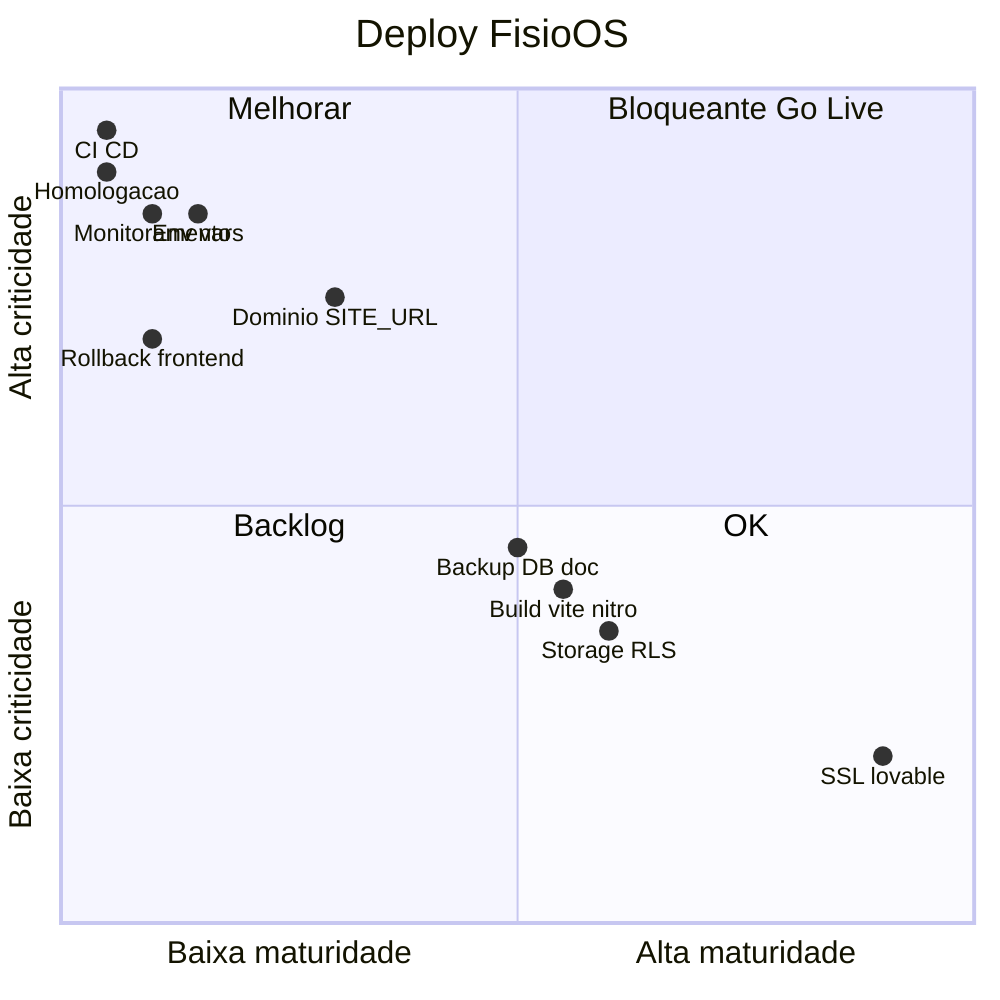

# Infraestrutura de Deploy — FisioOS (READ ONLY)

Análise **exclusiva do pipeline de build/deploy, configuração de ambientes e operação de produção** no repositório. Nenhum arquivo foi alterado.

**Stack de deploy identificada:**

```
Código → vite build (+ Nitro 3 beta) → Cloudflare Workers (default)
         ↕ secrets Lovable Cloud
         Supabase (Postgres + Auth + Storage) — project_id sppyifwiugugigynmysb
Host atual documentado: moveplus-clinic-hub.lovable.app
```

---

## Avaliação por dimensão

| Dimensão | Estado | Classificação |
|---|---|---|
| **Build** | `vite build`; Nitro/CF via `@lovable.dev/vite-tanstack-config` | **MÉDIO** |
| **Deploy** | Lovable Cloud; sem script `deploy` no repo | **ALTO** |
| **Variáveis de ambiente** | 6–7 vars inferíveis; **sem `.env.example`** | **CRÍTICO** |
| **Produção** | URL Lovable + Supabase managed; parcialmente documentado | **MÉDIO** |
| **Homologação** | **Inexistente** no repo (`build:dev` só) | **CRÍTICO** |
| **CI/CD** | **Inexistente** | **CRÍTICO** |
| **GitHub Actions** | **Inexistente** (pasta `.github/` ausente) | **CRÍTICO** |
| **Rollback** | DR DB no GO-LIVE; **sem rollback frontend** | **ALTO** |
| **Backup** | Snapshot diário Lovable (doc); CSV manual | **MÉDIO** |
| **Restore** | Procedimento DR documentado; **não testado no repo** | **ALTO** |
| **Logs** | `console.error` + Lovable runtime; sem agregador | **CRÍTICO** |
| **Monitoramento** | Manual semanal (GO-LIVE); sem automação | **CRÍTICO** |
| **Supabase** | 50 migrations; RLS; config mínimo (`project_id` only) | **MÉDIO** |
| **Storage** | 3 buckets (`documents`, `clinic-logos`, `user-avatars`); RLS | **MÉDIO** |
| **Domínio** | `*.lovable.app` ativo; custom domain pendente; `fisioos.app` hardcoded | **ALTO** |
| **SSL** | HTTPS Lovable ✅; custom domain ⚠️ | **BAIXO** (Lovable) / **ALTO** (custom) |
| **Segurança produção** | Service role server-only; RLS; gaps legado | **ALTO** |

---

## Detalhamento

### Build — **MÉDIO**

**Scripts (`package.json`):**
- `dev` → `vite dev`
- `build` → `vite build`
- `build:dev` → `vite build --mode development`
- `preview` → `vite preview`
- `lint` / `format` — qualidade, não deploy

**Pipeline técnico (`vite.config.ts`):**
- `@lovable.dev/vite-tanstack-config` injeta: TanStack Start, React, Tailwind, Nitro (**target default: Cloudflare**), env `VITE_*`.
- Entry SSR customizado: `src/server.ts` (wrapper de erro).
- Middleware: `src/start.ts` (auth bearer + error HTML).

**Gaps:**
- Sem `test` no build pipeline.
- Nitro **3.0.260603-beta** — dependência beta em produção.
- Outputs gitignored: `.output`, `.nitro`, `.wrangler`, `dist` — build é local/CI-externo.
- Sem Dockerfile, sem manifesto de deploy self-hosted.

---

### Deploy — **ALTO**

- Deploy **não está no repositório** — acoplado à **Lovable Cloud** (GO-LIVE §1.1).
- `.gitignore` prevê `.wrangler/` e `.dev.vars` (Cloudflare), mas **sem `wrangler.toml` no repo**.
- Nenhum script `npm run deploy`.
- Processo opaco: push Lovable → build → publish CF Workers.

**Risco:** impossível reproduzir deploy fora da Lovable sem documentação adicional.

---

### Variáveis de ambiente — **CRÍTICO**

| Variável | Onde | Público? | Observação |
|---|---|---|---|
| `VITE_SUPABASE_URL` | Client (build-time) | ✅ Sim | Bundled no browser |
| `VITE_SUPABASE_PUBLISHABLE_KEY` | Client | ✅ Sim | Anon key — OK público |
| `SUPABASE_URL` | SSR / server fn | Server | Fallback SSR |
| `SUPABASE_PUBLISHABLE_KEY` | Auth middleware | Server | Bearer validation |
| `SUPABASE_SERVICE_ROLE_KEY` | `client.server.ts` | **Secret** | Bypass RLS |
| `SITE_URL` | `saas-admin.functions.ts` | Server | **Default `https://fisioos.app`** |
| `NODE_ENV` | `config.server.ts` | Server | Parcialmente usado |
| `LOVABLE_API_KEY` | GO-LIVE only | Secret | Não referenciado no código app |

**Problemas:**
- **Sem `.env.example`** — onboarding/deploy depende de conhecimento tácito.
- **Divergência de domínio:** produção documentada = `moveplus-clinic-hub.lovable.app`, mas convites server-side usam `SITE_URL ?? "https://fisioos.app"` — se `SITE_URL` não estiver configurado na Lovable, **links de convite quebram**.
- Convites via UI clínica (`usuarios.tsx`) usam `window.location.origin` — **correto** no client.
- PDF/QR usa fallback `fisioos.app` em `pdf-engine.ts` — QR codes podem apontar domínio errado.

`config.server.ts` documenta bem o padrão Cloudflare Workers (ler env **dentro** de handlers, não no module scope).

---

### Produção — **MÉDIO**

**Documentado (GO-LIVE):**
- Frontend: `moveplus-clinic-hub.lovable.app`
- Backend: Lovable Cloud `ACTIVE_HEALTHY`
- Supabase: migrations aplicadas, RLS 100%
- Storage `documents` privado

**Arquitetura runtime:**
- Rotas autenticadas: **`ssr: false`** — app SPA-like pós-login (guard client-side).
- Server functions via TanStack Start + Bearer token (`auth-attacher.ts`).
- Página pública `/validar/$hash` — client-side Supabase RPC.

**Gaps:**
- Sem health check endpoint.
- Sem versionamento de release no código (semver/tag).
- Checklist GO-LIVE marca itens como ✅ sem evidência no repo (security scan, linter pendentes).

---

### Homologação — **CRÍTICO**

- **Nenhum ambiente staging** documentado ou configurado.
- `build:dev` existe mas não há projeto Supabase staging, secrets separados, ou URL de homolog.
- Beta fechado **deveria** usar staging espelhando prod — **não existe no repo**.

---

### CI/CD — **CRÍTICO** | GitHub Actions — **CRÍTICO**

- Pasta `.github/` **ausente**.
- Nenhum workflow: lint, build, test, deploy preview, migration check.
- Qualidade depende de execução manual local antes do publish Lovable.

---

### Rollback — **ALTO**

| Camada | Procedimento | No repo? |
|---|---|---|
| **Banco** | Snapshot diário Lovable (GO-LIVE §7) | Documentado |
| **Migrations** | Forward-only (50 SQL files) | Sem down migrations |
| **Frontend** | — | **Não documentado** |
| **Secrets** | Rotação manual em incidente | GO-LIVE §7 |

---

### Backup — **MÉDIO** | Restore — **ALTO**

**Backup (GO-LIVE §6):**
- Automático: snapshot diário Lovable Cloud.
- Manual: CSV via `/app/relatorios` + armazenamento externo.

**Restore (GO-LIVE §7):**
- RPO 24h, RTO 2h.
- Cenários: backend down → `supabase--restart`; dados corrompidos → snapshot.

**Gaps:**
- Storage (PDFs/logos) — backup **não documentado** separadamente do DB.
- **Nenhum drill de restore** registrado no repositório.
- Migrations locais ≠ garantia de estado prod (Extra Flow schema incerto).

---

### Logs — **CRÍTICO** | Monitoramento — **CRÍTICO**

- App: `console.error` (SSR, server fn, Supabase client init).
- Frontend: `reportLovableError` → plataforma Lovable.
- Ops: rotina manual GO-LIVE §5.2 (cloud_status, linter, slow_queries, audit_log, runtime errors).
- **Sem** Sentry, Datadog, Cloudflare Logpush configurado no repo.
- **Sem** alertas automatizados.

---

### Supabase — **MÉDIO**

- `supabase/config.toml`: apenas `project_id = "sppyifwiugugigynmysb"`.
- **50 migrations** versionadas — fonte de verdade do schema.
- Deploy migrations: via Lovable/Supabase dashboard (não automatizado no CI).
- Auth: email/senha (GO-LIVE); Google ⚠️ pendente.
- Redirect URLs de convite devem incluir `/set-password` no domínio de produção.

---

### Storage — **MÉDIO**

| Bucket | Uso | Policies |
|---|---|---|
| `documents` | PDFs `{clinic_id}/...`, branding | Tenant-scoped (migration recente) |
| `clinic-logos` | Logos clínica | Super admin write; read aberto |
| `user-avatars` | Avatares `{user_id}/...` | Owner-scoped |

- Buckets referenciados em policies; **criação de buckets** provavelmente via dashboard Supabase (não encontrada INSERT em migrations).
- Uploads diretos do browser — sem worker intermediário.

---

### Domínio — **ALTO** | SSL — **BAIXO** (atual) / **ALTO** (custom)

| Domínio | Status | Uso no código |
|---|---|---|
| `moveplus-clinic-hub.lovable.app` | Produção doc | GO-LIVE |
| `fisioos.app` | Fallback hardcoded | Convites server, QR PDF |
| Custom (ex. `app.moveplus.com.br`) | Pendente GO-LIVE | — |

- SSL no `*.lovable.app`: automático ✅.
- Custom domain + SSL: pendente, checklist GO-LIVE §1.1.
- **Alinhar `SITE_URL`** em todos os ambientes antes do Go Live.

---

### Segurança da produção — **ALTO**

**Pontos fortes:**
- `SUPABASE_SERVICE_ROLE_KEY` só em `client.server.ts` (`.server` pattern).
- Auth middleware valida Bearer + `getClaims()`.
- `.env`, `.wrangler`, `.dev.vars` gitignored.
- Storage RLS endurecida (migration `20260625232637`).

**Riscos deploy/prod:**
- Secrets via Lovable UI — sem rotação automatizada documentada.
- `ssr: false` em rotas auth — segurança depende de RLS (correto, mas sem defense-in-depth SSR).
- Legado RLS (`documents` table aberta) — gap de segurança em prod multi-tenant.
- Sem CSP headers, rate limiting, WAF config no repo.
- Security scan + linter Supabase: **pendentes** no GO-LIVE.

---

## Matriz resumo



---

## 1. Checklist de produção

Use como gate **contínuo** após Go Live.

### A. Build e artefato

- [ ] **CRÍTICO** — `npm run build` passa sem erro no commit de release
- [ ] **CRÍTICO** — `npm run lint` passa
- [ ] **ALTO** — Versão/tag registrada (git tag ou changelog)
- [ ] **MÉDIO** — `build:dev` não é usado em produção
- [ ] **MÉDIO** — Nitro beta monitorado; plano de upgrade documentado

### B. Variáveis e secrets

- [ ] **CRÍTICO** — `VITE_SUPABASE_URL` + `VITE_SUPABASE_PUBLISHABLE_KEY` configurados no host
- [ ] **CRÍTICO** — `SUPABASE_URL` + `SUPABASE_PUBLISHABLE_KEY` no runtime server (CF Workers)
- [ ] **CRÍTICO** — `SUPABASE_SERVICE_ROLE_KEY` **somente** server; nunca no bundle client
- [ ] **CRÍTICO** — `SITE_URL` = URL real de produção (ex. `https://app.fisioos.com.br`)
- [ ] **ALTO** — `LOVABLE_API_KEY` rotacionável; inventário de secrets
- [ ] **ALTO** — Nenhum secret commitado (`.env` gitignored)

### C. Supabase (produção)

- [ ] **CRÍTICO** — Todas as 50 migrations aplicadas; drift zero vs repo
- [ ] **CRÍTICO** — RLS ativa em 100% das tabelas `public.*`
- [ ] **CRÍTICO** — Redirect URLs Auth incluem `{SITE_URL}/set-password`, `{SITE_URL}/auth`
- [ ] **ALTO** — Buckets `documents`, `clinic-logos`, `user-avatars` existem
- [ ] **ALTO** — Storage policies da migration mais recente aplicadas
- [ ] **ALTO** — Supabase Auth: Google configurado (se exigido pela clínica)
- [ ] **MÉDIO** — Connection pooling (Supavisor) habilitado se MAU > 500

### D. Domínio e SSL

- [ ] **CRÍTICO** — HTTPS ativo na URL de produção
- [ ] **ALTO** — Domínio custom conectado (se aplicável) + SSL validado
- [ ] **ALTO** — QR codes PDF apontam para domínio de produção (não fallback `fisioos.app`)
- [ ] **MÉDIO** — CORS / redirect URLs Supabase alinhados ao domínio final

### E. Deploy e rollback

- [ ] **ALTO** — Procedimento de deploy documentado (Lovable ou self-host)
- [ ] **ALTO** — Procedimento de rollback frontend documentado e testado
- [ ] **ALTO** — Migrations são forward-only; backup antes de cada migration
- [ ] **MÉDIO** — Deploy em horário de baixo uso; comunicação prévia se breaking

### F. Backup e restore

- [ ] **CRÍTICO** — Backup automático Supabase/Lovable confirmado ativo
- [ ] **ALTO** — Drill de restore executado nos últimos 90 dias
- [ ] **ALTO** — Procedimento CSV manual documentado (`/app/relatorios`)
- [ ] **MÉDIO** — Política de retenção de snapshots definida
- [ ] **MÉDIO** — Storage (PDFs) incluído no plano de backup

### G. Logs e monitoramento

- [ ] **CRÍTICO** — APM/erros (Sentry ou Lovable runtime) ativo e revisado
- [ ] **CRÍTICO** — Uptime monitor na URL de produção
- [ ] **ALTO** — Rotina semanal GO-LIVE §5.2 executada e registrada
- [ ] **ALTO** — Baseline slow queries capturada
- [ ] **ALTO** — Security scan + linter Supabase limpos
- [ ] **MÉDIO** — Alertas de error spike configurados

### H. Segurança produção

- [ ] **CRÍTICO** — `public.documents` RLS fechada ou deprecada
- [ ] **CRÍTICO** — Convite não cria `user_roles.admin` global
- [ ] **ALTO** — Service role key rotacionada pós-incidente (se aplicável)
- [ ] **ALTO** — Modo suporte testado (read-only clínico)
- [ ] **MÉDIO** — Termo LGPD assinado pelo controlador

---

## 2. Checklist de Go Live

Gate **único** antes de abrir para clínicas piloto (consolida GO-LIVE-V1.md + gaps do repo).

### Pré-requisitos bloqueantes (GO / NO-GO)

| # | Item | Sev. | GO-LIVE ref |
|---|---|---|---|
| 1 | Build + lint passam no commit de release | **CRÍTICO** | — |
| 2 | **`SITE_URL` configurado** = URL real (convites server-side) | **CRÍTICO** | §1.1 |
| 3 | Supabase migrations 100% aplicadas em prod | **CRÍTICO** | §1.2 |
| 4 | **`SITE_URL`/Auth redirect URLs** incluem `/set-password` | **CRÍTICO** | §4 |
| 5 | Security scan executado — zero critical | **CRÍTICO** | §1.3, §9 |
| 6 | Linter Supabase executado — critical resolvidos | **CRÍTICO** | §1.3, §9 |
| 7 | RLS legado (`documents`, admin global) corrigido | **CRÍTICO** | Auditoria segurança |
| 8 | Convite fisioterapeuta funciona end-to-end | **CRÍTICO** | Beta checklist |
| 9 | Isolamento multi-tenant validado manualmente | **CRÍTICO** | §1.3 |
| 10 | Staging espelha prod (migrations + buckets + RLS) | **CRÍTICO** | — (ausente hoje) |

### Infraestrutura (GO-LIVE §1)

- [ ] Frontend publicado e acessível (HTTPS)
- [ ] Lovable Cloud `ACTIVE_HEALTHY`
- [ ] Storage `documents` privado + policies
- [ ] Secrets `SUPABASE_*` + `LOVABLE_API_KEY` configurados
- [ ] Domínio próprio conectado **ou** decisão explícita de usar `*.lovable.app` temporariamente
- [ ] SSL validado (custom domain se aplicável)

### Banco e dados (GO-LIVE §1.2)

- [ ] Migrations Blocos A–C (+ posteriores) aplicadas
- [ ] Triggers: audit, validation hash, reassessment ativos
- [ ] Índices críticos presentes
- [ ] Baseline slow queries capturada (pendente GO-LIVE §1.4)

### Smoke test clínico (GO-LIVE §2 + Beta §E)

- [ ] Provisionar clínica piloto
- [ ] Owner: signup → `/set-password` → login
- [ ] Owner convida fisioterapeuta — membro aparece
- [ ] Fluxo: paciente → avaliação → evolução → PDF → `/validar/{hash}`
- [ ] White label (logo/cores) reflete em PDF e sidebar

### Operação (GO-LIVE §3, §5, §8)

- [ ] Treinamento admin + fisio agendado
- [ ] Canal de suporte definido (WhatsApp/email)
- [ ] Modo suporte treinado para super_admin
- [ ] Planilha de triagem piloto ativa (§8)
- [ ] Rotina semanal de monitoramento acordada
- [ ] Procedimento DR comunicado (RPO 24h, RTO 2h)

### Legal e produto

- [ ] Termo LGPD assinado pelo controlador
- [ ] Auth Google configurado (se clínica exige)
- [ ] Expectativas de escopo Beta alinhadas (BACKLOG V1.1)

### GO / NO-GO final

| Critério | GO | NO-GO |
|---|---|---|
| Todos os itens **CRÍTICO** acima | ✅ | ❌ |
| `SITE_URL` alinhado ao domínio real | ✅ | ❌ |
| Convite + isolamento tenant OK em staging | ✅ | ❌ |
| Security scan + linter limpos | ✅ | ❌ |
| Clínica treinada + suporte definido | ✅ | ❌ |

**Veredito atual (só infra deploy):** a base **Lovable + Supabase + Vite/Nitro** suporta **piloto fechado** após corrigir **`SITE_URL`/domínio**, criar **staging**, e executar **scans pendentes**. **CI/CD, homologação formal, rollback frontend e observabilidade automatizada estão ausentes** — classificação **CRÍTICO** para Go Live comercial, **ALTO** para piloto assistido.

---

Nenhum arquivo foi alterado nesta análise.