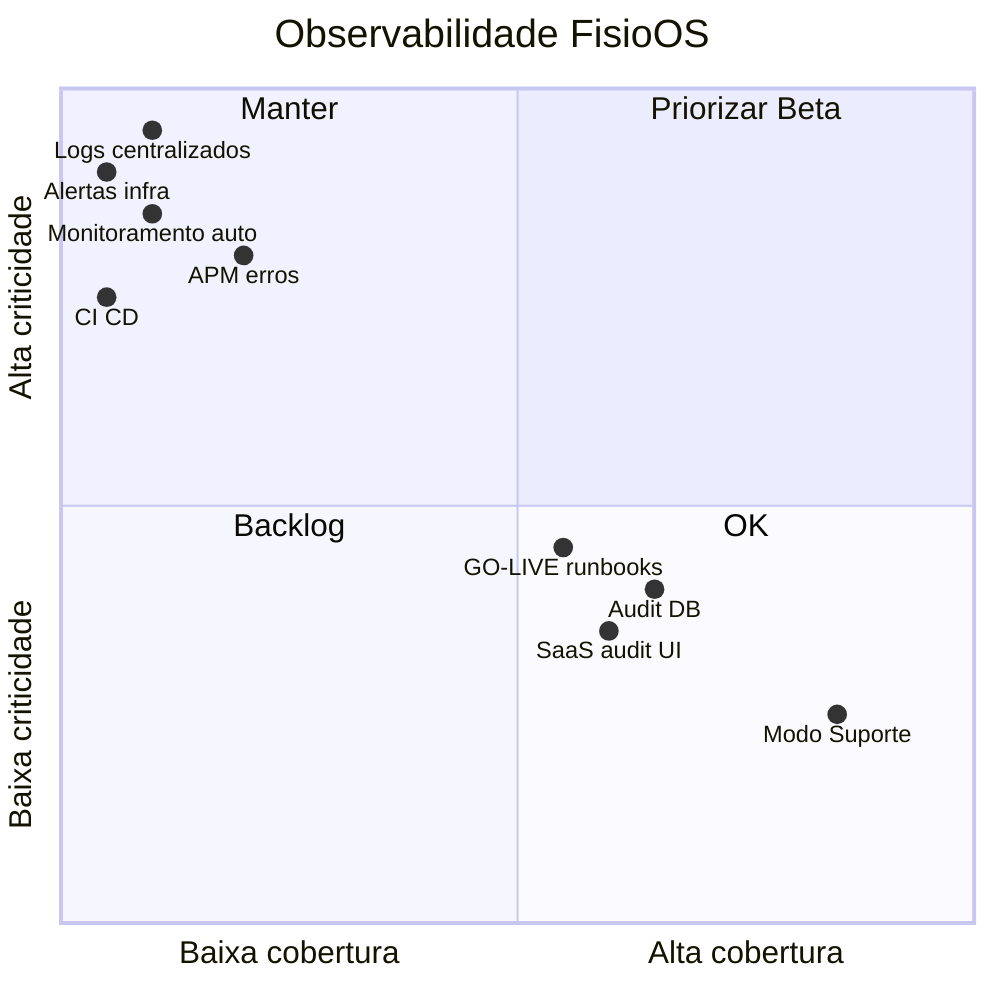

# Observabilidade e Operação — FisioOS (READ ONLY)

Análise **exclusiva do código, schema e documentação operacional** (`GO-LIVE-V1.md`, componentes de erro/suporte, auditorias DB). Nenhum arquivo foi alterado.

**Veredito central:** o FisioOS tem **boa base de auditoria clínica no Postgres** e **runbooks manuais no GO-LIVE**, mas **observabilidade moderna (APM, alertas, métricas, CI/CD, rollback automatizado) está praticamente ausente**. Para Beta fechado isso é **aceitável com ressalvas**; para operação autônoma, **não**.

---

## Avaliação por dimensão

| Dimensão | O que existe | Classificação |
|---|---|---|
| **Logs** | `console.error` (SSR/server fn), `toast.error` (UX), Lovable runtime | **CRÍTICO** (sem centralização) |
| **Auditoria** | 3 camadas: `audit_log`, `assessment_audit_log`, `saas_audit_log` | **MÉDIO** |
| **Erros** | Error boundary + `reportLovableError` + `error-capture.ts` SSR | **ALTO** (parcial) |
| **Alertas** | Alertas de produto (reavaliações); zero alertas infra | **CRÍTICO** |
| **Monitoramento** | Rotina manual GO-LIVE (Lovable/Supabase tools) | **CRÍTICO** |
| **Métricas** | KPIs de produto no painel; sem métricas ops | **ALTO** |
| **Supabase** | Triggers, RLS, backups documentados na plataforma | **MÉDIO** |
| **Frontend** | Root error component, cache clear no logout | **MÉDIO** |
| **Backend** | `server.ts` wrapper, auth middleware, best-effort audit | **ALTO** |
| **Deploy** | Lovable Cloud + Nitro/CF Workers; **sem CI no repo** | **ALTO** |
| **Rollback** | DR via snapshot DB (GO-LIVE); sem rollback app documentado | **ALTO** |
| **Backups** | Snapshot diário Lovable + CSV manual | **MÉDIO** |
| **Runbooks** | GO-LIVE §5–8 (único material real) | **MÉDIO** |
| **Suporte** | Modo suporte completo (sessão, banner, guard, audit) | **BAIXO** (maduro) |
| **Incidentes** | Template triagem piloto; sem processo formal | **ALTO** |
| **Rastreabilidade** | Audit DB + hash documento; sem trace distribuído | **ALTO** |

---

## Detalhamento

### Logs — **CRÍTICO**

**Implementado:**
- SSR: `console.error` em `server.ts` + recuperação de erros engolidos pelo h3 via `error-capture.ts`.
- Server functions: `console.error("[Supabase]...")`, `console.error("[saas_audit_log]")`.
- Frontend: dezenas de `toast.error(e.message)` espalhados — feedback ao usuário, **não** log centralizado.
- Scripts: `console.error` / `console.warn` em seed e fixtures.

**Ausente:**
- Agregador (Sentry, Logtail, Datadog, Cloudflare Logpush).
- Logs estruturados (JSON com `level`, `clinic_id`, `user_id`, `route`).
- **Correlation ID** / request ID ponta a ponta.
- Retenção, busca e alertas sobre logs.

**vs. melhores práticas:** produção SaaS exige **log centralizado + retenção ≥30 dias + busca por tenant/usuário**.

---

### Auditoria — **MÉDIO**

Três sistemas paralelos:

| Sistema | Escopo | Gravação | Leitura UI |
|---|---|---|---|
| **`audit_log`** | 8 tabelas clínicas via `fn_audit_trigger` | Trigger DB (old/new JSONB) | ❌ Sem UI clínica; policy `admin` global |
| **`assessment_audit_log`** | Wizard (autosave, finalize, template) | Client insert | ❌ Sem UI |
| **`saas_audit_log`** | Ops SaaS (planos, clínicas, suporte) | Server fn (best-effort) | ✅ Tab Auditoria em `/app/admin-saas` |

**Pontos fortes:**
- INSERT direto em `audit_log` **bloqueado** para clientes (`audit_no_client_insert`).
- Modo suporte registra `support.start` / `support.end` com duração.
- `listSaasAudit` com filtros por clínica, ação, período.

**Gaps:**
- **`audit_log` read policy** ainda usa `has_role(..., 'admin')` global — não escopado por tenant/clínica.
- **`saas_audit_log` best-effort** — falha silenciosa (`catch` + `console.error`), operação continua.
- Coluna `ip_address` existe no schema mas **não é populada** nas server functions.
- Backlog prevê `/app/auditoria` clínica — **não implementado**.
- Trilhas **desconectadas** (clínico vs SaaS vs wizard).

---

### Erros — **ALTO**

**Implementado:**

```34:37:src/routes/__root.tsx
function ErrorComponent({ error, reset }: { error: Error; reset: () => void }) {
  console.error(error);
  useEffect(() => { reportLovableError(error, { boundary: "tanstack_root_error_component" }); }, [error]);
```

- `reportLovableError` → `window.__lovableEvents.captureException` (depende da plataforma Lovable).
- Página HTML de fallback SSR (`error-page.ts`).
- Auth middleware com mensagens explícitas de unauthorized.

**Gaps:**
- Sem captura de **unhandledrejection** no client (só SSR via `error-capture.ts`).
- Erros Supabase client-side vão só para toast — **sem telemetria**.
- Sem classificação (4xx vs 5xx), sem fingerprinting, sem agrupamento.
- `example.functions.ts` expõe endpoint sem auth (superfície menor).

---

### Alertas — **CRÍTICO**

**Produto (implementado):**
- KPI “Reavaliações pendentes” com tom warning no painel.
- Sidebar “atividades importantes” (rascunhos, evoluções sem assinatura).
- Banner âmbar em Modo Suporte.

**Infra/ops (ausente):**
- Uptime, error rate, latência p95, slow queries automáticas.
- Alertas de backup falho, storage quota, auth failures.
- Pager/on-call, status page.

---

### Monitoramento — **CRÍTICO**

Única rotina documentada (`GO-LIVE-V1.md` §5.2):

1. `cloud_status` → `ACTIVE_HEALTHY`
2. `supabase--linter`
3. `slow_queries limit=20`
4. Revisar 200 linhas `audit_log`
5. Runtime Errors Lovable

**Tudo manual, semanal, dependente de ferramentas Lovable** — não versionado no repo, não automatizado.

**Ausente no código:** health check endpoint, synthetic monitoring, CI gates, dashboards Grafana/Datadog.

---

### Métricas — **ALTO**

- Painel clínico: contagens operacionais (pacientes, docs, atendimentos) — **produto**, não ops.
- `clinic_usage` view para metering SaaS — bom para billing, não exportado como métrica.
- Sem RED/USE metrics, sem SLI/SLO definidos no código ou docs.

---

### Supabase — **MÉDIO**

**Pontos fortes:**
- Audit triggers, índices em `audit_log` e `saas_audit_log`.
- RLS hardened; funções internas revogadas de `anon`.
- Backups diários documentados (Lovable Cloud).

**Gaps operacionais:**
- Sem runbook de **restore testado** no repositório.
- Sem documentação de tier/limites (conn, storage, MAU).
- Edge Function logs citados no GO-LIVE — **nenhuma Edge Function no repo** (lógica em server fn + client).
- Baseline slow queries marcada como pendente no GO-LIVE.

---

### Frontend — **MÉDIO**

- Error boundary global com retry.
- Logout limpa React Query cache (evita vazamento entre contas — relevante para ops de suporte).
- `persistent-cache` TTL para branding — não é observabilidade.
- Sem Real User Monitoring (RUM), Core Web Vitals export, session replay.

---

### Backend — **ALTO**

- Cloudflare Workers via Nitro (`vite.config.ts` → `server.ts`).
- Auth middleware robusto (`getClaims`).
- Erro SSR recuperável quando h3 engole exceção.

**Gaps:**
- Logs só `console.error` (visíveis no dashboard CF, mas sem estrutura/alerts).
- `logAudit` best-effort sem fail-closed.
- Sem rate limiting, sem circuit breaker, sem timeout budgets documentados.

---

### Deploy — **ALTO**

- Host: **Lovable Cloud** (`moveplus-clinic-hub.lovable.app`).
- Build: Vite + Nitro (default Cloudflare).
- **Zero `.github/workflows`** — sem CI/CD no repositório.
- Sem ambientes staging/prod documentados no código.
- Sem feature flags, canary ou blue-green.

---

### Rollback — **ALTO**

**Documentado (GO-LIVE §7):**
- DB: restore snapshot diário Lovable.
- Secrets: rotação manual em vazamento.
- Frontend: **sem procedimento de rollback** explícito.

**Ausente:**
- Rollback de migration (forward-only).
- Rollback de deploy frontend (versão anterior).
- Playbook testado em drill.

---

### Backups — **MÉDIO**

**Automático:** snapshot diário Lovable (RPO 24h documentado).

**Manual:** export CSV via `/app/relatorios` + armazenamento externo criptografado.

**Gaps:**
- Storage (PDFs, logos) — backup DB **não** inclui objetos Storage automaticamente de forma documentada.
- Sem backup off-site testado.
- Sem política de retenção/arquivamento de `audit_log`.

---

### Runbooks — **MÉDIO**

**Existe (GO-LIVE):**
- §5 Monitoramento semanal
- §6 Backup
- §7 DR (RPO 24h, RTO 2h)
- §8 Triagem de demandas piloto

**Não existe no repo:**
- `docs/operacao/*` (placeholders vazios)
- Runbook de convite quebrado, provisionamento, escalação de bug crítico
- Runbook Modo Suporte (parcialmente implícito no código)

---

### Suporte — **BAIXO** (ponto forte)

Implementação madura:
- `start_support_session` / `end_support_session` RPC com audit.
- `SupportBanner` (refresh 30s).
- `SupportGuard` + `support-click-interceptor` bloqueiam escrita na UI.
- `fn_block_support_writes` no DB (8 tabelas core).
- Tab Auditoria SaaS filtra eventos de suporte.

**Gap menor:** escrita ainda possível em tabelas fora do escopo do trigger de suporte (documentado na auditoria de segurança).

---

### Incidentes — **ALTO**

- Template de triagem piloto (GO-LIVE §8) — planilha, não processo ITIL.
- Sem severidades (SEV1–4), sem canal de war room, sem postmortem template.
- Sem runbook “backend inacessível” testado além da tabela DR.

---

### Rastreabilidade — **ALTO**

**Implementado:**
- `audit_log` com old/new por registro clínico.
- `clinical_documents.validation_hash` + `template_version` + `locked_at`.
- `saas_audit_log` com entity_type/id e diff.
- Wizard: passo, ação, detalhes em `assessment_audit_log`.

**Ausente:**
- Request tracing (OpenTelemetry).
- Correlação erro frontend ↔ server fn ↔ query Supabase.
- Audit unificado pesquisável por paciente/clínica em UI clínica.

---

## Matriz resumo



---

## 1. Plano operacional

### Fase 0 — Beta fechado (0–4 semanas) · operação manual assistida

| # | Entrega | Responsável | Critério |
|---|---|---|---|
| O0.1 | **Checklist semanal GO-LIVE** executado e registrado (planilha) | Ops/Founder | 4 semanas consecutivas |
| O0.2 | **Canal de suporte** definido (WhatsApp/email + SLA piloto) | CS | Clínicas sabem como escalar |
| O0.3 | **Smoke test manual** 15 passos documentado e executado pré-Beta | QA | 1× por release |
| O0.4 | **Baseline slow queries** capturada (item pendente GO-LIVE) | DBA/Ops | Arquivo salvo |
| O0.5 | **Security scan + linter** Supabase executados | Sec | Zero critical |
| O0.6 | **Drill de restore** — restaurar snapshot em staging | Ops | RTO validado |
| O0.7 | **Inventário de secrets** (Supabase, Lovable) + rotação documentada | Sec | Sem secrets no client |
| O0.8 | **Template de incidente** (SEV, timeline, comunicação clínica) | Ops | 1 página |

---

### Fase 1 — Observabilidade mínima (1–3 meses)

| # | Entrega | Impacto |
|---|---|---|
| O1.1 | **Sentry** (ou equivalente) — client + SSR + server functions | MTTR −70% |
| O1.2 | **Health check** `/api/health` (Supabase ping + version) | Uptime monitor |
| O1.3 | **CI básico** — `lint` + `build` em PR | Regressão deploy |
| O1.4 | **Staging** espelhando prod (Supabase project separado) | Teste seguro |
| O1.5 | **Runbooks versionados** em `docs/operacao/` (extrair GO-LIVE) | Onboarding ops |
| O1.6 | **Fail-closed** em `saas_audit_log` (falha = abortar operação admin) | Compliance |
| O1.7 | Popular **`ip_address`** + user-agent nas server functions admin | Forense |
| O1.8 | **Alertas** — uptime (Better Uptime/Pingdom) + Sentry error spike | Proativo |

**Critério de done:** incidente P1 detectado em <15 min sem depender do usuário reportar.

---

### Fase 2 — Operação SaaS (3–9 meses)

| # | Entrega |
|---|---|
| O2.1 | Dashboard ops (Grafana/Datadog): error rate, p95 latency, DB conn, storage |
| O2.2 | SLI/SLO documentados (uptime 99.5%, p95 API <500ms) |
| O2.3 | `/app/auditoria` clínica (filtro tenant em `audit_log`) |
| O2.4 | Retention policy `audit_log` (>90d → cold storage) |
| O2.5 | Deploy pipeline: staging → prod com approval |
| O2.6 | Rollback frontend documentado + testado |
| O2.7 | Postmortem template + blameless culture |
| O2.8 | Synthetic checks (login, criar paciente, emitir PDF) |

---

### Fase 3 — Escala operacional (9–18 meses)

| # | Entrega |
|---|---|
| O3.1 | OpenTelemetry trace (browser → worker → Supabase) |
| O3.2 | Status page pública |
| O3.3 | On-call rotation + PagerDuty |
| O3.4 | Audit unificado (clínico + SaaS + auth events) |
| O3.5 | Backup Storage + restore test trimestral |
| O3.6 | FinOps dashboard (custo/clínica) |
| O3.7 | Chaos drills (DB down, CF outage) |

---

## 2. O que falta antes do Beta

### P0 — Bloqueante operacional

| Item | Classificação | Motivo |
|---|---|---|
| Executar **security scan + linter** Supabase | **CRÍTICO** | GO-LIVE bloqueador |
| **Canal de suporte** + SLA piloto definidos | **CRÍTICO** | Clínica precisa escalar |
| **Smoke test manual** documentado e executado 1× | **CRÍTICO** | GO-LIVE checklist §H |
| **Baseline slow queries** capturada | **ALTO** | GO-LIVE pendente |
| **Drill restore** snapshot (mesmo que manual) | **ALTO** | Validar RPO/RTO real |
| **Staging** espelhando prod | **ALTO** | Beta sem staging = risco |

### P1 — Fortemente recomendado

| Item | Classificação |
|---|---|
| **Sentry** (ou APM mínimo) client + SSR | **CRÍTICO** |
| **Uptime monitor** no URL público | **ALTO** |
| **CI** lint + build em PR | **ALTO** |
| Runbook **Modo Suporte** escrito (como iniciar/encerrar/escalar) | **MÉDIO** |
| Template **incidente** (SEV + comunicação clínica) | **ALTO** |
| Inventário **secrets** + procedimento rotação | **ALTO** |
| Corrigir **audit_log read** para tenant (ou restringir a super_admin até ter UI) | **ALTO** |

### P2 — Pode ser pós-Beta imediato

| Item | Classificação |
|---|---|
| `/app/auditoria` clínica | **MÉDIO** |
| OpenTelemetry | **BAIXO** (Beta) |
| Status page | **BAIXO** |
| Fail-closed audit SaaS | **MÉDIO** |
| Retention/archival audit | **MÉDIO** |

---

## 3. Gargalos operacionais prioritários

| # | Gargalo | Impacto |
|---|---|---|
| 1 | **Zero log centralizado** — debug depende de Lovable console + browser DevTools | MTTR alto |
| 2 | **Monitoramento 100% manual** — rotina semanal não escala | Incidentes tardios |
| 3 | **Sem CI/CD** — deploy sem gate automatizado | Regressões silenciosas |
| 4 | **Audit silencioso** (best-effort) em ops críticas | Compliance gap |
| 5 | **Rollback só DB** — frontend sem volta documentada | Downtime prolongado |
| 6 | **3 trilhas de audit desconectadas** — investigação fragmentada | Forense lenta |
| 7 | **`audit_log` sem UI clínica** — GO-LIVE promete audit, admin não vê | Confiança piloto |

---

## Conclusão executiva

| Área | Nota Beta | Comentário |
|---|---|---|
| **Suporte / Modo Suporte** | ✅ Pronto | Melhor capacidade operacional do produto |
| **Auditoria DB** | ⚠️ Parcial | Dados existem; UI e tenant scope incompletos |
| **Runbooks** | ⚠️ Parcial | GO-LIVE é bom; não versionado em `docs/` |
| **Erros / APM** | ❌ Insuficiente | Lovable-only; sem Sentry |
| **Alertas / Monitoramento** | ❌ Insuficiente | Manual semanal |
| **Deploy / Rollback / CI** | ❌ Insuficiente | Lovable opaco; sem pipeline |

**Para Beta fechado (1–3 clínicas):** operação **manual assistida** é viável **se** P0 for cumprido (suporte, smoke test, security scan, staging, drill restore) **e** Sentry/uptime forem adicionados (P1 fortemente recomendado).

**Para Beta ampliado ou GA:** Fase 1 do plano operacional é **obrigatória**.

Nenhum arquivo foi alterado nesta análise.