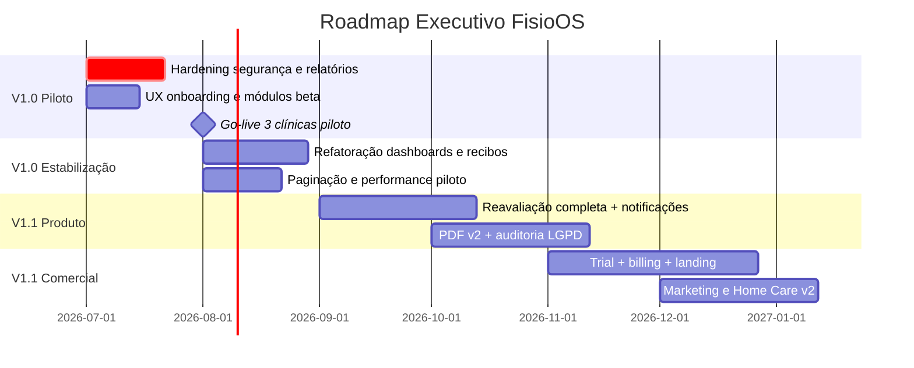

# FisioOS — Análise de Produto Final (READ ONLY)

Avaliação **exclusiva do código e documentação existente** (`GO-LIVE-V1.md`, `BACKLOG-POS-V1.md`, rotas em `src/routes/_authenticated/app/`, componentes clínicos e schema Supabase). Nenhum arquivo foi alterado.

**Legenda de classificação**

| Nível | Significado |
|---|---|
| **CRÍTICO** | Bloqueia uso confiável, venda ou conformidade |
| **ALTO** | Funciona parcialmente; risco operacional ou de churn |
| **MÉDIO** | MVP utilizável com gaps conhecidos |
| **BAIXO** | Maduro; polish ou escala futura |

**Escala de maturidade:** % de completude para uso real em clínica (não “código escrito”, mas **produto entregável**).

---

## Módulos

### 1. Dashboard (Painel `/app` + Indicadores `/app/dashboard-clinico`)

| | |
|---|---|
| **Maturidade** | **78%** |
| **Classificação** | **MÉDIO** |

**Implementado**
- Painel operacional (`index.tsx`): KPIs (pacientes, atendimentos, docs), agenda do dia, reavaliações pendentes, rascunhos, card clínica nova.
- Painel clínico (`dashboard-clinico.tsx`): gráficos Recharts (risco, escalas, objetivos, reavaliações).

**Gaps**
- Dois painéis com nome “Painel Clínico” e propósitos sobrepostos.
- `dashboard-clinico` consulta `assessment_scales` e `assessment_goals` **sem filtro `clinic_id`** — dados podem vazar entre tenants.
- `OnboardingChecklist` existe mas **não é renderizado** em nenhuma rota.

---

### 2. Agenda

| | |
|---|---|
| **Maturidade** | **88%** |
| **Classificação** | **BAIXO** |

**Implementado**
- Views dia / semana / mês, CRUD completo, filtros por profissional e status, slot prefill, SupportGuard, empty states.

**Gaps**
- Sem lembretes (e-mail/WhatsApp), sem integração com evolução automática pós-atendimento, sem recorrência.

---

### 3. Pacientes

| | |
|---|---|
| **Maturidade** | **85%** |
| **Classificação** | **MÉDIO** |

**Implementado**
- Lista com busca, cadastro, prontuário 360º (`$id.tsx`): timeline, tabs clínicas, avaliações, evoluções, documentos, alta, comparativo.
- Delete seguro (`safeDeletePatient`), tenant-scoped, layout premium em index.

**Gaps**
- Sem paginação server-side (carrega todos os ativos).
- Prontuário denso: wizard + form clássico coexistem.

---

### 4. Avaliação

| | |
|---|---|
| **Maturidade** | **76%** |
| **Classificação** | **ALTO** |

**Implementado**
- Wizard 7 passos (`assessment-wizard.tsx`): identificação → diagnóstico → anamnese → exame → escalas → plano.
- Detecção rule-based (`detectDiagnoses`), perfis clínicos, rascunho, lock/finalizar.
- Form clássico alternativo (`assessment-form.tsx`).
- Lista global `/app/avaliacoes`.

**Gaps**
- Passo 7 “Assinaturas” no wizard é **placeholder** (“Fase 4”) — assinatura funciona só via `ClinicalTabs` no prontuário, não no fluxo do wizard.
- Objetivos sugeridos são badges read-only; catálogos SQL não totalmente conectados.
- Feature `inteligencia_clinica` no plano sem gate no app.

---

### 5. Evolução

| | |
|---|---|
| **Maturidade** | **82%** |
| **Classificação** | **MÉDIO** |

**Implementado**
- `EvolutionForm` completo (EVA, sinais vitais, conduta, preview PDF).
- Assinatura via `locked_at`, lista global `/app/evolucoes`, PDF builder dedicado.

**Gaps**
- Sem vínculo obrigatório com sessão da agenda.
- Assinatura = lock timestamp, não canvas integrado no form (diferente de `SignaturePad`).

---

### 6. Reavaliação

| | |
|---|---|
| **Maturidade** | **72%** |
| **Classificação** | **MÉDIO** |

**Implementado**
- Trigger DB agenda reavaliação (`fn_schedule_reassessment`).
- Página `/app/reavaliacoes` (atrasadas / a vencer / concluídas).
- Tipo `reavaliacao` no wizard; comparador no prontuário.

**Gaps**
- Comparador (`reassessment-comparator.tsx`) só compara **EVA + texto** — escalas/MRC/goniometria fora.
- Sem notificações automáticas (e-mail/WhatsApp/cron).
- Sem ação “iniciar reavaliação” direta da lista global.

---

### 7. Alta

| | |
|---|---|
| **Maturidade** | **70%** |
| **Classificação** | **MÉDIO** |

**Implementado**
- Tab “Alta” no prontuário (`discharge-panel.tsx`): motivos padronizados, registro, lock, PDF com branding.

**Gaps**
- Não há rota/módulo global de altas.
- Inativação automática do paciente incompleta (atualiza `data_alta`, fluxo de `situacao` parcial).
- Sem encaminhamento estruturado pós-alta.

---

### 8. Escalas

| | |
|---|---|
| **Maturidade** | **86%** |
| **Classificação** | **MÉDIO** |

**Implementado**
- 19 escalas em `clinical-scales.ts` (Barthel, Katz, Berg, Tinetti, Braden, TUG, etc.).
- `ScalesPanel`: aplicar, classificar risco, gráfico evolutivo por paciente.
- Integração no wizard (passo escalas) + tabs clínicas.

**Gaps**
- Catálogo seed-only (sem editor admin).
- Bug em relatórios: query usa `scale_code`, coluna real é `scale_type`.
- Dashboard clínico sem filtro tenant nas escalas.

---

### 9. Biblioteca

| | |
|---|---|
| **Maturidade** | **83%** |
| **Classificação** | **BAIXO** |

**Implementado**
- 8 tipos (cartilha, exercício, protocolo, POP, treinamento, marketing…).
- Busca, categorias, favoritos, visualização, export PDF com branding.

**Gaps**
- Conteúdo global (RLS); clínica não edita próprio acervo.
- Sem versionamento de conteúdo.

---

### 10. Documentos (Emissão)

| | |
|---|---|
| **Maturidade** | **84%** |
| **Classificação** | **MÉDIO** |

**Implementado**
- Wizard 4 passos (`documentos.tsx`): modelo → paciente → preview → emitir.
- Merge tags, validação de profissional, hash + QR, arquivamento em `clinical_documents`.
- Templates em `/app/templates`.

**Gaps**
- Editor WYSIWYG adiado (Markdown + merge tags).
- Sem diff visual entre versões.

---

### 11. PDFs

| | |
|---|---|
| **Maturidade** | **81%** |
| **Classificação** | **MÉDIO** |

**Implementado**
- Engine V2 (`pdf-engine.ts`): layout editorial, QR, assinatura, EVA visual, multi-bloco.
- Builders para avaliação, evolução, biblioteca, recibos, alta.
- Validação pública `/validar/$hash`.
- Upload Storage + registro.

**Gaps**
- Geração **100% client-side** (jsPDF) — gargalo em lote.
- Cores do PDF nem sempre usam `primary_color` da clínica.
- Sem gráficos embutidos como PNG (backlog).

---

### 12. Financeiro

| | |
|---|---|
| **Maturidade** | **68%** |
| **Classificação** | **ALTO** |

**Implementado**
- Lançamentos (receita/despesa por paciente), recibos simples, preview/impressão PDF.
- Aba recibos dentro de `/app/financeiro`.

**Gaps**
- **Dois fluxos de recibos**: `/app/financeiro` + `/app/recibos` (Extra Flow com `pagamentos` — schema paralelo, menos maduro).
- Sem gateway (Stripe/MP) — texto explícito em relatórios como backlog.
- Sem DRE, conciliação, NF.

---

### 13. Home Care

| | |
|---|---|
| **Maturidade** | **42%** |
| **Classificação** | **ALTO** |

**Implementado**
- CRUD de visitas domiciliares: endereço, plano, relatório familiar, duração.

**Gaps**
- UI promete “checklist” — **não implementado**.
- Sem roteirização, offline, PDF domiciliar dedicado.
- Query de visitas em `diferenciais.tsx` **sem filtro clinic_id**.

---

### 14. Marketing

| | |
|---|---|
| **Maturidade** | **38%** |
| **Classificação** | **ALTO** |

**Implementado**
- Calendário editorial (`marketing_calendar`): título, data, canal, status.

**Gaps**
- Sem banco de ideias integrado à biblioteca (`post_social` existe na biblioteca mas não conectado).
- Sem geração de arte, métricas, publicação.
- Descrição comercial supera entrega real.

---

### 15. White Label

| | |
|---|---|
| **Maturidade** | **84%** |
| **Classificação** | **BAIXO** |

**Implementado**
- `clinic_settings`: logo, cores, app_name, slogan, CREFITO default.
- `useBranding()` em sidebar, painel, PDFs, biblioteca.
- Preview ao vivo em configurações.

**Gaps**
- Login pré-auth sempre FisioOS institucional (correto para SaaS, limita white label total).
- PDF parcialmente tenant-aware.
- Sem domínio custom por clínica (Enterprise).

---

### 16. Administração SaaS

| | |
|---|---|
| **Maturidade** | **87%** |
| **Classificação** | **ALTO** |

**Implementado**
- Painel completo (`admin-saas.tsx` ~1.600 linhas): provisionar clínica, planos CRUD, limites, trial/status, convites owner, modo suporte, audit SaaS, soft delete.

**Gaps**
- Dependente de operação manual (sem self-serve).
- Convite com bug de role (`physiotherapist` vs `profissional`).
- `SITE_URL` inconsistente com deploy Lovable.
- Sem billing integrado.

---

### 17. Configurações

| | |
|---|---|
| **Maturidade** | **86%** |
| **Classificação** | **BAIXO** |

**Implementado**
- Dados cadastrais, logo uploader, cores, slogan, rodapé PDF, avatar profissional, preview branding.

**Gaps**
- Sem parametrização de políticas (senha, retenção LGPD, intervalos padrão de reavaliação).

---

### 18. Relatórios

| | |
|---|---|
| **Maturidade** | **62%** |
| **Classificação** | **CRÍTICO** |

**Implementado**
- Abas clínico / financeiro / operacional, filtros de período, export CSV com BOM UTF-8.

**Gaps**
- Queries **sem `clinic_id`** em pacientes, avaliações, evoluções e escalas.
- Campo errado `scale_code` vs `scale_type` — distribuição de risco quebrada.
- Financeiro tab é placeholder de gateway.
- Sem Excel, sem materialized views BI.

---

## Visão consolidada

| Módulo | Maturidade | Risco |
|---|---|---|
| Dashboard | 78% | MÉDIO |
| Agenda | 88% | BAIXO |
| Pacientes | 85% | MÉDIO |
| Avaliação | 76% | ALTO |
| Evolução | 82% | MÉDIO |
| Reavaliação | 72% | MÉDIO |
| Alta | 70% | MÉDIO |
| Escalas | 86% | MÉDIO |
| Biblioteca | 83% | BAIXO |
| Documentos | 84% | MÉDIO |
| PDFs | 81% | MÉDIO |
| Financeiro | 68% | ALTO |
| Home Care | 42% | ALTO |
| Marketing | 38% | ALTO |
| White Label | 84% | BAIXO |
| Admin SaaS | 87% | ALTO |
| Configurações | 86% | BAIXO |
| Relatórios | 62% | CRÍTICO |
| **Média ponderada (core clínico)** | **~79%** | — |

**Núcleo clínico** (pacientes → avaliação → evolução → documentos → PDF): **~81%** — vendável em piloto.

**Satélites comerciais** (marketing, home care, financeiro avançado, relatórios BI): **~53%** — não prometer como “final”.

---

## Respostas finais

### 1. O que está pronto?

Pronto para **uso real em clínica piloto** (com treinamento):

- **Agenda** — operação diária completa
- **Pacientes + prontuário 360º** — hub central funcional
- **Avaliação** — wizard 6/7 passos + perfis clínicos + rascunho
- **Escalas + MRC + goniometria + objetivos** — via tabs clínicas
- **Evolução** — registro, lock, PDF
- **Documentos + templates + merge tags** — emissão com QR
- **PDFs + validação pública** — diferencial comercial forte
- **Biblioteca** — conteúdo clínico exportável
- **White label + configurações** — branding operacional
- **Reavaliações** — agendamento DB + fila de pendências
- **Alta** — registro + PDF no prontuário
- **Admin SaaS + modo suporte** — operação multi-clínica founder-led

---

### 2. O que precisa de refatoração?

| Prioridade | Item |
|---|---|
| **P0** | Relatórios: filtro `clinic_id` + corrigir `scale_type` |
| **P0** | Dashboard clínico: filtro tenant em escalas/objetivos |
| **P0** | Segurança transversal: RLS `public.documents` legado, convite quebrado |
| **P1** | Unificar **dois painéis** (operacional vs indicadores) |
| **P1** | Unificar **dois fluxos de avaliação** (wizard vs classic) |
| **P1** | Unificar **dois fluxos de recibos** (`financeiro` vs `recibos`) |
| **P1** | Completar passo Assinaturas no wizard ou remover placeholder |
| **P1** | Conectar `OnboardingChecklist` ao painel |
| **P2** | Paginação server-side (pacientes, avaliações, evoluções) |
| **P2** | PDF: cores tenant-aware + worker para lotes |
| **P2** | Home care: filtro tenant + alinhar promessa vs UI |

---

### 3. O que falta para a versão 1.0?

Alinhado a `GO-LIVE-V1.md` (piloto operacional, não escala comercial):

**Bloqueadores V1.0**

| # | Entrega |
|---|---|
| 1 | Security scan + linter Supabase executados e limpos |
| 2 | Corrigir convite de usuários (roles CHECK) |
| 3 | Fechar RLS legado (`public.documents`) |
| 4 | Relatórios tenant-safe + bug `scale_type` |
| 5 | `SITE_URL` / domínio produção consistente |
| 6 | Onboarding checklist visível no `/app` |
| 7 | Smoke test do fluxo feliz documentado no GO-LIVE (avaliação → PDF → QR) |
| 8 | Termo LGPD + contrato piloto |
| 9 | Baseline performance (slow queries) |
| 10 | Remover/ocultar módulos imaturos do menu ou marcar “Beta” (Marketing, Home Care parcial) |

**V1.0 = produto clínico confiável para 1–10 clínicas piloto**, não PLG comercial.

---

### 4. O que fica para a versão 1.1?

Conforme `BACKLOG-POS-V1.md` + gaps identificados:

| Área | Itens V1.1 |
|---|---|
| **Documentação** | Templates WYSIWYG, diff de versões |
| **PDF** | Gráficos PNG, layouts por destinatário, worker server-side |
| **Reavaliação** | Cron + e-mail/WhatsApp, comparador com escalas |
| **Inteligência** | Conectar catálogos, CDS rule-based v2 |
| **BI** | Materialized views, export Excel, `/app/auditoria` |
| **Comercial** | Trial self-serve, Stripe, landing page |
| **Financeiro** | Gateway, unificar recibos, DRE básico |
| **Home Care / Marketing** | Checklist domiciliar, calendário + biblioteca integrados |
| **UX** | PWA, push, offline domiciliar |
| **Segurança** | 2FA admin, auditoria de login |
| **Performance** | Lazy routes, paginação, cache PDF |

---

### 5. Roadmap executivo

#### Fase A — V1.0 Go-Live (4–6 semanas)

**Objetivo:** clínica piloto usa o sistema 8h/dia sem susto.

1. Corrigir CRÍTICOS (relatórios, RLS, convite, tenant leaks)
2. Renderizar onboarding checklist
3. Ocultar ou rotular Beta: Marketing, Home Care, Recibos Extra
4. Executar checklist GO-LIVE §1–3 integral
5. Treinar 3 clínicas piloto

**Critério de sucesso:** fluxo paciente → avaliação → evolução → PDF → QR validado em produção.

---

#### Fase B — V1.0 Consolidação (6–8 semanas)

**Objetivo:** reduzir dívida técnica antes de escalar.

1. Unificar dashboards, avaliações e recibos
2. Completar wizard (assinaturas in-flow)
3. Paginação + lazy routes
4. Sentry + uptime + CI smoke test
5. Manual usuário + 5 vídeos

**Critério de sucesso:** suporte < 2h/semana por clínica sem founder.

---

#### Fase C — V1.1 Diferenciação (3–4 meses)

**Objetivo:** justificar upgrade de plano e retenção.

1. Comparador reavaliação com escalas/MRC
2. Notificações reavaliação (cron)
3. `/app/auditoria` + export LGPD
4. Templates WYSIWYG
5. PDF com gráficos + worker lote

**Critério de sucesso:** NPS piloto > 50; churn zero no cohort.

---

#### Fase D — V1.1 Comercialização (3–4 meses)

**Objetivo:** receita recorrente sem provisionamento manual.

1. Landing + pricing público
2. Signup + trial 14 dias
3. Stripe/Mercado Pago
4. Marketing integrado à biblioteca
5. Home Care checklist + PDF familiar

**Critério de sucesso:** 30% trial→paid; 30 clientes pagantes.

---

## Veredito de produto final

O FisioOS **não é um produto final comercial completo**, mas **é um produto clínico finalizável como V1.0 piloto** com ~**79% de maturidade média**.

| Perfil | Veredicto |
|---|---|
| **Fisioterapeuta usando prontuário** | Pronto (com treinamento) |
| **Dono de clínica usando BI/relatórios** | Não pronto — CRÍTICO |
| **Operação SaaS self-serve** | Não pronto — Admin manual |
| **Marketing / Home Care como diferencial** | Subproduto — 38–42% |

**Três módulos definem o go/no-go da V1.0:** Relatórios (CRÍTICO), Avaliação (ALTO — wizard incompleto), Admin SaaS (ALTO — dependência operacional). O restante do núcleo clínico já sustenta a promessa central: **prontuário estruturado + documentos profissionais + validação pública**.

Nenhum arquivo foi alterado nesta análise.