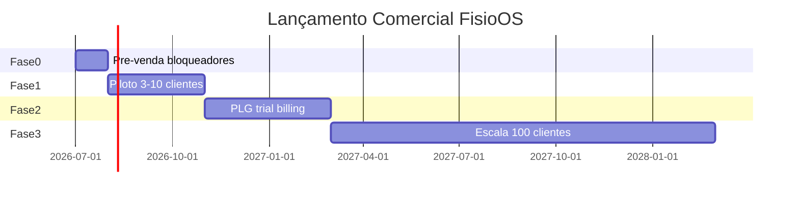

# FisioOS — Prontidão Comercial (READ ONLY)

Análise **exclusiva do produto como oferta comercial**, cruzando código, schema SaaS, UX, documentação e auditorias anteriores. Nenhum arquivo foi alterado.

**Veredito em uma linha:** o FisioOS tem **proposta de valor clínica real e diferenciada**, mas está pronto para **venda consultiva / piloto founder-led** — **não** para comercialização self-serve em escala.

---

## Avaliação por dimensão

| Dimensão | Estado | Classificação |
|---|---|---|
| **Valor percebido** | Prontuário estruturado, escalas, PDF+QR, perfis clínicos, biblioteca | **BAIXO** (forte) |
| **Diferenciais** | Multi-tenant, white label, inteligência rule-based, validação pública | **MÉDIO** |
| **Onboarding** | Componente existe; **não integrado**; provisionamento manual | **CRÍTICO** |
| **Trial** | Schema `trial` + `trial_ends_at`; **sem fluxo self-serve** | **ALTO** |
| **Planos** | 4 planos seed (R$99–R$999); limites + módulos; admin SaaS | **MÉDIO** |
| **Cobrança** | **Zero integração** Stripe/MP; financeiro = clínica, não SaaS | **CRÍTICO** |
| **White Label** | Cores, logo, app name, PDF branding — **maduro** | **BAIXO** (forte) |
| **UX** | Painel premium, wizard avaliação; duplicidades e polish incompleto | **MÉDIO** |
| **Documentação** | GO-LIVE parcial; docs/ vazio; sem manual usuário | **CRÍTICO** |
| **Escalabilidade** | OK ~100 clínicas com ajustes; 1k+ exige refactor | **ALTO** |
| **Suporte** | Modo suporte maduro; sem CS playbook | **MÉDIO** |
| **Segurança** | RLS legado, convite quebrado, admin global | **CRÍTICO** |
| **Performance** | Monolito client-side; OK piloto pequeno | **ALTO** |
| **Marketing** | Módulo `/app/marketing` + biblioteca; **sem site/landing comercial** | **ALTO** |
| **Retenção** | Reavaliações, KPIs; **sem billing dunning, NPS, churn analytics** | **ALTO** |
| **Experiência do cliente** | Fluxo clínico end-to-end; gaps convite/onboarding/docs | **ALTO** |

---

## Detalhamento comercial

### Valor percebido — **BAIXO** (positivo)

O produto resolve dores reais de fisioterapia estruturada:

- Wizard de avaliação com perfis Neuro/Orto/Resp/Geriátrico
- 19 escalas validadas + MRC + goniometria normativa
- Documentos com merge tags, PDF profissional, QR de validação pública
- Timeline 360º, comparativo de reavaliação, agenda, financeiro básico
- Biblioteca (cartilhas, protocolos, exercícios, POPs)

Para o comprador (donos de clínica / fisios autônomos), o **“jobs to be done”** clínico está coberto de forma superior a planilha + Word.

---

### Diferenciais — **MÉDIO**

| Diferencial declarado | Real no código | Força comercial |
|---|---|---|
| Prontuário inteligente | Keyword matching + templates (não IA) | Médio |
| PDF + QR validação | ✅ Implementado | **Alto** |
| White label | ✅ Cores, logo, app name | **Alto** |
| Multi-clínica SaaS | ✅ RLS + admin SaaS | **Alto** (B2B) |
| Marketing integrado | Módulo existe, plan-gated | Médio |
| Home Care | CRUD básico | Fraco |
| Inteligência clínica | Feature flag; regras v1 | Médio (não vender como IA) |

Posicionamento honesto: **“Sistema operacional clínico para fisioterapia estruturada”**, não “IA clínica”.

---

### Onboarding — **CRÍTICO**

- `OnboardingChecklist` implementado (logo → profissional → paciente → avaliação) mas **não importado em nenhuma rota** — código morto.
- Painel `/app` tem card para clínica nova, mas checklist progressivo **não aparece**.
- Nova clínica: **`provision_clinic` só via super_admin** — zero self-serve.
- Auth: **apenas login** (`/auth`), sem signup público; `/` redireciona para `/auth`.
- GO-LIVE estima 30–45 min configuração manual — viável só com acompanhamento.

---

### Trial — **ALTO**

**Schema pronto:**
- `clinic_plans.status` ∈ `active | trial | suspended | canceled`
- `trial_ends_at` em `clinic_plans` e `clinics`
- `has_plan_feature` honra status `trial`

**Ausente:**
- Landing “Comece grátis 14 dias”
- Signup → auto-provision → trial
- E-mail de expiração / downgrade automático
- Paywall ao fim do trial

Trial hoje = **decisão manual do super_admin**.

---

### Planos — **MÉDIO**

Seed comercial (migration):

| Plano | Preço/mês | Usuários | Pacientes | Módulos-chave |
|---|---|---|---|---|
| Starter | R$ 99 | 2 | 100 | pacientes, avaliações, documentos |
| Professional | R$ 199 | 5 | 500 | + biblioteca, agenda |
| Clinic | R$ 399 | 15 | 2.000 | + financeiro, relatórios |
| Enterprise | R$ 999 | ilimitado | ilimitado | + marketing, home care, multi-unidade |

- Limites enforced no DB (`fn_enforce_*`).
- Admin SaaS: CRUD planos, troca de plano, auditoria.
- Menu filtrado por `usePlanFeatures()`.

**Gaps:** preços no seed podem não refletir estratégia atual; sem página pública de pricing; sem comparação de planos para o cliente.

---

### Cobrança — **CRÍTICO**

- **Nenhum** Stripe, Mercado Pago, Pagar.me ou webhook de pagamento SaaS.
- Relatórios mencionam integração como **backlog pós-V1**.
- Financeiro do produto = lançamentos **da clínica** (receitas/despesas paciente), não mensalidade FisioOS.
- Impossível: checkout, fatura recorrente, inadimplência automática, upgrade self-serve.

**Primeira venda possível apenas com cobrança manual** (PIX/boleto/contrato externo).

---

### White Label — **BAIXO** (ponto forte)

- `clinic_settings`: `app_name`, `slogan`, `primary_color`, `secondary_color`, logo
- `useBranding()` aplica sidebar, login (pós-auth), PDFs
- Enterprise positioning: clínica “tem seu sistema”

Gap menor: PDF ainda usa cor fixa em partes (`pdf-engine`); login pré-auth é sempre FisioOS institucional (correto para SaaS).

---

### UX — **MÉDIO**

**Fortes:** painel premium, wizard 7 passos, prontuário rico, modo suporte claro.

**Fracos comerciais:**
- Dois painéis “Painel Clínico” (`/app` vs `/app/dashboard-clinico`)
- Wizard + form clássico de avaliação
- Dois fluxos de recibos
- Onboarding checklist invisível
- Mobile usável mas não otimizado para domiciliar

Para demo comercial: **usar wizard + fluxo feliz ensaiado**.

---

### Documentação — **CRÍTICO**

- Sem README, manual usuário, FAQ, vídeos (GO-LIVE marca V1.1)
- `docs/` majoritariamente vazio
- Cliente pós-venda depende de treinamento ao vivo (2–3h previsto no GO-LIVE)

Escala comercial exige **materiais self-service mínimos**.

---

### Escalabilidade — **ALTO**

- ~100 clínicas: viável com paginação, APM, staging
- 100 clientes × ~5 usuários = ~500 MAU — Supabase aguenta
- Gargalos: PDF client-side, sem CI/CD, audit_log growth, suporte manual

---

### Suporte — **MÉDIO**

**Maduro:** Modo Suporte (sessão auditada, banner, guard UI+DB).

**Imaturo:** sem SLA, sem base de conhecimento, sem ticketing, sem CS playbook. Founder = suporte tier 1.

---

### Segurança — **CRÍTICO**

Bloqueadores comerciais de confiança:

- `public.documents` RLS aberta
- Convite fisioterapeuta quebrado (`physiotherapist` vs `profissional`)
- `user_roles.admin` global no convite
- Security scan / linter pendentes (GO-LIVE)

**Nenhum cliente pagante deveria entrar sem resolver isso.**

---

### Performance — **ALTO**

- Bundle monolítico, jsPDF no browser
- OK para piloto; risco em clínicas com muitos pacientes/PDFs
- Não é bloqueador da **primeira** venda; é bloqueador de **100 clientes ativos**.

---

### Marketing — **ALTO**

**Dentro do produto:** `/app/marketing`, biblioteca com posts/cartilhas, `/app/diferenciais` com KPIs de uso.

**Fora do produto:** sem landing page comercial, sem site institucional no repo, sem SEO, sem case studies. Raiz `/` → login only.

---

### Retenção — **ALTO**

**Mecânicos existentes:**
- Reavaliações agendadas (retorno ao produto)
- Relatórios/KPIs (valor contínuo)
- Biblioteca de conteúdo (sticky content)

**Ausentes:**
- Cobrança recorrente / dunning
- Trial → paid conversion flow
- NPS, health score, alertas de churn
- E-mail transacional (reavaliações, onboarding)
- Comunidade / treinamentos contínuos

---

### Experiência do cliente — **ALTO**

Jornada ideal (com suporte humano):

```
Demo → Contrato manual → super_admin provisiona → convite owner →
treinamento → configuração white label → primeiros pacientes → PDF/QR wow moment
```

Jornada self-serve: **inexistente**.

Pontos de fricção: convite quebrado, onboarding invisível, domínio `SITE_URL` inconsistente, sem help in-app.

---

## Respostas diretas

### 1. O produto está pronto para vender?

| Modelo de venda | Pronto? |
|---|---|
| **Self-serve / PLG** (site → trial → cartão) | **Não** |
| **Venda consultiva / piloto** (1–5 clínicas, founder-led) | **Sim, com ressalvas** |
| **Venda em escala** (100+ clientes, time comercial) | **Não** |

**Produto clínico:** vendável como **MVP premium** para nicho (fisioterapia geriátrica/neuro/domíciliar).

**Produto comercial:** **infra de receita, onboarding e confiança** incompletos.

---

### 2. O que impede a primeira venda?

| # | Impedimento | Sev. |
|---|---|---|
| 1 | **Segurança** — RLS legado, convite quebrado, admin global | **CRÍTICO** |
| 2 | **Sem cobrança integrada** — venda manual only | **CRÍTICO** |
| 3 | **Provisionamento manual** — super_admin obrigatório | **ALTO** |
| 4 | **Convite owner/fisio** pode falhar (`SITE_URL`, role bug) | **CRÍTICO** |
| 5 | **Termo LGPD / contrato** — externo, pendente GO-LIVE | **CRÍTICO** |
| 6 | **Materiais comerciais** — demo script, one-pager, pricing público | **ALTO** |
| 7 | **Onboarding checklist** não visível | **ALTO** |
| 8 | **Security scan + linter** pendentes | **ALTO** |

**Primeira venda é possível hoje** se: cliente de confiança, contrato manual, provisionamento assistido, escopo piloto acordado, bloqueadores de segurança corrigidos antes do go-live da clínica.

---

### 3. O que impede chegar a 100 clientes?

| # | Impedimento | Sev. |
|---|---|---|
| 1 | Tudo que impede a 1ª venda, em escala | **CRÍTICO** |
| 2 | **Self-serve signup + trial + billing** | **CRÍTICO** |
| 3 | **Onboarding automatizado** (checklist, e-mails, tours) | **ALTO** |
| 4 | **Suporte escalável** (docs, FAQ, L1, SLA) | **ALTO** |
| 5 | **Observabilidade** (Sentry, uptime) — MTTR | **CRÍTICO** |
| 6 | **Performance** (paginação, PDF worker, lazy routes) | **ALTO** |
| 7 | **CI/CD + staging** | **ALTO** |
| 8 | **Retenção** (dunning, trial expiry, health score) | **ALTO** |
| 9 | **Marketing externo** (site, SEO, cases, ads) | **ALTO** |
| 10 | **Capacidade humana** (CS + suporte + vendas) | **ALTO** |
| 11 | **Domínio/marca** consolidada (`fisioos.app` vs Lovable) | **MÉDIO** |
| 12 | **Manual do usuário + treinamento gravado** | **MÉDIO** |

Estimativa realista: **100 clientes exige 6–12 meses** pós-correção dos bloqueadores + investimento em GTM e ops.

---

## 4. Plano de lançamento comercial

### Fase 0 — Pré-venda (2–4 semanas) · desbloqueia 1ª receita

| # | Entrega | Objetivo |
|---|---|---|
| 0.1 | Corrigir bloqueadores segurança (convite, RLS, admin global) | Confiança |
| 0.2 | Configurar `SITE_URL` + domínio produção | Convites/QR OK |
| 0.3 | **One-pager comercial** + deck demo (15 min) | Vendas |
| 0.4 | **Pricing sheet** oficial (4 planos ou simplificar para 2) | Clareza |
| 0.5 | Contrato + Termo LGPD (jurídico) | Compliance |
| 0.6 | Script demo: paciente → avaliação → PDF → QR | Wow moment |
| 0.7 | Processo manual: PIX/contrato → provision → treinar | 1ª venda |
| 0.8 | Conectar `OnboardingChecklist` ao `/app` | Time-to-value |

**Meta:** 1–3 clínicas piloto pagantes (preço promocional ou anual antecipado).

---

### Fase 1 — Piloto comercial (1–3 meses) · 3–10 clientes

| # | Entrega |
|---|---|
| 1.1 | Programa **Beta fechado** com checklist GO-LIVE |
| 1.2 | Treinamento padronizado (admin 2h + fisio 3h) |
| 1.3 | Canal suporte (WhatsApp Business + SLA piloto) |
| 1.4 | Coletar **3 depoimentos + 1 case study** |
| 1.5 | FAQ mínimo (20 perguntas) |
| 1.6 | Sentry + uptime monitor |
| 1.7 | Staging + smoke test por release |
| 1.8 | Pricing piloto: Starter R$149 / Pro R$299 (validar willingness to pay) |

**Meta:** NPS > 40, churn zero no piloto, 3 cases publicáveis.

---

### Fase 2 — Product-led readiness (3–6 meses) · 10–30 clientes

| # | Entrega |
|---|---|
| 2.1 | **Landing page** comercial (`fisioos.app`) |
| 2.2 | **Signup + trial 14 dias** (auto-provision starter) |
| 2.3 | **Stripe/Mercado Pago** — checkout + webhook + dunning |
| 2.4 | Paywall por plano (upgrade in-app) |
| 2.5 | E-mail transacional (trial day 1/7/13, welcome) |
| 2.6 | Manual usuário PDF + 5 vídeos curtos |
| 2.7 | `/app/auditoria` clínica (compliance vendável) |
| 2.8 | Domínio custom Enterprise (white label DNS) |

**Meta:** 30% trial → paid; CAC payback < 6 meses.

---

### Fase 3 — Escala comercial (6–18 meses) · 30–100 clientes

| # | Entrega |
|---|---|
| 3.1 | Time: 1 AE + 1 CS + suporte L1 |
| 3.2 | Inbound: SEO + conteúdo (blog fisioterapia + software) |
| 3.3 | Outbound: CREFITO, associações, home care |
| 3.4 | Parcerias: escolas de fisio, consultorias clínicas |
| 3.5 | Programa **revenda / implantação** (clínicas Enterprise) |
| 3.6 | Health score + churn alerts |
| 3.7 | Performance/scaling (PDF worker, paginação) |
| 3.8 | Certificações / auditoria segurança externa (vendável) |

**Meta:** 100 clientes pagantes, MRR previsível, churn < 5% mensal.

---

### Timeline visual



---

## Matriz decisão comercial

| Pergunta | Resposta |
|---|---|
| Vender hoje para 1 clínica de confiança? | **Sim**, após fix segurança + contrato manual |
| Abrir trial público no site? | **Não** |
| Anunciar “100 clínicas”? | **Não** — 6–12 meses mínimo |
| Preço recomendado piloto | Starter **R$149–199/mês** ou anual -20% |
| Diferencial #1 para pitch | PDF profissional + QR validação + white label |
| Risco #1 para churn | Onboarding fricção + suporte dependente do founder |

---

## Conclusão executiva

O FisioOS **não está pronto para comercialização em escala**, mas **está pronto para venda consultiva de piloto** com proposta de valor clínica **genuína e diferenciada** no nicho de fisioterapia estruturada.

Os três bloqueadores universais são:

1. **Confiança** (segurança + convite)
2. **Receita** (sem billing automatizado)
3. **Escala operacional** (onboarding, docs, suporte, observabilidade)

A Fase 0 do plano acima é **obrigatória antes de qualquer receita recorrente previsível**. A Fase 2 é o marco de **produto comercialmente vendável** sem depender do founder em cada clínica.

Nenhum arquivo foi alterado nesta análise.