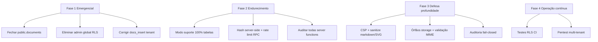

# Auditoria de Segurança — FisioOS (READ ONLY)

Análise estática do código e das migrations Supabase. Nenhum arquivo foi alterado.

---

## Resumo executivo

O FisioOS tem **base sólida** em multi-tenant (helpers `can_access_clinic`, `is_member_of`, RLS reescrito na maioria das tabelas clínicas, modo suporte com bloqueio de escrita no banco, validação pública via RPC limitada). Porém coexistem **artefatos legados críticos** — especialmente a tabela `public.documents` com RLS aberto e o papel global `admin` em `user_roles` ainda efetivo no banco — que **quebram o isolamento entre clínicas** apesar da UI já ter evoluído na direção correta (`useRoles` não usa mais `admin` global para permissões clínicas).

---

## Matriz de achados

### CRÍTICO

| Área | Achado |
|------|--------|
| **RLS / Policies** | Tabela legada `public.documents` mantém políticas abertas desde a migration inicial: `SELECT USING (true)` e `INSERT WITH CHECK (true)`. Qualquer usuário autenticado pode **ler e inserir** registros de **todas as clínicas**. Ainda é usada em `pdf.ts` (`uploadAndRegisterPdf`) e `patient-timeline.tsx`. |
| **Multi-tenant / Isolamento** | Política `clinics_admin` em `public.clinics` concede `FOR ALL` a quem tem `has_role(..., 'admin')` global — **nunca foi removida** nas migrations posteriores. |
| **Escalada de privilégios** | `admin-users.functions.ts` continua atribuindo papel global `admin` em `user_roles` ao convidar usuários. Combinado com `clinics_admin` e outras policies legadas, um admin de clínica convidado vira **admin global da plataforma** no banco. |
| **RLS / clinical_documents** | Policy `docs_insert` valida apenas `can_access_patient(patient_id)`, **sem exigir** `clinic_id = patients.clinic_id`. Um membro da clínica A pode inserir documento referenciando paciente de A com `clinic_id` da clínica B, **injetando dados no tenant B**. |

### ALTO

| Área | Achado |
|------|--------|
| **Autorização** | Policies remanescentes com bypass global `has_role(..., 'admin')`: `sig_delete` em `clinical_signatures`, `doc delete admin` em `public.documents`, `clinics_admin`. UI ignora `admin` global (`auth.ts`), mas **RLS ainda honra**. |
| **Service Role** | `supabaseAdmin` bypassa RLS em todas as server functions. Padrão correto (auth middleware + checks), mas **um único endpoint sem guard** = acesso total ao banco. |
| **Autorização / super_admin** | Policies de update em `assessments`/`evolutions` permitem `super_admin` alterar registros **mesmo com `locked_at` preenchido**, contornando imutabilidade clínica. |
| **JWT** | Sessão Supabase em `localStorage` (`client.ts`). XSS bem-sucedido = roubo de token e acesso completo à conta. |
| **Modo Suporte** | `fn_block_support_writes` cobre só 8 tabelas. **Fora do escopo**: `receipts`, `clinical_signatures`, `patient_attachments`, `clinic_members`, biblioteca, etc. Super admin em suporte pode escrever nelas via API direta. |
| **Storage** | Policy de leitura permite `auth.uid()::text = owner_id` sem vínculo em `clinical_documents`/`receipts` — arquivos órfãos permanecem legíveis pelo uploader; vetor de armazenamento não rastreado. |

### MÉDIO

| Área | Achado |
|------|--------|
| **Hash / QR Code** | `validation_hash` gerado no **cliente** (`documentos.tsx`) e gravado junto com `locked_at` imediato. Hash identifica registro, **não prova integridade do PDF** (não é HMAC/conteúdo). QR aponta para `/validar/{hash}`. |
| **RPC** | `validate_document_by_hash` é `SECURITY DEFINER`, exposto a `anon` — correto para validação pública, mas **sem rate limiting**; vazamento de metadados (profissional, clínica, título) se hash vazar. |
| **Uploads** | Logo aceita **SVG** (`logo-uploader.tsx`). Risco XSS se renderizado inline sem sanitização (depende de como `resolveClinicLogoUrl` exibe). |
| **XSS** | `ReactMarkdown` em conteúdos da biblioteca sem `rehype-sanitize` explícito; v10 escapa HTML por padrão, mas links `javascript:` não são bloqueados explicitamente. |
| **Auditoria** | `saas_audit_log` insert é best-effort (`catch` + `console.error`); falhas silenciosas. Sem captura sistemática de IP no app (coluna existe na migration). |
| **Autenticação (rotas)** | Guard de rota usa `getUser()` client-side (`_authenticated/route.tsx`, `ssr: false`). Adequado para SPA, mas **não substitui** RLS; rotas sem `beforeLoad` extra (ex.: `/app/usuarios`) dependem só de UI + server fn checks. |
| **Assinaturas** | `SignaturePad` grava PNG base64 + metadados sem trava de documento bloqueado no client; depende de RLS. Delete de assinatura ainda exige `admin` global, não `can_manage_clinic`. |
| **Downloads** | Signed URLs com TTL curto (300s em documentos) — bom. Geração local via blob no emit — OK. |

### BAIXO

| Área | Achado |
|------|--------|
| **SQL Injection** | Queries via Supabase client/RPC parametrizados. Migrations usam `format()` apenas com listas fixas de tabelas. Risco baixo. |
| **CSRF** | API usa Bearer JWT (header), não cookies de sessão — CSRF clássico mitigado. Risco residual via XSS, não CSRF. |
| **XSS** | React escapa JSX por padrão; único `dangerouslySetInnerHTML` em `chart.tsx` (estilos). |
| **Logs** | `assessment_audit_log` com escopo tenant; triggers `fn_audit_trigger` revogados de execução direta. |
| **Autenticação (server)** | `requireSupabaseAuth` valida Bearer + `getClaims()` — implementação correta. |
| **Multi-tenant (core)** | Tabelas principais (`patients`, `assessments`, `evolutions`, etc.) reescritas com policies tenant-scoped; `can_access_clinic` inclui modo suporte restrito à clínica da sessão. |
| **Storage (recente)** | Insert exige prefixo `{clinic_uuid}/` + membership; leitura exige vínculo DB ou branding com `can_manage_clinic`. |
| **Server fn exemplo** | `getGreeting` em `example.functions.ts` **sem auth** — vaza `nodeEnv`; baixo impacto, mas superfície desnecessária. |

---

## Análise por domínio

### Autenticação — **MÉDIO** (global) / **BAIXO** (server)

- Supabase Auth + JWT Bearer no middleware server-side.
- Sessão persistida em `localStorage` — principal vetor: XSS → hijack.
- Rotas autenticadas checam sessão no client; server functions checam token de forma robusta.

### Autorização — **CRÍTICO** (legado) / **MÉDIO** (atual)

- Camada UI evoluiu: `useRoles` usa `clinic_members` + suporte, não `admin` global.
- Camada DB ainda mistura modelo legado (`user_roles.admin`) com tenant (`clinic_members.role`).
- Server functions SaaS (`clinics-admin`, `clinic-ops`, `saas-admin`) exigem `super_admin` — **bom**.
- `admin-users.functions.ts` usa service role mas autoriza via `ensureCanManageUsers` incluindo `admin` global — **inconsistente e perigoso**.

### RLS e Policies — **CRÍTICO**

Pontos fortes:
- Reescrita multi-clínica em `patients`, `assessments`, `evolutions`, `financial_entries`, etc.
- `docs_public_validate` (anon lendo todos os docs locked) foi **removida**; validação pública migrou para RPC.

Pontos fracos:
- `public.documents` nunca endurecida.
- `docs_insert` em `clinical_documents` incompleta.
- Policies globais `admin` remanescentes.

### RPC — **MÉDIO**

| RPC | Avaliação |
|-----|-----------|
| `validate_document_by_hash` | Definer, dados mínimos (iniciais LGPD), grant anon — OK com rate limit |
| `has_role`, `can_access_clinic`, `current_clinic_id` | Definer, revogado de anon onde aplicável |
| `start_support_session` / `end_support_session` | Restrito a `super_admin`, audit log |
| `provision_clinic` | Restrito a `super_admin` |

### Service Role — **ALTO**

- Proxy lazy em `client.server.ts`, documentado como server-only.
- Usado após checks em funções admin — padrão correto, impacto de falha humano/código = total.

### JWT — **MÉDIO**

- Validação via `getClaims` no server.
- Refresh automático no client.
- Armazenamento em `localStorage` — trade-off SPA vs segurança.

### Multi-tenant e isolamento — **CRÍTICO** (legado) / **MÉDIO** (core)

- Modelo `clinic_id` + `clinic_members` + helpers definer é sólido.
- **Quebrado** por: `public.documents` aberta, `admin` global, `docs_insert` sem amarração de tenant.

### Storage / Uploads / Downloads — **MÉDIO**

- Bucket `documents`: path `{clinic_id}/...`, insert com membership, read com join em tabelas clínicas.
- Upload de PDFs e logos passa validação client-side (tipo/tamanho); enforcement real está nas policies.
- `owner_id` bypass na leitura — gap de governança.

### QR Code e Hash — **MÉDIO**

- Entropia adequada (24 bytes hex = 192 bits).
- QR em PDF aponta para `/validar/{hash}` — modelo de verificação por segredo na URL.
- Sem prova criptográfica de que o PDF não foi alterado após emissão.

### Assinaturas — **MÉDIO**

- RLS: insert via `can_access_patient`; PNG em texto no banco.
- Sem non-repudiation forte (sem certificado, sem hash do traço vinculado ao documento).
- Delete policy desatualizada (`admin` global).

### Logs e Auditoria — **MÉDIO**

- `fn_audit_trigger` + `assessment_audit_log` tenant-scoped.
- `saas_audit_log` só leitura para `super_admin`; escrita via service role.
- Falhas de audit best-effort; sem trilha unificada clínica + SaaS.

### Escalada de privilégios — **CRÍTICO**

1. Convite com role `admin` → `user_roles.admin` global.
2. `clinics_admin` → controle total de clínicas.
3. `docs_insert` → injeção cross-tenant.
4. `super_admin` → bypass de locks clínicos.

### SQL Injection — **BAIXO**

Parametrização consistente; sem concatenação de SQL no app.

### XSS — **MÉDIO**

React + markdown sem sanitização explícita de links; SVG upload; JWT em localStorage amplifica impacto.

### CSRF — **BAIXO**

Bearer token; risco principal é XSS, não CSRF.

---

## O que já funciona bem

1. Middleware `requireSupabaseAuth` com validação de claims.
2. Modo suporte: UI + triggers DB nas tabelas core.
3. Remoção de policy anon aberta em `clinical_documents`.
4. Storage endurecido nas migrations recentes (`20260625232637`).
5. `useRoles` documentado e alinhado ao modelo tenant (UI).
6. Validação pública LGPD-friendly via RPC (iniciais do paciente).
7. Revogação de `EXECUTE` em triggers internos para anon/authenticated.

---

## Plano de melhorias (sem implementação)

### Fase 1 — Emergencial (1–2 semanas)

1. **Fechar `public.documents`**
   - Substituir policies abertas por tenant-scoped (via `patient_id → clinic_id`) ou deprecar tabela e migrar para `clinical_documents`.
   - Auditar linhas existentes cross-tenant.

2. **Eliminar papel `admin` global operacional**
   - Migration: dropar `clinics_admin` e policies com `has_role(..., 'admin')`.
   - Reservar `super_admin` apenas para SaaS.
   - Atualizar `admin-users.functions.ts` para gravar só `clinic_members.role`, nunca `user_roles.admin`.

3. **Corrigir `docs_insert`**
   - `WITH CHECK`: `clinic_id = (SELECT clinic_id FROM patients WHERE id = patient_id) AND is_member_of(clinic_id)`.
   - Trigger BEFORE INSERT reforçando a mesma regra.

4. **Inventário de policies**
   - Script SQL listando todas as policies com `admin` ou `USING (true)`; eliminar ou reescrever.

### Fase 2 — Endurecimento (2–4 semanas)

5. **Modo suporte completo**
   - Estender `fn_block_support_writes` a todas as tabelas mutáveis (receipts, signatures, attachments, members, settings).

6. **Service role**
   - Checklist: toda `createServerFn` deve ter middleware auth + assert de tenant/role.
   - Remover ou proteger `example.functions.ts`.

7. **Integridade documental**
   - Hash gerado server-side (trigger ou RPC) após upload.
   - Opcional: HMAC do PDF (`sha256` + segredo server) armazenado no registro.
   - Rate limit / CAPTCHA em `validate_document_by_hash`.

8. **super_admin e locks**
   - Remover bypass de `locked_at` para operações clínicas; usar RPC auditada para exceções.

### Fase 3 — Defesa em profundidade (1–2 meses)

9. **XSS / sessão**
   - CSP restritiva.
   - Considerar httpOnly cookies via SSR para tokens (trade-off arquitetural).
   - `rehype-sanitize` no markdown; bloquear SVG ou sanitizar SVG uploads.

10. **Storage**
    - Remover leitura por `owner_id` sem registro DB, ou TTL/expiração de órfãos.
    - Antivírus/magic-byte validation server-side para uploads.

11. **Assinaturas**
    - Policy delete via `can_manage_clinic`.
    - Hash do canvas + timestamp + `document_id` locked.
    - Trava: não assinar documento já `locked_at` sem fluxo explícito.

12. **Auditoria**
    - Falhas de `saas_audit_log` devem falhar a operação (não best-effort).
    - Registrar IP/user-agent nas server functions admin.
    - Dashboard de eventos de segurança (logins, suporte, convites, deletes).

### Fase 4 — Conformidade e operação contínua

13. **Testes de segurança automatizados**
    - Suite RLS: usuário clínica A não lê/escreve clínica B (incl. `documents`, storage, RPC).
    - Teste de regressão para convite de usuário (não deve criar role global).

14. **Revisão periódica**
    - Pentest anual focado em multi-tenant.
    - Rotação de service role key; secrets fora do bundle client.

15. **Documentação**
    - Modelo de ameaças (STRIDE) para fluxos: emitir documento, validar QR, modo suporte, convite.

---

## Priorização visual

---

## Conclusão

A arquitetura **intencional** de multi-tenant do FisioOS é madura na maior parte das tabelas clínicas, mas a segurança efetiva é **limitada pelo legado ainda ativo no Postgres**: `public.documents` aberta, papel `admin` global e insert de `clinical_documents` sem amarração de `clinic_id`. Esses três pontos devem ser tratados **antes** de qualquer expansão de clientes ou dados sensíveis em produção multi-clínica.

Nenhum arquivo foi modificado nesta análise.